In this paper, we investigate how optional or advanced sections in complex ILIAS forms could be presented and hidden if they are not currently relevant.

The goal is to improve the user experience by
* reducing visual noise that can be overwhelming and intimidating
* speeding up the process of filling out complex forms

# Complex forms in ILIAS

Most objects in ILIAS are created by filling out a form. Often times the forms simply map a huge number of object properties and settings onto one page.

Segmentation is often done by presenting input fields in group segments with a headline and/or by using the ILIAS tabs. When tabs are used to spread settings onto multiple pages, each page requires a click on the Save button before switching the tab or the input will be lost.

Often times, many properties are mandatory for the creation of the object. This requirement is softened by many defaults that are pre-set.

# Issues with complex ILIAS forms

## Loosing overview

Especially forms meant for administrators and users with more permissive roles (we will call them "managing users") tend to have so many input fields, checkboxes and dropdowns that forms almost always extend below the fold (the area of the screen visible before scrolling.)

If you are a new user, you have to search the entire form for options you might need because the grouping does not always help with the decision to ignore an entire section of the form.

When options are spread over multiple tabs, it's not always immediately clear which tabs can be ignored most of the time and which tabs might contain further relevant choices as they are presented with equal visual weight.

Even experienced users often have to invest a couple of seconds to search for that one specific option that they know exists somewhere.

## Can one type of form cover everything?

ILIAS forms look (with rare exceptions) the same in all contexts. A registration form on the frontend for end-users utilizes the same design and UI components as a complex setting screen for administrators.

However, those two use cases have vastly different requirements:
* For frontend forms, user satisfaction ratings and high conversion rates to collect information are the most important Key Performance Indicators.
* An administrativ form is a tool not only for creation, but also for frequently managing settings and often fulfill the role of a control panel.

# Goal: Ease of use

Optional sections in ILIAS forms should meet the following goals:
* New users should feel like the forms are very manageable and easy to learn. The number of fields is (initially) reduced.
* Experienced users should be able to quickly jump to the basic and advanced options they are familiar with.
* Forms should take anyone less time to complete.
* We are looking for solutions that work for both end-user information input as well as for managing settings.

A promising approach that we will discuss in this paper is if we need multiple distinctly different solutions for distinctly different use cases within ILIAS. We will explore how some styles of hiding and segmenting form fields are appropriate in some situations but not in others.

# UI/UX Principles

While using forms, the users focus and main intention can be vastly different. These different focuses are mainly defined by...
* the **user intent**: "the purpose of a user’s series of actions" [^intro-user-graph]
* the **mental model**: "what users know (or think they know) about a system" [^nielsen_mental-models]

The interactive functionality of an UI element (or really anything) can be examined as an affordance:
* "an **affordance** is what a user can do with an object based on the user’s capabilities. [...] A door affords opening if you can reach the handle. For a toddler, the door does not afford opening [...]. [It's] an action possibility in the relation between user and an object."[^interaction-design_affordance]

For this analysis we had a look at many forms in ILIAS and sorted them into three general categories:

## Condensed information prompt

Sometimes forms are designed to collect a specific, small set of information quickly (like a user registration, login, survey, quiz or contact form). In this case it's often expected that the user fills out or changes (almost) all fields and they often do so one field after the other in sequence.

While the submitted information can create an object in the software, the focus of such forms is often a frictionless conversion from query to submission.

Seeing a lot of fields that aren't applicable or relevant to the user can be confusing and deters some people from completing the form. Consequently, these forms are often reduced to a selected, small amount of fields.

An object created by submitting an information prompt likely has many more properties under the hood that are being added automatically or by a managing user beforehand that the end-user will never see (pre-set user role, conditional logic, quiz evaluation, admin email address to receive a notification etc.).

### Examples:

*[Wikipedia.org](https://en.wikipedia.org/) User Registration*

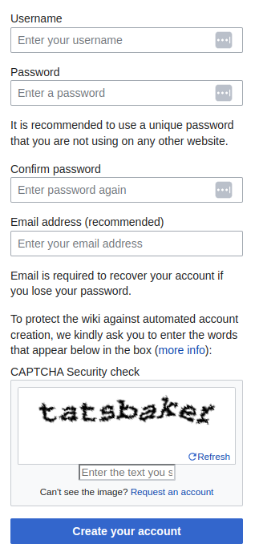

*A rating question in Typeform*

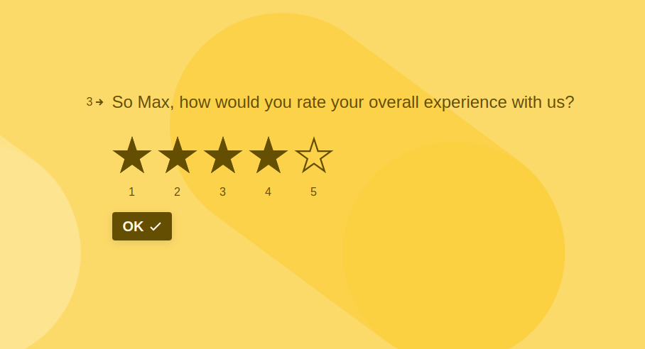

## Object creation focus

In ILIAS, many forms are an almost complete representation of an object's settings and properties. Most things that could possibly be defined about the object have a field.

During the initial creation of such an object (e.g. test, test question, course etc.) a managing user will probably fill out most fields and check if the pre-set default values are in line with their intentions.

While more experienced users will be better at jumping to the input elements that are required or relevant, it's still a sequential process most of the time. Named categories help to gain an overview.

## Adjusting settings

When a user wants to change an already existing object they are often thrown into the same form that was used for creating it.

However, when coming back to existing objects, the user intent is often different: They want to change or check a specific amount of settings (e.g. switch a test from offline to online).

As the mental modal is no longer a sequential field by field processing, getting an overview and jumping to the relevant spot in the form is now the main focus.

So far ILIAS barely accommodates this mental model. Forms for editing objects and forms for editing objects are very often exactly the same

# Strategies & Best Practices

Fortunately, other projects had to solve similar challenges before us and we can get inspiration from their solutions.

## Reducing the amount of fields

It might seem obvious, but the best way to maintain a feeling of overview is to not have that many options in a form to begin with.

"In any situation where completion is important (which is almost always), minimize the number of fields you use." [^designlabs_tricks]

A project at ebay that aimed to remove many fields from the registration process to an optional after registration form proved to be very successful: "The impact  was tremendous because a lot more people registered successfully and began to use eBay. And perhaps ironically, significantly more people answered the optional questions when they were asked after they registered!" [^web-form-design_ebay]

Consequently, if there are fields that are barely used or are left over from abandoned or never finished concepts, they should either be brought to full functionality at a carefully chosen place or be removed. Moving such fields to a hidden advanced or optional section only shifts the problem out of direct sight, but does not solve it.

When following the approach that all properties and settings of an object are mapped almost completely to a form, managing users will be left with quite a few options. However, there might still be possibilities to remove fields:

The business software ERPNext for example allows administrators to remove not mandatory field from forms permanently for the entire instance. This makes a lot of sense if an instance is not ever using certain functionalities as it reduces unnecessary weight of the interface for all users.

Some CRM software like WordPress distinguishes between end-user facing content and setting forms for the managing users. The advantage is that most WordPress form plugins only expose forms that are greatly simplified and optimized for conversion to the average user and only administrators see the complex setting forms where everything is visible.

## Revealing options dynamically

How do most forms on the web and in SaaS handle the actual hiding and showing of additional form elements?

"Progressive disclosure in forms refers to the method of only displaying inputs when they become necessary." [^dhis2-doc]

### Conditional visibility

We already have a UI component in ILIAS that allows hiding and showing sub-forms when a checkbox or radio box is ticked (named Optional Group and Switchable Group).

This is an example of conditional visibility that can be set up in many form builders and is frequently used in forms all over the internet.

#### Radio button reveals sub-form

Using radio buttons for progressive disclosure (like the Switchable Group in ILIAS) gets quite a positive verdict in Luke Wroblewski's user testing:
* They "can maintain the context of a person’s initial selection while introducing the required selection-dependent inputs where they are most relevant". [^web-form-design_318]
* They "achieved near-perfect satisfaction ratings". [^web-form-design_318]
* A "small number of selection-dependent inputs and animated transitions when people change their initial selections [...] help make this method work." [^web-form-design_320]

#### Dropdown reveals sub-form

Conditional visibility could potentially also be triggered by other field types e.g. a dropdown.

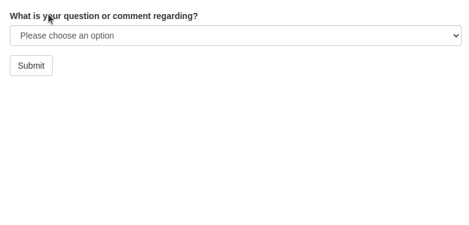

*Screencapture shows a codepen by Dustin Horstman* [^conditional-form-field]

User testing yielded the following conclusions:

* It "obscures most of the initial options—as only one option is visible in the drop-down list" [^web-form-design_286] which could be a downside if the goal is maximum overview at a glance, but an upside if you want to de-clutter the screen
* "Using a single control may better communicate the scope and impact of the initial selection". [^web-form-design_286]
* "It's easy on the eyes and completed quite quickly" [^web-form-design_287]
* It had "relatively high satisfaction scores" [^web-form-design_287]
* Dropdowns are "safe [...] when your list of initial options scales past a number that either horizontal or vertical tabs can support" [^web-form-design_287]

## Accordion

One of the most frequently suggested tools to group and hide content are inline accordions.

User testing from the Baymard Institute and Luke Wroblewski working with London-based usability firm Etre came to the following conclusions:

### Advantages

* "Accordion forms have the potential to be really effective because hiding irrelevant form controls from people until they need them results in forms that are easy on the eyes." [^testing-accordion-forms]
* "Allowing multiple open sheets suggests that all sheets will be submitted"[^baymard_accordion-ux] (Tabs do not have this affordance)

### Disadvantages

* They "can inadvertently confuse users, or even flat out violate their expectation." when "users can’t figure out which form fields will be submitted – whether it is only the fields in the currently active inline accordion or tab “sheet”, or whether the collapsed “sheets” will be submitted as well."[^baymard_accordion-ux]
* "Allowing multiple open sheets suggests that all sheets will be submitted, although the user may be unsure if only the open ones will be submitted."

### Scenario: Multi-step processes

Notably, in a testing with e-commerce checkout forms, accordion forms tested surprisingly well - if a very specific condition was met:

* "The test subjects clearly experienced accordion checkouts as a multi-step process."[^baymard_accordion-checkout] Therefor it should be "design[ed] for multi-step behavior such as returning the customer to the previous accordion section when they use the browser back button as well as storing data during each step-transition."[^baymard_accordion-checkout]
* In such a step by step setup, a continue button inside each accordion drawer rather than a submit button below the form prevented users from submitting the form by accident. Using primary buttons to advanced proved to be the better way than "forcing people to interact with non–standard form controls like section headers."[^testing-accordion-forms]

*Screenshot from Etre's user testing using a primary button inside each accordion*[^testing-accordion-forms]

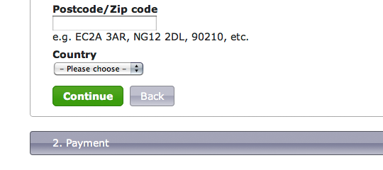

* Something that can work very well in this context is partial validation of the input. This screenshot from a Stackoverflow conversation illustrates how the overall progress and validity of data can be shown very clearly on each section header.[^stackexch_errors-in-tabbed-form]

User DaveAlger stresses another advantage of accordions over horizontal tabs: "In some cultures the far right tab is considered first but in no cultures is the item at the very bottom considered to be first or most important." [^stackexch_errors-in-tabbed-form]

## Tabs and progress bar steps

There are multiple distinct ways to split a form's content into tabs:
* horizontal tabs
* vertical tabs

They commonly look like
* drawers
* or steps on a progress bar

And they can hold
* form pages
* different forms
* a subset of fields inside a form

*Horizontal tabs looking like drawers holding a subset of fields inside a form*[^web-form-design_279]

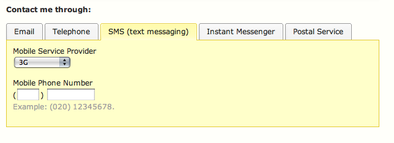

While visually similar the concept of tabs might be used for vastly different reasons - they could separate...
* distinctly different features of a software (Design Customization, Sending E-Mail, User Management),
* sections of the same feature or form (Question Settings, Feedback, Hints),
* a step in a process (Shipping Address, Billing Address, Payment Information,...)
* or an in place selection and replacement (switch between html, markdown or text-only editor to enter paragraphs of text)

Here is an example for splitting options for the same object over multiple tabs in the ILIAS 9 test question creation:

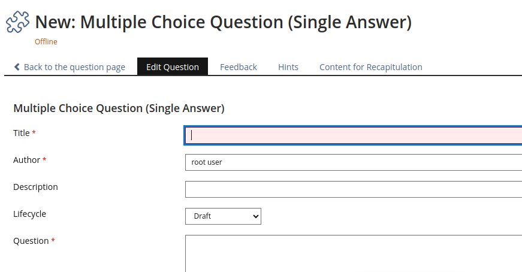

Jamie Holst illustrates some common challenges of tabbed forms with related tabs by writing out the questions a potential user could have:[^baymard_accordion-ux]

> * “Do I need to save the changes before I open another tab?”
> * “Is it only the options that I’m currently seeing that will be submitted or will it submit all sections (including the ‘collapsed’ ones)?” (i.e. is it a partial or a “full” submit)
> * “Will clicking one of the other sections cause the page to reload, and if so, will the other entered data be persisted?”

*Example from the classic Gmail interface: It's unclear if only this tab will be sumbitted and wether input is lost when switching the tab*[^baymard_accordion-ux]

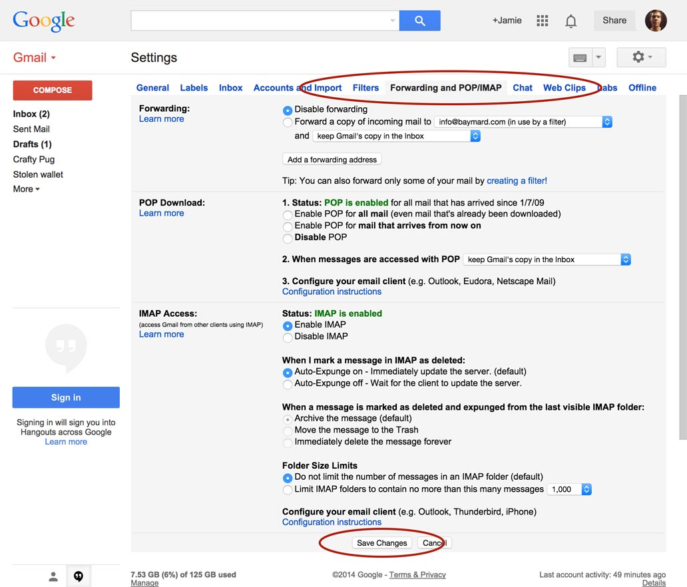

Interestingly, this issue has rarely been reported in ILIAS. Maybe the form headline makes it sufficiently clear that the form is a self contained entity within a single tab drawer? Maybe ILIAS forms are so long that the users forget about the tabs at the top and don't assume that they could ever be sections of the same form? We might stumble into this challenge if we further reduce the number of options in a settings form.

Here are the results and conclusions from user testing (mostly inline) tabs:

### Advantages

* Tabs provide a really good overview as they "present not only the initial set of options, but also provide a strong indicator of the current selection."[^web-form-design_280]
* Good choice "when users don't need to see content from multiple tabs simultaneously."[^nielsen_tabs]
* They are effective in "hiding irrelevant form controls from people until they need[] them."[^web-form-design_283]

### Disadvantages

* "With inline accordions and tab-style forms, users often can’t tell if the “sheets” are mutually exclusive"[^baymard_accordion-ux]

### Specific to horizontal tabs

* "many people move from top to bottom and, as a result, may ignore horizontal options."[^web-form-design_280]
* "eye-tracking data indicated that other designs were easier to process. This may have been due to the extra effort involved in scanning across the page to read the tabs."[^web-form-design_281]

### Specific to vertical tabs

* "if the content is mutually exclusive, then use the standard UI element designed to indicate this: radio buttons. These can be integrated into a tab-like design, but it’s important that the radio buttons are an integrated part of that as they clearly set user expectations."[^baymard_accordion-ux]
* "vertical tabs score better on satisfaction, eye-tracking metrics, and time to completion, my inclination is to prefer them to horizontal tabs"[^web-form-design_285]

*Best Buy uses radio buttons in vertical tabs to clarify that the options are mutually exclusive*[^baymard_accordion-ux]

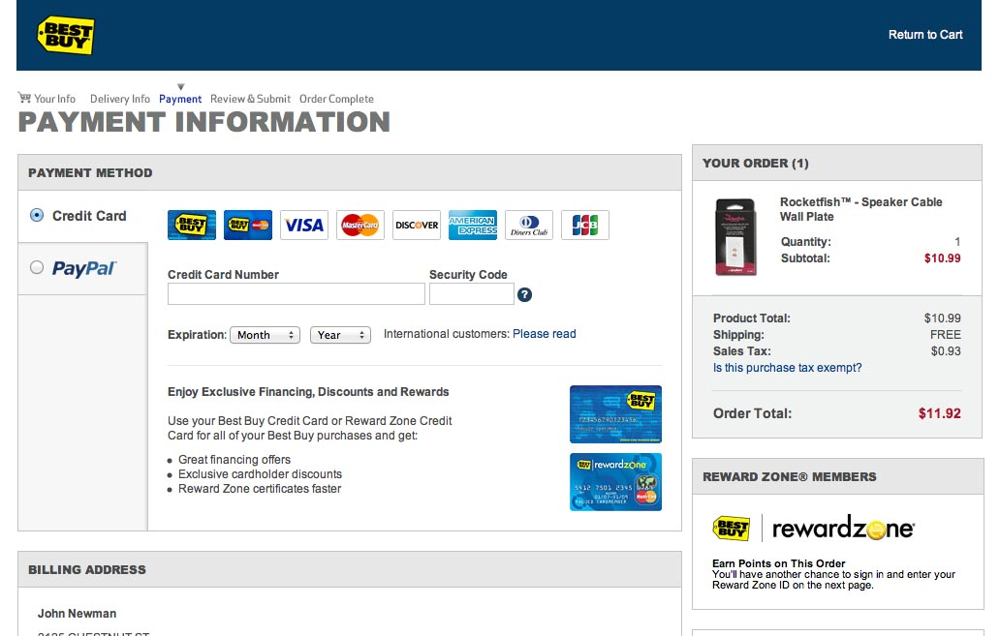

### Specific to steps on progress bars

When using tabs for a step by step process, they often look less like tabs. They appear to be sections of a progress bar, but often remain functionally the same. Some e-commerce checkouts even allow filling out tabs in any order despite a prominently visible numbering.

Due to the sequential nature, numbered steps make clear that they are not exclusive, but every single applicable tab needs to be filled out.

*WordPress Plugin Multi-Step Checkout for WooCommerce by Silyk Press*

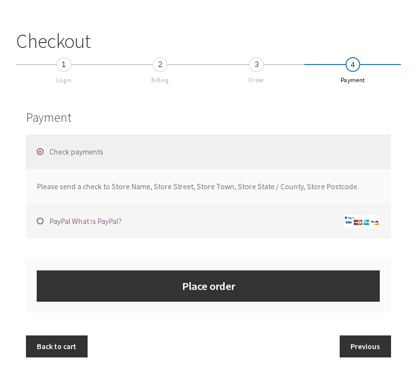

## Form pages (and wizards)

Long forms could be split into multiple pages without a tab navigation or clickable progress bar. Depending on a first selection, the form would branch to the related page(s). 

* hides optional and advanced sections by skipping their page if they aren't specifically triggered
* "[individual steps] are less overwhelming from a usability standpoint, with fewer requirements being demanded of the user at any given time."[^seek-blog_switch-to-wizard]
* "page-level selection performed averagely. It achieved average satisfaction scores, a relatively low number of errors, and faired well on eye-tracking measures"[^web-form-design_278]
* "lack of scroll translates perfectly to mobile device screens and provides a cleaner interface with fewer distractions."[^seek-blog_switch-to-wizard]
* the user might complete the form completely unaware that some branches and pages exist. This is good for end-users fulfilling info prompts, bad for admins that want to know about every advanced setting in the system.

*A wizard showing single or few fields per step*[^seek-blog_switch-to-wizard]

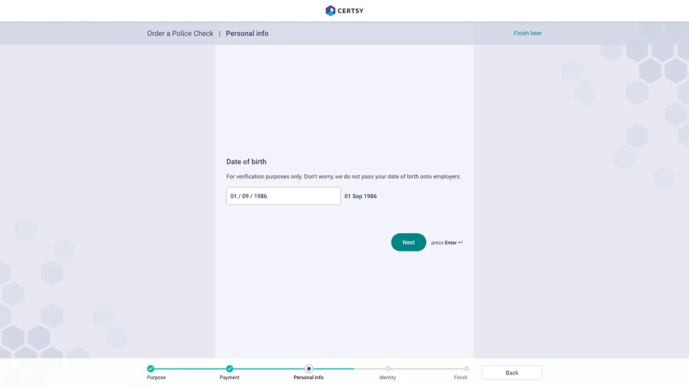

### Conversational forms

A special type of form wizards are so called conversational forms that would more or less mimic a chat-like interaction. As with wizards, the "chatbot" would just skip irrelevant questions.

* "This interactive approach keeps users engaged and encourages their active participation, leading to higher completion rates."[^johnson_conversational-forms]
* This more conversational style can, in a very friendly tone, "provide immediate feedback and validation, notifying users of errors or missing information in real-time"[^johnson_conversational-forms]
* "conversational forms limit users’ ability to scan and review the entire form at once."[^johnson_conversational-forms]

## Editing and viewing mode

Some apps and websites show form data in a more condensed viewing mode as an entry point for editing one, some or all fields.

In this example from LinkedIn, editing fields can be triggered by hovering over the data and then clicking on an edit icon. This will replace the entire section with the corresponding form fields:[^webapphuddle_inline-edit]

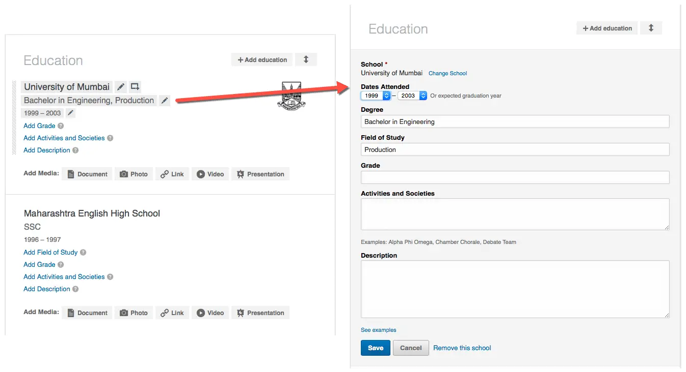

In the 2009 version of the Apple Checkout process, sections of the form were rendered in a condensed viewing mode whenever you move on to the next accordion section. In these two screenshots you can see how the shipping sections first contains fields, but then displays a summary when you move on:[^lukew_apple-checkout]

Advantage of using viewing mode:

* "if the web application is supposed to display data [...] it is hard to avoid"[^webapphuddle_inline-edit]
* solves the issue with vertical accordions because there is no doubt that the data has been saved.[^baymard_accordion-ux]
* the view mode summary could omit labels where they are clearly implied ("first name: Bob, last name: Smith" simply becomes "Bob Smith") or even hide empty or advanced inputs entirely.

Advantage of always showing editable fields:

* "there is no confusion of what can be edited, no need to discover anything and no so called friction."[^webapphuddle_inline-edit]

## Sub-forms in modals

Sometimes when information is delivered by a view mode, the sub-form is displayed in a modal pop-over.

Here is an extreme example from apple, where the "labels" and field groups are large cards triggering a modal which contains one or more corresponding form fields. A long form with all account related fields is never shown.

*Screenshots of the Apple ID website:*[^alphr_forgot-aplle-id]

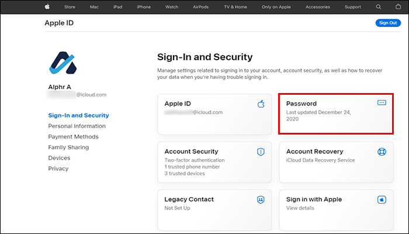

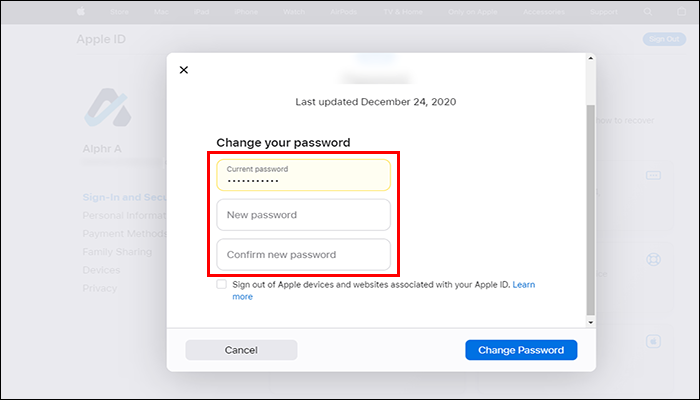

There are a few things to consider when using modals for sections of a form:

* "If you need to expose a large number of additional inputs, consider using an overlay instead of exposing them inline to avoid page jumping and disorientation."[^web-form-design_270]
* a modal should not cover up anything the user might still want to reference - sidebars and accordions might do a better job in that case.
* if context is lost it's "hard for users to know where they are and what’s going on, especially those with cognitive disabilities"[^ux_matters_designing-forms]
* it should be very easy to save and close the modal.[^web-form-design_270]

# Possible solutions for ILIAS

With all these observations, user testings and best practices in mind, let's think about which elements are the most promising to consider when optimizing ILIAS.

## Switchable and optional group UI component

ILIAS 9 has UI components called Optional Group and Switchable Group that can reveal further input fields when a checkbox or radio button is ticked.

This approach had one of the highest satisfaction ratings in Etre's user testing and it's a component that we can use in non-legacy forms right now.

Whenever we move forms from legacy code to the UI framework, we should probably consider moving some fields into Optional and Switchable Groups.

An interesting edge case are important fields that are related to optional/advanced fields hidden away in such Groups. For example, a checkbox "exclude this question from point evaluation" could be considered an important input for a test question and therefor be near the top of the form. However, further down, an Optional Group "advanced evaluation settings" could get back to the same topic - but now these two related settings are spread apart. Mockups and user testing might be required to come up with clear guidelines of how such situations could be handled best.

## Wizards for filling out in sequence

The Creation user intent could highly benefit from simple step by step wizards. Many service providers and institutions already add paged form sequences to their plugins.

A wizard could advanced (or simply currently irrelevant) settings if they are not triggered or completely reserve them for the settings screen of the created object.

This way, new users have a much more guided experience creating their first objects in ILIAS and experienced users might still choose to use the wizards when they know that they only need to focus on the most basic settings.

## Distinguish between front-end and admin forms

There is a huge difference in user intent between information prompts and adjusting administrative settings.

While both need the same type of components input fields, checkboxes etc.

## Optimized for viewing and checking

## Multi-column approaches

There are also some settings in ILIAS which are just not following the mental model most users expect. To change the sorting of repository elements in a category, ILIAS displays this quite spacious switchable group:

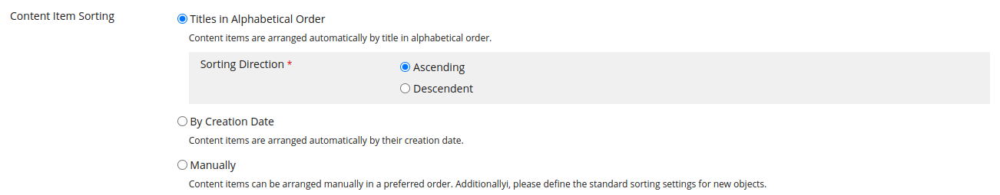

Compare this to a View Control which would take significantly less space and is intuitively understood by most users:

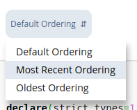

[^intro-user-graph]: Ciprian Borodescu. A gentle introduction to orchestrating intelligent journeys with User Intent Graphs. February 13, 2022 https://uxdesign.cc/a-gentle-introduction-to-orchestrating-intelligent-journeys-with-user-intent-graphs-503192a637e2 visited November 29, 2023.
[^nielsen_mental-models]: Jakob Nielsen. Mental Models. nngroup.com. October 17, 2010. https://www.nngroup.com/articles/mental-models/ visited November 29, 2023.
[^interaction-design_affordance]: Interaction Design Foundation - IxDF. (2016, September 13). What are Affordances?. Interaction Design Foundation - IxDF. https://www.interaction-design.org/literature/topics/affordances visited December 5, 2023
[^designlabs_tricks]: Designlab.com. Form UI Design: 36 Tips & Best Practices. June 16, 2022. https://designlab.com/blog/form-ui-design-best-practices/ visited November 29, 2023.
[^web-form-design_ebay]: Luke Wroblewski. Web Form Design - Filling in the Blanks. Rosenfeld Media. Brooklyn, New York. 2008; p. 233.
[^dhis2-doc]: DHIS2 Documentation. Forms. https://ui.dhis2.nu/principles/forms/ visited November 29, 2023.
[^web-form-design_318]: Wroblewski. Web Form Design - Filling in the Blanks. p. 318.
[^web-form-design_320]: Wroblewski. Web Form Design - Filling in the Blanks. p. 320.
[^conditional-form-field]: Dustin Horstmann. Conditional Form Field with Bootstrap. February 26, 2018. https://codepen.io/horstmannd/pen/jZeXev screen recording from November 29, 2023.
[^web-form-design_286]: Wroblewski. Web Form Design - Filling in the Blanks. p. 286.
[^web-form-design_287]: Wroblewski. Web Form Design - Filling in the Blanks. p. 287.
[^testing-accordion-forms]: Luke Wroblewski. Testing Accordion Forms. A List Apart - Issue 314. September 21, 2010. https://alistapart.com/article/testing-accordion-forms/ visited on December 4, 2023.
[^baymard_accordion-ux]: Jamie Holst. Accordion UX: The Pitfalls of Inline Accordion and Tab Designs. Baymard Institute. October 21, 2014 https://baymard.com/blog/accordion-and-tab-design visited December 4, 2023.
[^baymard_accordion-checkout]: Christian Holst. Accordion Style Checkouts – The Holy Grail of Checkout Usability?. September 18, 2012
[^stackexch_errors-in-tabbed-form]: Stackexchange users. Best way to display contextual user entry errors in a tabbed html form. https://ux.stackexchange.com/questions/68415/best-way-to-display-contextual-user-entry-errors-in-a-tabbed-html-form visited December 4, 2023.
[^web-form-design_279]: Wroblewski. Web Form Design - Filling in the Blanks. p. 279.
[^web-form-design_280]: Wroblewski. Web Form Design - Filling in the Blanks. p. 280.
[^web-form-design_283]: Wroblewski. Web Form Design - Filling in the Blanks. p. 283.
[^web-form-design_281]: Wroblewski. Web Form Design - Filling in the Blanks. p. 281.
[^nielsen_tabs]: Jakob Nielsen. Tabs, Used Right. nngroup.com. July 9, 2016. https://www.nngroup.com/articles/tabs-used-right/ visited December 6, 2023.
[^web-form-design_285]: Wroblewski. Web Form Design - Filling in the Blanks. p. 285.
[^web-form-design_278]: Wroblewski. Web Form Design - Filling in the Blanks. p. 278.
[^seek-blog_switch-to-wizard]: Brooke Nankin. Complex Forms Made Simple. SEEK blog on medium. August 31, 2021. https://medium.com/seek-blog/complex-forms-made-simple-50754a68a6e2 visited December 5, 2023.
[^webapphuddle_inline-edit]: Abhijit Rawool. How to Properly Design Inline Edit Feature in Web Applications. https://webapphuddle.com/inline-edit-design/ visited December 6, 2023
[^lukew_apple-checkout]: Luke Wroblewski. The Apple Store's Checkout Form Redesign. Lukew.com. December 16, 2009 https://www.lukew.com/ff/entry.asp?968 visited December 6, 2023
[^johnson_conversational-forms]: Johnson Lawrence. Conversational Forms: The Future of Forms. Medium. June 2, 2023. https://medium.com/@onajijohnson1/conversational-forms-the-future-of-forms-cbda1026e369 visited December 6, 2023
[^ux_matters_designing-forms]: Jessica Enders. Designing UX: Forms. UX Matters. May 22, 2017. https://www.uxmatters.com/mt/archives/2017/05/designing-ux-forms.php visited December 6, 2023
[^alphr_forgot-aplle-id]: Lee Stanton. Forgot Your Apple ID Email Address?. Alphr. August 8, 2022. https://www.alphr.com/forgot-apple-id-email-address/ visited December 6, 2023
[^web-form-design_270]: Wroblewski. Web Form Design - Filling in the Blanks. p. 270.