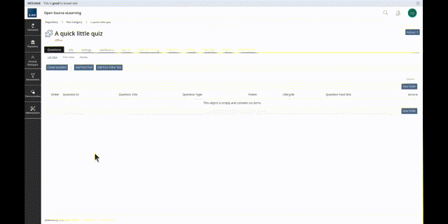
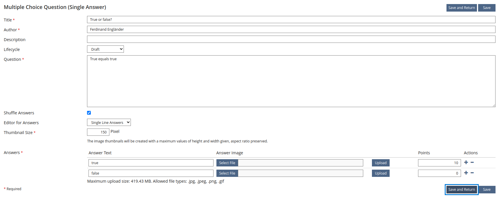
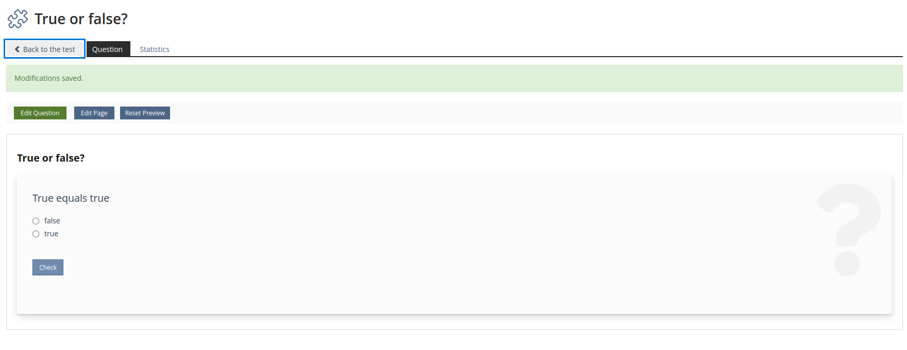
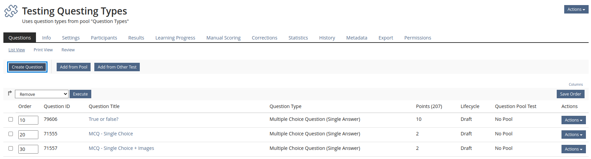
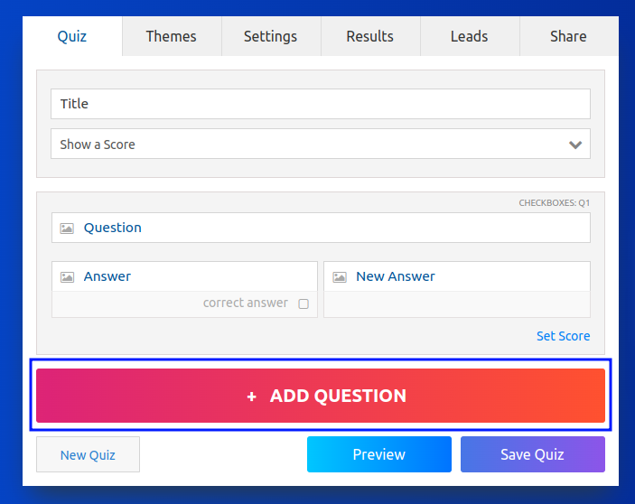
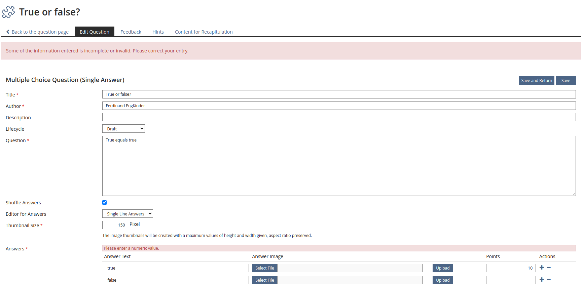
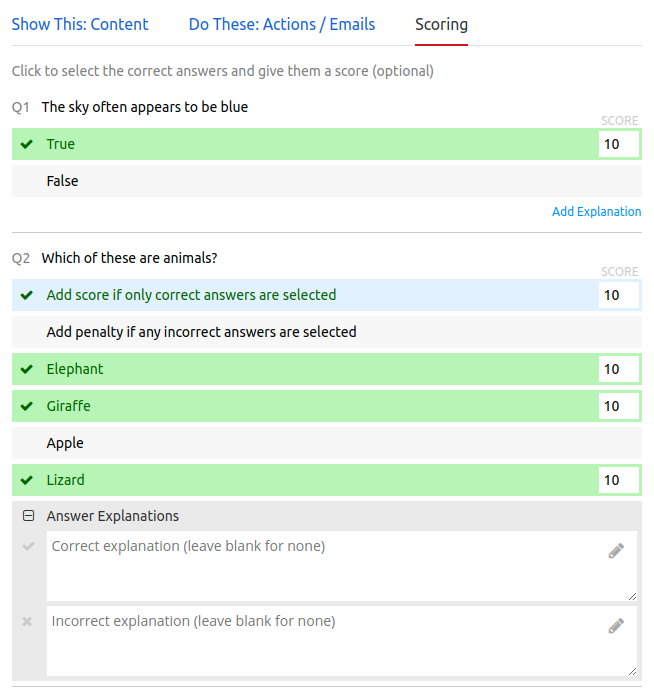
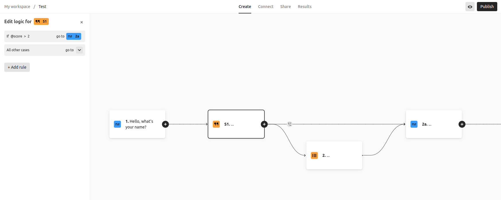
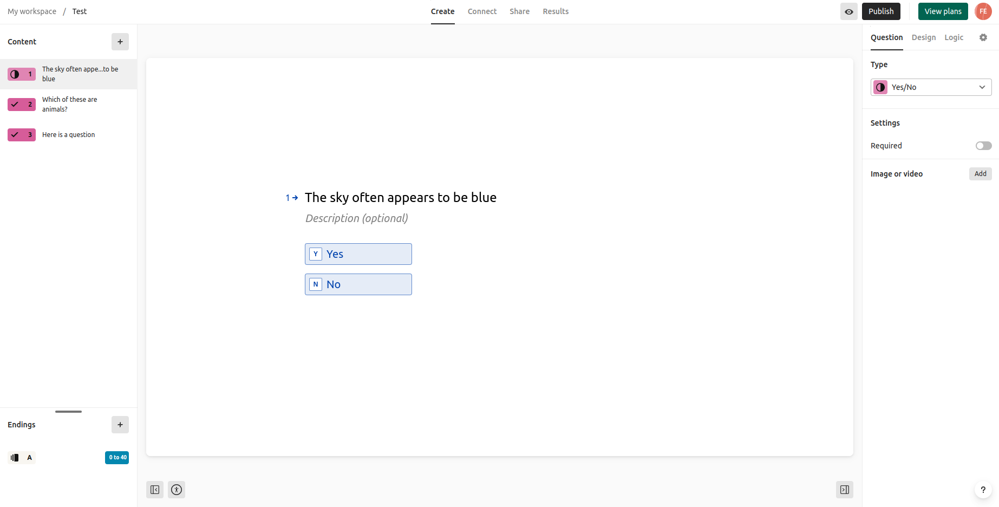
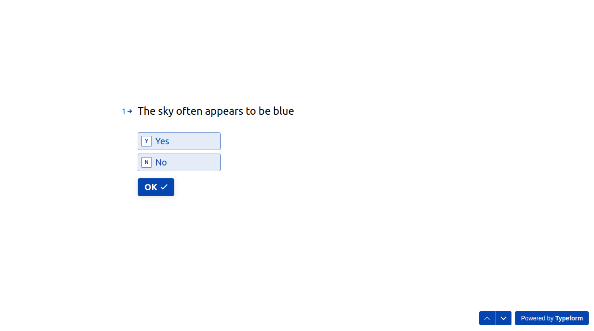

# Report: Creating Question (ILIAS Test & Assessment)

The ILIAS Test & Assessment is a core feature for many institutions and businesses that use ILIAS to train and evaluate students, employees and other learners.

ILIAS offers many different types of questions and a lot of options to create complex tests uniquely tailored to individual needs. The downside of such a powerful set of features is that navigating through many settings and views can be overwhelming and time consuming.

In this report we analyze the current state of the question creation process and make suggestions on how to make it more intuitive and efficient.

## User feedback

An E-Assesment conducted by ILIAS NRW among teaching staff of universities with 326 evaluated submissions gives us good insights on how the Test & Assessment Center is currently perceived (Report and Presentation is in German): https://www.ilias.nrw/goto.php?target=cat_212

Here are some user voices from the PDF report highlighting room for optimization with regards to question creation (English translation has been added):
* "Die Erstellung von Lückentextfragen ist nicht sehr benutzerfreundlich." (p. 22) / "The creation of Cloze Questions (fill in the blank questions) is not very user friendly."
* "Anlegen der [Single Choice] Frage recht kompliziert." (p. 23) / "Creation of Single Answer and Multiple Answer Questions is quite complicated."
* "Der Editor ist sehr hakelig (gilt für alle Fragetypen)." (p. 28) / "The editor is very finicky (all question types)."
* "Zu aufwändig zu nutzen, alle Tests in ILIAS." (p. 28) / "Requires too much effort to use (all Tests in ILIAS)."

One of the recommendations in the report is that the offered information material and support could be extended (p. 26). However, as this paper will demonstrate, there might be many issues we could solve with a more self-explanatory, intuitive interface design.

## General discontent

The voices we are most interested in for this paper, are the ones that claim the ILIAS Test & Assessment is "complicated" or requires "too much effort" in general.

Complaints about details can be made into feature requests or issue reports, but a general discontent is much harder to address.

To get behind how we could improve the user's general satisfaction we will:
* use the amount of clicks and page loads as a measurable metric for friction in the interface
* look for UI/UX principles helping us to put issues and solutions into clear words
* analyze why creating questions in other quiz builder tools feels more effortless
* draw conclusions and make recommendations for how to improve the creation of questions in ILIAS

## Every click matters

When looking at other tools that can create questions for an interactive test or quiz, it's striking that ILIAS not only requires the most amount of clicks to get the job done, but is also the tool that most frequently replaces the majority of its interface content (e.g. refreshes or shows a new view or tab).

In the table below we counted clicks and view changes when:

* starting on the overview screen of an empty test or quiz
* creating one single choice true/false question
* creating one multiple choice question with four options
* assigning 10 points to the every single correct answer option (or if assigning points to a single answer option is not possible, 10 points for passing the question)
* ending on the overview screen

Screen recordings of the question creation in ILIAS and on Quiz-Maker.com:




| Tool            | Click Count | Change of View | Set 10 points for correct answers  |
| --------------- | ----------- | -------------- | ---------------------------------- |
| ILIAS           | 33          | 8              | possible                           |
| Typeform        | 19          | 3              | possible                           |
| Quiz-Maker.com  | 18          | 3              | possible                           |
| EasyTestMaker   | 18          | 4              | only for overall correct/incorrect |
| H5P             | 16          | 0              | not possible                       |
| Articulate Rise | 13 - 16     | 0              | not possible                       |

H5P, Rise, and EasyTestMake miss a feature to assign custom point values to single answer options (if they did, it would most likely require 3 - 6 more clicks).

Quiz-Maker, EasyTestMaker, and Typeform have true/false or yes/no as a default option for a question with two choices. This saves 2 clicks as they didn't need to be changed. 

We only looked at the most simple question types as these are the most comparable across all the apps.

While a high click count is not necessarily frustrating for the user, replacing the entire view 8 times (complete page loads in the case of ILIAS) does demand a short re-orientation that can be mentally taxing and break the flow of work if it adds up for dozens of questions.

Going rapidly back and forth between the same views with a full page load is especially noticeable, as UX designer Jared Spool concludes in [this article.](https://articles.centercentre.com/refresh-or-not/)

## Helpful UI/UX principles

Fortunately, we can turn to established UI and UX guidelines that have proven useful to improve the usability of software:

### User Intent

Knowing what precisely a user wants to do in any given view helps us to support them more accurately by showing the elements they are likely looking for more prominently.

The challenge during test creation is that the user's needs may change depending on their current focus.

### Mental Model

Users bring expectations of how an interface should work. These mental models are shaped by interfaces from other apps that they have used before.

In the E-Assessment by ILIAS NRW some participants mention interfaces they like more (H5P and even some specific question types) and criticize broken drag and drop functionality because of previously shaped mental models.

### Miller's Law

Miller’s Law states that immediate memory capacity of an average person is limited to approximately seven items. Interestingly, single items can be divided into chunks, which are then seen as one item (which is why 368120947 is harder to memorize than 368 120 947).

The consequence for interface design is that we need to find groups of elements that the brain can process as one semantic unit to improve clarity and avoid overwhelming noise.

During question creation users mostly see forms with very little visual weighting. Obscure, advanced options are presented just as visibly as mandatory frequently used fields.

## Core issues

### No flow during question creation

Sometimes the authors of tests have to enter dozens of questions. However, in its current state, the interface requires many clicks and view changes that slow the user down or interrupt their focus.

For example, to finish one question and create another the user has to:
* finish the question with a click on "save and return" in form actions
  


* exit the preview by clicking on "Back to the Test" in sub tabs



* click on "Create Question" in Questions overview page



That's three clicks in three different locations across three views. That's far too many for a user intent that we can be relatively certain of: most of the time when a user creates one question, they also want to create another one immidetately after.

Compare this to Quiz-Maker.com where creating a new question is always possible at the bottom of the view and you never need to indicate that you are done editing a question:



!!! Additionally, there is no pop-up, validation error messages concerning the user input in Quiz-Maker on this screen. Rather, errors are neatly marked to be reviewed.

In ILIAS, if you forget to add "0" as a point value for the incorrect answers, the resulting error causes the page to reload and scroll up, which is quite jarring to a user needing to enter many questions.

When submitting a question, EasyTestMaker asks for a modal of the next question type that the user would like to use. An extra click is only necessary when you are done with the very last question.



The goal should be to allow a flow state, where the interface is an unobtrusive room for the user's thoughts, rather than causing them to think about the interface itself. Loosing your position in an unexpected way does not feel like a smooth user experience at all.

### Using the keyboard

While keyboard navigation in ILIAS is technically possible, it is far from being a pleasant experience. After every page reload the keyboard focus tabbing begins all the way at the top in the breadcrumb bar, which is not at all relevant to a user wanting to blaze through the input of many questions.

We believe that a fluent and consistent keyboard support can make the input of many questions a lot easier, as moving the hand from keyboard to mouse repeatedly can be perceived as friction for the user experience.

In Quiz Maker, keyboard focus is automatically set to the question text after creating a new question, which feels very natural and saves a click (and in ILIAS would save many keyboard tabs).

### Feature overload

Because ILIAS supports many different use cases, there are many features that might not be relevant for most user intents. ILIAS often shows these features with the same visual priority or even requires an input. Additionally, it seems that some very prominent features are not used in a way that could unfold their full potential.

There is a field to change the author's name for a question as one of the first and therefore most visible form fields. While there might be use cases (entering questions on a professor's behalf or marking co-authorship) it would make much more sense to change the author name once for all following operations thereafter. Changing the author's name for each new question manually adds to the already large click count.

!!! The Lifecycle field that marks the approval status of a question would be most useful as a bulk operation in an overview screen, or an approval mode to quickly approve or disapprove an entire question set. Setting all questions to "Final" during creation is a huge waste of time, as questions set to "Draft" appear in the quiz anyway.

In our research, we noticed that some tools (Quiz-Maker, Typeform) keep scoring hidden from the average user and just award answers marked as correct with 1 point unless otherwise specified in an optional second step.

While skipping the scoring step is probably not suitable for setting up a complex exam, it can greatly speed up some use cases. The creation of little brain teaser tests that someone might want to add to a learning sequence, or at the end of a live lesson, would greatly benefit from a more simplified scoring option.

The features that are separated in sub-tabs from the core question input do not always benefit from this separation. While some users might prefer to enter feedback texts separately from the answer options, there are also advantages to having such a field right in the vicinity. While an author thinks of an incorrect option, they often may have a feedback in mind that corresponds to it. To enter that feedback you would have to switch to yet another view.

ILIAS forms also currently do not have advanced sections that can be collapsed and expanded, or fields and buttons that will only show up once certain fields are selected.

### Preview disconnected from creation

After a question has been created with a click on "Save and Return", the user does not actually return to a previous view, but is directed to a preview of the question.

While previewing the test is a valid user intent at some point in the process, an author who is creating many questions in a row might feel bothered by being repeatedly forced to click out of the preview.

## Inspiration from other apps

### Flow state

Due to limited screen space, many good mobile apps have mastered how to optimize interfaces by minimizing the amount of options shown at one time and leading users through multiple views with ease.

If you learn a language in Duolingo or create a rental on Airbnb you are guided in many little steps through onboardings, wizards, and bite sized prompts. The screens with the most options are usually setting or selection screens, probing for the user intent. The actual work process is then done step by step in very minimal interfaces.

Even on larger desktop screens, there are many use cases for minimal interfaces: Distraction free text editors are very popular among writers and programmers. Project management software like Asana, Trello, Notion, and Active Collab work with quite complex entities with many properties, but show reduced versions and simplified input forms in most views.

Markdown based presentation tools like Reveal.js or Marp, and the pitch deck service Slidebean, separate content creation from design as a distinct two-step process. This way the user can focus fully on either writing or design (and their distinctly different user intents and mental models) and doesn't have to jump back and forth between both like the way it is generally done in programs like Power Point.

We believe that there are two things from these examples that we should re-create in ILIAS:
* reducing and segmenting the interface where it feels natural and smooth to the user (and vice versa - combining steps that the user would expect to be combined)
* taking inspiration from data entry, focused writing, and markdown-based tools, that allow a flow state when entering large amounts of texts without ever interrupting the user with unnecessary obstacles.

### Decoupling scoring from question creation

Notably, Typeform and Quiz-Maker have a whole separate view for assigning point scores and assessment logic. It's an extra step meant to be done after the input of all questions is complete.


*Adding scores and feedback in Quiz-Maker*

In Typeform this is especially needed, as branching paths can be set up in a mind-map style editor, and all settings related to the logic are separated from the content creation.


*Logic Editor in Typeform*

Given that ILIAS is meant to design exams, we might want to consider building a view that is specialized on helping authors with the intent to set up complex scoring concepts and logic.

### WYSIWYG makes preview steps unnecessary

Typeform questions look (almost) exactly the same during editing as they look to the user taking the test. This makes a preview step obsolete.

### Constant overview

Typeform and Rise show a sidebar with all questions. Quiz-Maker and H5P display all questions on one page. This makes going back to an overview screen, which you are constantly forced to do in ILIAS, unnecessary.

### Fast keyboard navigation

While Quiz-Maker is severely lacking in accessibility otherwise, keyboard input inside a question works exceptionally well:

Right after the question type is selected, the question text field automatically gets keyboard focus - this saves many clicks and contributes greatly to a feeling of flow.

Tabbing to the last answer option text field adds another answer option automatically. To leave out another answer option, it can just be left blank.

In ILIAS you have to focus on and then press plus and minus buttons to add and remove answer options, and then tab forward to enter their text fields. This feels very clunky.

## Improvements to current implementation

### Minimizing page loads

There are page loads and view changes we can avoid right now to support the user intent of adding many questions:

!!! To skip over the (for this user intent - annoying) preview and overview screens. During the creation of many questions there could be a "Save and Create New Question" button at the end of the question form.

Furthermore the "Save and Return" button should be re-labeled as "Save and Preview" to make clear where the user will end up.

### Point validation and default values

When leaving the point field for scoring an answer blank, the page reloads with an error message. The author sees part of the error at the top, but then has to scroll down to find the error in the actual field, which feels quite jarring.

It would be better if the field could be marked without a page reload as long as the input is invalid.

Additionally, one could argue that leaving the field blank already indicated the user's intent to score this answer with 0 points, and the error is due to a misinterpretation. Therefore, 0 could be the default value of the point input field.

### Overview during question creation

The ILIAS test can already show a table of contents question list during the test. If we showed this list during question creation, and even allowed for adding questions with a button, most users would likely not want to return to the overview screen.

The overview screen could then be specialized to better fulfill the user intent of managing users - e.g. bulk setting the author field or (in the question pool) assigning and changing the taxonomy tags of many questions at once.

### Hide and optimize advanced features

We should further investigate which fields are rarely used or don't really have a concept behind them. For example:

#### Author Field

While you can set an author's name, which is shown very prominently at the beginning of each question, you can neither filter for it, nor do bulk operations based on it. We should either add features that make this information actually usable or consider removing it from one of the most visible places of the form.

#### Thumbnail Size

Prompting the user to enter thumbnail sizes in pixels is bad practice for mobile responsiveness. Making images look nice in the test is not something that should be on our user's mind. Instead the test styling should automatically deal with images, while the upload itself should reject unreasonably large files.

#### Semantic groupings and hiding

Right now, the forms barely show any chunks that the brain could categorize as a group of connected options, and there is not much visual distinction between options - both small and very impactful options take one line of the form.

While this would require a whole development and design process beyond the scope of this document, we suspect that there are two promising approaches to continue with:

* The existing form group capabilities could help to split the form into clear sections (e.g. Question, Answer Configuration, Answer Options). While it will add to the length of the page, it might help the brain to feel less overwhelmed (see Miller's law).
* Quiz-Maker makes extensive use of showing additional elements only on mouse hover or keyboard focus. We believe that some smart hiding of fields until their parent or sibling field is selected could greatly reduce how intimidating creating questions in ILIAS feels.

These improvements would be in line with Miller's law, trying to limit the amount of semantic chunks to around 7.

### Keyboard navigation is a feature not an accessibility afterthought

None of the quiz and exam tools we looked at for this paper were 100% keyboard accessible - with ILIAS actually being the one where most buttons and fields were technically reachable via keyboard. In most of the others, keyboard tabbing was eventually stuck (Easy Test Maker), important buttons could not be selected (Quiz-Maker), or the keyboard focus was not even visible (Rise).

However, since question creation requires so many steps authors have to repeat over and over again, we believe that a good keyboard support could be a helpful, core feature.

As mentioned above, Quiz-Maker is giving us a sneak peak of how wonderful speeding through questions with the keyboard could feel. Automatically passing the focus to the question text field after adding a question, or offering another answer option field automatically when the last of a repeating group of fields has been reached can reduce friction when done right.


Typeform selects the entire text of an answer field when you focus on it, which saves a click if the user intended to write a completely new answer.

Since we have to pay close attention to keyboard accessibility in ILIAS, we might as well refine it so that anyone has the option to use the keyboard when navigating with the mouse would take more time.

## Overall Approach

If we want to go beyond mere fixes and patches, we believe that the following approaches would be promising options for an overhauled and all around improved user experience during question creation:

### Markdown

A markdown editor has just been added to ILIAS as a UI component. Maybe markdown could be a suitable format to write down many questions in one flow without being interrupted by any page reloads or view changes.

The basics of markdown feel quite intuitive. Instead of picking formatting options from a menu or buttons, the user puts control syntax into the text that change how the text is later rendered.

```markdown
# This would be a headline

This would just be a normal paragraph of text leading into some bullet points:
* This is a bullet point
* And here is another bullet points
```

Here is a possible question syntax taken from [text2qti](https://github.com/gpoore/text2qti):

```markdown
1.  What is 2+3?
a)  6
b)  1
*c) 5

1.  Which of the following are dinosaurs?
[ ] Woolly mammoth
[*] Tyrannosaurus rex
[*] Triceratops
[ ] Smilodon fatalis
```

#### Pros

* A simple quiz is very readable in markdown.
* There are some existing projects we could choose to build on:
  * https://github.com/bonartm/quizdown-js/
  * https://github.com/gpoore/text2qti
* A stand-alone version of this markdown parser that works without ILIAS could bring in more users and more developers for this part of ILIAS.

#### Cons

* While markdown is popular among programmers, most ILIAS users will most likely never have heard of it.
* Even if you know markdown, you still have to learn additional syntax, especially for scoring and feedback logic. Maybe some good auto-complete suggestions can nudge new users in the right direction, but some of it will not be self-explanatory.
* While writing the markdown might feel frictionless, having to hunt for errors later when markdown parsing fails might be a very frustrating experience.

### Full WYSIWYG

Typeform feels very sleek and modern because of two very impactful concepts:
* They split up options into very distinct areas of their interface, one view or tab per user intent.
* The area where you enter the question looks almost exactly how it will look for the test participant ("What You See is What You Get" approach, WYSIWYG for short).

This is the question in the editor:



This is the question in their player:



Interfaces like this are quite doable in modern HTML5 [using the contenteditable property for divs.](https://medium.com/@jitubutwal144/three-different-ways-to-build-inline-content-editor-using-javascrpit-d58c2edac9cb)

You might be wondering if we could fit all the advanced options that ILIAS offers into a WYSIWYG interface. Quiz-Maker shows us how this could be possible: When you focus or hover on certain areas, more options become visible.


This is quite a modern way of tucking away options, which is rarely used in ILIAS. The question creation might be an excellent area to experiment with this kind of dynamic interface.

#### Pros

* No more need to switch to a preview screen (in ILIAS 8, questions are rendered in 3 different ways, this would increase a feeling of familiarity in all parts of the process).
* Modern WYSIWYG UI concepts align with mental models people are used to from mobile apps.
* The page editor could benefit from a WYSIWYG input field for text.

#### Cons

* Not all options would be visible at once - some ILIAS users have gotten used to that.
* This would stand out from the other form-heavy configuration screens.
* Writing a good WYSIWYG is challenging. Here, a developer describes their [struggles with contenteditable](https://answerly.io/blog/my-pain-developing-a-WYSIWYG-editor-with-contenteditable/)

### Overview in slate & new form features

For this approach, we are staying in the world of ILIAS features and concepts that are already established. There are a number of tweaks we can do to greatly improve the interface without diving into drastically new kinds of interfaces:

* The slate is an already established tool to hold tables of contents and lists. It could permanently show the overview of all questions and the options to create new ones, making the need to constantly go back to an overview screen obsolete.
* The UI framework already offers switchable and optional groups that can show more form fields on selection. This could greatly reduce visual clutter and react dynamically to indicated user intents.
  * The feedback fields could be on the main question screen, but only show up when "add custom feedback text" is checked.
  * All answer options marked as correct could be automatically scored with 1 point, and only if the user checks "set custom point scores" do the areas for setting the point values need to be shown.
* Is it really necessary to offer simple text fields, a page editor area, and also the TinyMCE/markdown as an option to add content - can we reduce it to one?

Additionally, we could implement the following features without deviating from established ILIAS concepts too much:
* A new optional group type that doesn't use a checkbox, but rather a text field. If the text field is filled, more of the form is triggered to show up. This could be used to implement the automatic addition of another answer option seen in Quiz-Maker.
* The first form field could catch keyboard focus for screens that only consist of a form.
* There could be inline forms where form fields can be displayed next to each other, bundling strongly connected options together into one chunk.
* A question preview could be quickly shown and hidden as a modal.
* "Create Another Question" button/dropdown
* If true/false questions are a common use case, maybe there should be a question type specifically for it with reasonable default settings that save a few clicks.
* We should further explore which steps of the question creation should be merged into the slate or the question input form, and which ones should get or remain separated.
* We should consider overhauling question types that were heavily criticized in the ILIAS NRW survey (order, cloze, and formula questions).
* The drag and drop dependencies for order questions have not been updated for years. If we switch/modernize them, they should support touch drag and drop by default.
* Coming up with filters and use cases that give the Lifecycle and Author field a useful purpose.

#### Pros

* Everything builds on existing concepts and should feel familiar to ILIAS users.
* Other parts of ILIAS benefit from more general UI component features to the input forms.

#### Cons

* It will likely not feel as modern as a WYSIWYG interface.
* We are not forced to come up with something completely new, which will lead to compromises that might harm the user experience.

## Recommendation for the overall approach

From a design and UX standpoint, the author of this paper sees the biggest possible leap for the most frictionless UI in committing to a WYSIWYG interface. It could potentially feel the most modern and forces us to come up with a consistent concept, because we have to plan most aspects from scratch.

However, such a WYSIWYG approach is a huge undertaking that we might not be able to handle. A huge amount of resources for concept work, mockups, and implementation would be needed to tackle this properly.

While we think that the markdown concept is promising for users willing to learn a dedicated syntax, it's definitely a concept that requires learning and will feel old-fashioned for many users.

Consequently, the next best thing would be to work inside the concepts and UI components that already exist in ILIAS.

While we don't think that this approach will lead to revolutionary, never before seen interface ideas, adding to the slate and forms with carefully crafted concepts will deliver plenty of opportunities to make the input of questions feel easier, and reduce friction for all users.