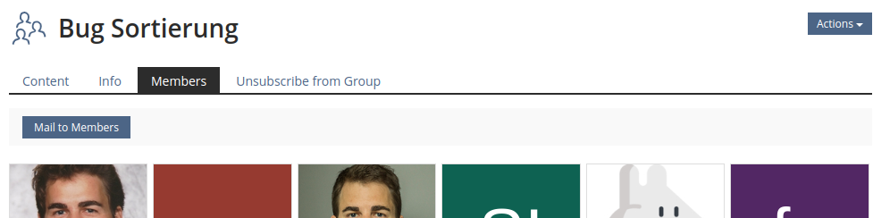

# ILIAS Toolbar - Functionalities and Recommendations

The `Toolbar` is a visual element that is used throughout ILIAS. As its name suggests,
it aims to bundle functionality that could come in handy for the current page. It is
located above the actual page content, but below the main navigational elements on the
pages.

Although the description and the appearance of the `Toolbar` seem to be simple, the
actual occurrences of the `Toolbar` show a  surprising variety of uses and offered
funtionality. This paper attempts to give an overview of this variety and derive
recommondations for improvements of the `Toolbar` or alternative locations for the
provided functionality.

## Groups of Functionality in the `Toolbar`

The general functionality of the `Toolbar` can be grouped into four categories.
`Toolbar`s may contain functionality from all groups, mostly presented as standard
buttons. Sometimes, functionality is presented by a primary button, if it is deamed
the most important functionality on the page. Sometimes functionality is grouped
with spacings or bars, so that the `Toolbar` consists of different semantic groups.

### Actions

Actions allow the user to directly modify or initialize modifications on the data
that is displayed below the `Toolbar`. The occurences of the `Toolbar` that have been
investigated for this reports contained the following actions:

* manage or change a connected status or attribute (e.g. "Mark as Completed" in the LSO)
* submit or suspend a certain input mode (e.g. "Suspend the Test" in the Test)
* change or activate a feature or setting (e.g. "Activate Translation for Page Editing"
  in the Category)
* create sub-items (e.g. "Create Appointment" in the Calendar)
* edit this item or view (e.g. "Customize Page" in the Category)
* join with a specific role (e.g. "Add yourself as appraisee to this survey")

### Bulk Actions

Bulk actions allow users to directly modify or initialize modifications on multiple
datasets presented below the `Toolbar`, or even just located below the currently
viewed object. Examples from the investigated occurences are:

* import (Users in Local User Administration)
* message many (mail to group members)
* process multiple sub-items individually (copy, move, delete, mark)
* save a coordinated change on multiple sub-items (save sort order)
* change applied didactic template

### Navigation

Navigation leads users to other ressources, such as other HTML-pages or files.
These links are always presented as buttons and mostly named as actions:

* download export (e.g. "Download [Event] Files")
* print (Notes, LSO kiosk mode, Learning Module)
* go to other page (similar to navigating to subtab e.g. learning module)
* next/previous view/item in line (LSO kiosk mode, Survey Questions)
* launch/start a mode

### Interface Modifications

These functionalities in the `Toolbar` do not lead users to new ressources but
instead modify the content or view that currently is already presented:

* query specific item by freely entered text (change to user by entering a name)
* a general search query
* show/hide sidebar
* view Controls for items in the content (sortation, ranges)

## Rivals

There already exist various locations in the system that provide alternative locations
for the functionality offered in the `Toolbar`:

* `Action` dropdown next to the object title: In general, these actions seem to be
about the complete object rather than the data that is presented in the current view.
Still, that line is blurry. For example: Why do we "Open as Webfolder" from
actions, while we "Download Export" from the `Toolbar`?
* Filters over tables: That component is mostly added above tables, but recently also
became available in other locations. Since filters modify the content or the view
just as the "Interface Modifications", the `Toolbar` and the filter are rivals. This
becomes especially visible at the "search"-functionality in the `Toolbar`.
* The `ilTableCommandRow` visually provides a similar row as the `Toolbar` and
offers functionality like "delete", "cut", "move", just as the `Toolbar`.
* The tabs and subtabs also over navigation within objects. The recent move of the
entry point of the Page Editor from the subtabs to the `Toolbar` show, that these
two components are indeed rivals.´

## Rendering

Currently, the actual rendering of the `Toolbar` in HTML reveals that there is in
fact not one single `Toolbar` but instead multiple implementations that are made
to look similar. These are named from A to I to relate these implementations to
the various occurences later:

* A: `
[...]<nav class="ilToolbar navbar navbar-default " id="1">`
* B: `
[...]<nav class="ilToolbar navbar navbar-default " id="2">`
* C: `

`, part
  of table but sometimes it's rendered directly under the sub-tabs, so it looks like it's the repository toolbar
* D: `
[...]
`
* E: `<nav class="ilToolbar navbar-default ilLSOKioskModeNavigation" role="navigation" id="2">` (LSO Kiosk Mode)
* F: `<form id="il-svy-output-form" [...]><table class="fullwidth">`
* G: `<nav class="ilToolbar navbar navbar-default " id="2">
` (during Test)
* H: `
` (during Test)
* I: `<nav class="ilToolbar navbar navbar-default " id="tst_results_toolbar">
`
  (Test Result Overview)

The strong variations regarding the rendering of the `Toolbar` are an obvious burden
on the maintenance of the UI component. The finding reinforces the idea, that is
indeed is an improvement to replace the legacy implementations of the component with
an standardized UI component in the UI framework of ILIAS. Even if this was the
one single change to be done with the `Toolbar` this would be a huge improvement.

## Recommendations

In general, it is quite interesting that the toolbar seems to mostly compete with
other UI components. Navigation could also be done via tabs or subtabs, filters
and `View Controls` are conceptualized in the UI framework and could simply be
used and actions and bulk actions can already be represented in tables for a
long time. It is thus likely, that the `Toolbar` either vanishes or reveals
another - stronger - concept once functionality that already has another place
in the UI is moved out of the `Toolbar`. Thus, this paper mostly proposes activities
that attempts to move functionality from the `Toolbar` to another place. Most
uses of the `Toolbar` should then simply vanish, once the other locations are
properly implemented and used. The remaining usages will give hints to a future
concept.

To iterate on the `Toolbar`, the following recommendations should be implemented:

* Many actions and bulk actions are strongly connected to the data that is displayed
  below. A proposal how to display and handle [items, their properties and actions on them](https://github.com/ILIAS-eLearning/ILIAS/blob/trunk/src/UI/docu/ux-guide-repository-objects-properties-and-actions.md)
  describes strategies how user intent can be mapped to various UI components. Many
  actions and most bulk actions currently presented in the `Toolbar` seem to be
  related to the `Managing multiple objects` intent. Hence, we should look for possibilities
  how these actions can be moved closer to the UI component that would display the
  data for this intent. The UI component most likely to be used for the intent, the
  `Data Table`, already offers the possibility to perform actions on the data that
  is displayed. It is missing a streamlined possibility to add new data or export
  the data. These possibilities should be added. This should allow to move lots
  of actions and bulk actions from the `Toolbar` closer to the tables. This would
  improve usability and remove functionality from the `Toolbar`, which simplifies
  further iterations on that UI component.
* A similar action should be taken for `View Control`s and searches currently located
  in the `Toolbar`. The according containers used for displaying the data should be
  enhanced with possibilities to host View Controls and Filters and the functionality
  can then be moved to these locations. The `Data Table` is en route to allow for
  filters and `View Control`s. The `Presentation Table` already allows `View Controls`
  and should be enhanced by a possibility to add filters. Containers for items (`Standard
  Listing Panel`, `Entity Listing`, `ilXYListGUI`) are currently missing possibilities
  to add filters and `ViewControl`s. This should allow to move the functionality
  that modifies the interface out of the `Toolbar`.
* Launch like actions should be implemented using the `Launcher` component of the UI
  framework.
* Suspend like actions should be implemented using the `Mode Info Main Control` of the
  UI framework. The visual appearance of the control, which is only used in a very
  limit amount of contexts currently, could be improved in that process.

## Investigated Occurences

### Calendar

#### Screenshot

#### Details

* Viewcontrols Day/Week/Month, pagination day/week/month
* Action: create sub-item ("Create Appointment")
* Action "Download [Event] Files"
*  https://test8.ilias.de/ilias.php?baseClass=ildashboardgui&cmdNode=9e:61:60&cmdClass=ilCalendarMonthGUI
* A: `
[...]<nav class="ilToolbar navbar navbar-default " id="1">`

### Repository Category Object

#### Screenshot

#### Details

* Action: create sub-item ("Add New Item")
* Action: edit this item ("Customize Page")
* "Action" dropdown doesn't have either options - what options go into navbar, sub-tabs or header action dropdown?
* https://test8.ilias.de/ilias.php?baseClass=ilrepositorygui&ref_id=7700
* A: `
[...]<nav class="ilToolbar navbar navbar-default " id="1">`

### Repository Manage View

#### Screenshot

#### Details

* Action: process one or multiple sub-items
* has the arrow of a `ilTableCommandRow`
* B: `
[...]<nav class="ilToolbar navbar navbar-default " id="2">`

### Repository Sorting View

#### Screenshot

#### Details

* Action: save a change of sub-items (sort order of sub-items)
* B: `
[...]<nav class="ilToolbar navbar navbar-default " id="2">`

### Repository Category > Settings > Multilingualism

#### Screenshot

#### Details

* Action: create sub-item
* Action: change a system setting (activate translation for Page Editing)
* `ilTableCommandRow` underneath fakes the look of a toolbar
* A: `
[...]<nav class="ilToolbar navbar navbar-default " id="1">`

### Repository Category > Settings > Filter

#### Screenshot

#### Details

* Action: jump to deeper settings (fieldselection for filter)
* What are you supposed to actually do on this screen? couldn't it just show the fieldselection instead?
* A: `
[...]<nav class="ilToolbar navbar navbar-default " id="1">`

### Repository Category > Local User Administration

#### Screenshot

#### Details

* Action: add sub-item (Local User)
* Bulk-Action: Import (Users in Local User Administration)
* A: `
[...]<nav class="ilToolbar navbar navbar-default " id="1">`

### Repository Category > Export

#### Screenshot

#### Details

* Action: add sub-item
* A: `
[...]<nav class="ilToolbar navbar navbar-default " id="1">`

### Repository Category > Permissions

#### Screenshot

#### Details

* Bulk-Action: Change to template selected from dropdown
* Action: add sub-item (Add New Local Role, Import Role)
* Potential rival on same screen: filter and save button

### Repository Category > Permission of User

#### Screenshot

#### Details

* Action: query specific items by freely entered text
* A: `
[...]<nav class="ilToolbar navbar navbar-default " id="1">`

### Search

#### Screenshot

#### Details

* Action: search query items by freely entered text
* D: `
[...]
`

### Learning Sequence

#### Screenshot

#### Details

* Navigation: Next/Previous
* Action: Mark (as completed)
* Action: print
* Direct Rivals:
  * Dropdown with "Edit Page, Info, Notes"
  * Close View
* E: `<nav class="ilToolbar navbar-default ilLSOKioskModeNavigation" role="navigation" id="2">`

### Private Notes

#### Screenshot

#### Details

* Action: Download Export
* View Controls for sub-items in view
* Why are print and HTML Export visually separated?
* Direct Rivals:
  * Filter
* A: `
[...]<nav class="ilToolbar navbar navbar-default " id="1">`

### File Info

#### Screenshot

#### Details

* Action: Download Export
* A: `
[...]<nav class="ilToolbar navbar navbar-default " id="1">`

### Group > Members

#### Screenshot

#### Details

* Bulk-Action: Message many (Mail to members)
* A: `
[...]<nav class="ilToolbar navbar navbar-default " id="1">`

### Learning Module

#### Screenshot

#### Details

* Navigation: Go to other page (info page)
* Action: Manage connected status/attribute
* Action: print
* A: `
[...]<nav class="ilToolbar navbar navbar-default " id="1">`

### Mediapool

#### Screenshot

#### Details

* Action: create sub-item
* in TableControls:
  * Bulk-Action: process multiple sub-items (copy, move, delete)
* A: `
[...]<nav class="ilToolbar navbar navbar-default " id="1">`
* C: `

`

### E-Mail

#### Screenshot

#### Details

* Action: edit this item/view (Forward, Print, Delete, Move)
* A: `
[...]<nav class="ilToolbar navbar navbar-default " id="1">`

### Survey - Landing

#### Screenshot

#### Details

* Action: join with a specific role
* A: `
[...]<nav class="ilToolbar navbar navbar-default " id="1">`

### Survey - Questions

#### Screenshot

#### Details

* Navigation: Next/Previous
* Navigation: Go to other page
* Action: Submit/Suspend Input Mode
* F: `<form id="il-svy-output-form" [...]><table class="fullwidth">`

### Forum

#### Screenshot

#### Details

* Action: create sub-item
* Bulk-Action: process multiple sub-items
* A: `
[...]<nav class="ilToolbar navbar navbar-default " id="1">`

### Forum Thread

#### Screenshot

#### Details

* Action: create sub-item
* Bulk-Action: process multiple sub-items
* View Controls for sub-items in view
* A: `
[...]<nav class="ilToolbar navbar navbar-default " id="1">`

### Blog

#### Screenshot

#### Details

* Navigation: Next/Previous Pagination/Month/Post
* Action: edit this item/view
* A: `
[...]<nav class="ilToolbar navbar navbar-default " id="1">`

### Test - Info Tab

#### Screenshot

#### Details

* Launch: Start a mode (start test)
* A: `
[...]<nav class="ilToolbar navbar navbar-default " id="1">`

### Test - Running Test

#### Screenshot

#### Details

* 3 Toolbar designs in one view
* Interface: Show/hide sidebar
* Navigation: Go to other page
* Action: Submit/Suspend Input Mode
* Interaction directly with specific question is part of a shy dropdown
* G: `<nav class="ilToolbar navbar navbar-default " id="2">
`
* H: `
`

### Test Result

#### Screenshot

#### Details

* Action: print
* Action: Download Export
* I: `<nav class="ilToolbar navbar navbar-default " id="tst_results_toolbar">
`