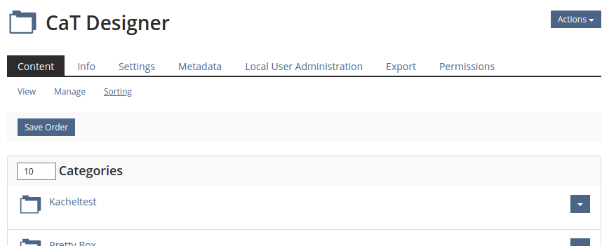

# Element Types in toolbar

* Action: Download Export (e.g. "Download [Event] Files")
* Action: Manage connected status/attribute
* Action: Mark (as completed in LSO kiosk mode)
* Action: Submit/Suspend Input Mode (like survey, test)
* Action: change a system setting (activate translation for Page Editing)
* Action: create sub-item ("Add magazine object", "Create appointment", add forum, some exports)
* Action: edit this item/view (open in page editor, email)
* Action: join with a specific role
* Action: print (Notes, LSO kiosk mode, learning module)
* Action: query specific item by freely entered text (Change to user by entering a name)
* Action: search query
* Bulk-Action: Change to template selected from dropdown (applied didactic template in Category Permissions)
* Bulk-Action: Import (Users in Local User Administration)
* Bulk-Action: Message many (Mail to group members)
* Bulk-Action: process multiple sub-items (copy, move, delete, mark)
* Bulk-Action: save a change of multiple sub-items (save sort order)
* Interface: Show/hide sidebar
* Launch: Start a mode
* Navigation: Go to other page (similar to navigating to subtab e.g. learning module)
* Navigation: Next/Previous view/item in line (LSO kiosk mode, Survey Questions)
* View Controls for sub-items in view (sortation in Notes or range of items in calendar, forum sortation)

# Observations and Questions

* What options go into navbar, sub-tabs, table command row or header action dropdown and why?
* View controls tend to be in the toolbar, but filters (with the exception of search query inputs) are often separate
* Visual spacing and bars sometimes separate buttons that feel like they are part of the same semantic groups
* Buttons are relevant to varying degrees, but they often are just default btns. Sometimes there is a btn primary.

# Rivals

* Action Dropdown in Header
* Filters
* `ilTableCommandRow`

# Multiple constructs that look similar

* A: `
[...]<nav class="ilToolbar navbar navbar-default " id="1">`
* B: `
[...]<nav class="ilToolbar navbar navbar-default " id="2">`
* part of table but sometimes it's rendered directly under the sub-tabs, so it looks like it's the repository toolbar, C: `

`
* D: `
[...]
`
* E: `<nav class="ilToolbar navbar-default ilLSOKioskModeNavigation" role="navigation" id="2">` (LSO Kiosk Mode)
* F: `<form id="il-svy-output-form" [...]><table class="fullwidth">`
* G: `<nav class="ilToolbar navbar navbar-default " id="2">
` (during Test)
* H: `
` (during Test)
* I: `<nav class="ilToolbar navbar navbar-default " id="tst_results_toolbar">
` (Test Result Overview)

# Occurences

## Calendar

* Viewcontrols Day/Week/Month, pagination day/week/month
* Action: create sub-item ("Create Appointment")
* Action "Download [Event] Files"
*  https://test8.ilias.de/ilias.php?baseClass=ildashboardgui&cmdNode=9e:61:60&cmdClass=ilCalendarMonthGUI
* A: `
[...]<nav class="ilToolbar navbar navbar-default " id="1">`

## Repository Category Object

* Action: create sub-item ("Add New Item")
* Action: edit this item ("Customize Page")
* "Action" dropdown doesn't have either options - what options go into navbar, sub-tabs or header action dropdown?
* https://test8.ilias.de/ilias.php?baseClass=ilrepositorygui&ref_id=7700
* A: `
[...]<nav class="ilToolbar navbar navbar-default " id="1">`

## Repository Manage View

* Action: process one or multiple sub-items
* has the arrow of a `ilTableCommandRow`
* B: `
[...]<nav class="ilToolbar navbar navbar-default " id="2">`

## Repository Sorting View

* Action: save a change of sub-items (sort order of sub-items)
* B: `
[...]<nav class="ilToolbar navbar navbar-default " id="2">`

## Repository Category > Settings > Multilingualism

* Action: create sub-item
* Action: change a system setting (activate translation for Page Editing)
* `ilTableCommandRow` underneath fakes the look of a toolbar
* A: `
[...]<nav class="ilToolbar navbar navbar-default " id="1">`

## Repository Category > Settings > Filter

* Action: jump to deeper settings (fieldselection for filter)
* What are you supposed to actually do on this screen? couldn't it just show the fieldselection instead?
* A: `
[...]<nav class="ilToolbar navbar navbar-default " id="1">`

## Repository Category > Local User Administration

* Action: add sub-item (Local User)
* Bulk-Action: Import (Users in Local User Administration)
* A: `
[...]<nav class="ilToolbar navbar navbar-default " id="1">`

## Repository Category > Export

* Action: add sub-item
* A: `
[...]<nav class="ilToolbar navbar navbar-default " id="1">`

## Repository Category > Permissions

* Bulk-Action: Change to template selected from dropdown
* Action: add sub-item (Add New Local Role, Import Role)
* Potential rival on same screen: filter and save button

## Repository Category > Permission of User

* Action: query specific items by freely entered text
* A: `
[...]<nav class="ilToolbar navbar navbar-default " id="1">`

## Search

* Action: search query items by freely entered text
* D: `
[...]
`

## Learning Sequence

* Navigation: Next/Previous
* Action: Mark (as completed)
* Action: print
* Direct Rivals:
  * Dropdown with "Edit Page, Info, Notes"
  * Close View
* E: `<nav class="ilToolbar navbar-default ilLSOKioskModeNavigation" role="navigation" id="2">`

## Private Notes

* Action: Download Export
* View Controls for sub-items in view
* Why are print and HTML Export visually separated?
* Direct Rivals:
  * Filter
* A: `
[...]<nav class="ilToolbar navbar navbar-default " id="1">`

## File Info

* Action: Download Export
* A: `
[...]<nav class="ilToolbar navbar navbar-default " id="1">`

## Group > Members

* Bulk-Action: Message many (Mail to members)
* A: `
[...]<nav class="ilToolbar navbar navbar-default " id="1">`

## Learning Module

* Navigation: Go to other page (info page)
* Action: Manage connected status/attribute
* Action: print
* A: `
[...]<nav class="ilToolbar navbar navbar-default " id="1">`

## Mediapool

* Action: create sub-item
* in TableControls:
  * Bulk-Action: process multiple sub-items (copy, move, delete)
* A: `
[...]<nav class="ilToolbar navbar navbar-default " id="1">`
* C: `

`

## E-Mail

* Action: edit this item/view (Forward, Print, Delete, Move)
* A: `
[...]<nav class="ilToolbar navbar navbar-default " id="1">`

## Survey - Landing

* Action: join with a specific role
* A: `
[...]<nav class="ilToolbar navbar navbar-default " id="1">`

## Survey - Questions

* Navigation: Next/Previous
* Navigation: Go to other page
* Action: Submit/Suspend Input Mode
* F: `<form id="il-svy-output-form" [...]><table class="fullwidth">`

## Forum

* Action: create sub-item
* Bulk-Action: process multiple sub-items
* A: `
[...]<nav class="ilToolbar navbar navbar-default " id="1">`

## Forum Thread

* Action: create sub-item
* Bulk-Action: process multiple sub-items
* View Controls for sub-items in view
* A: `
[...]<nav class="ilToolbar navbar navbar-default " id="1">`

## Blog

* Navigation: Next/Previous Pagination/Month/Post
* Action: edit this item/view
* A: `
[...]<nav class="ilToolbar navbar navbar-default " id="1">`

## Test - Info Tab

* Launch: Start a mode (start test)
* A: `
[...]<nav class="ilToolbar navbar navbar-default " id="1">`

## Test - Running Test

* 3 Toolbar designs in one view
* Interface: Show/hide sidebar
* Navigation: Go to other page
* Action: Submit/Suspend Input Mode
* Interaction directly with specific question is part of a shy dropdown
* G: `<nav class="ilToolbar navbar navbar-default " id="2">
`
* H: `
`

## Test Result

* Action: print
* Action: Download Export
* I: `<nav class="ilToolbar navbar navbar-default " id="tst_results_toolbar">
`