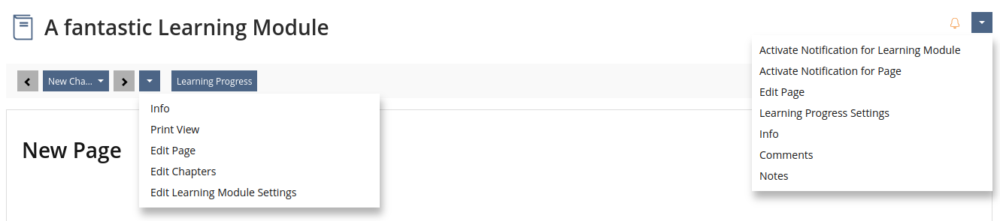

# Tabs and Subtabs Analysis & Optimization

Tabs and Sub-Tabs are one of the most prominent places for navigation in ILIAS. Through a bar in the header of a page, users can access different settings and contents.

At times, the tab navigation can be frustrating, because...
- when dozens of tabs fill the header, **finding a specific one is slow,**
- some tabs do **not contain what a new user would expect,**
- other buttons in or near the header offer similar or the same options, which can cause **confusion.**

Given that these tabs are such a central concept in ILIAS, we will use this paper to
- describe the existing use of Tabs and Sub-Tabs in ILIAS
- analyze strengths and weaknesses of tabs in general and ILIAS Tabs specifically
- explore strategies and structures that would help users navigate with less friction and more quickly

In the end, we arrive at concrete **recommendations on how to minimize frustrations** and optimize the user experience. The aim is to make ILIAS both **more accessible to beginners and quicker to use for power users**.

## Methodology

### Workshop

In July 2025, we conducted a one-day workshop at CaT Concepts and Training GmbH in Cologne with the following people contributing their expertise:

- Ferdinand Engländer, CaT Concepts and Training, Frontend Developer, ILIAS CSS authority for Code Changes
- Nils Haagen, CaT Concepts and Training, Developer
- Yvonne Seiler, University of Bern, Designer, ILIAS CSS authority for Conceptual Changes
- Denis Strassner, University of Hohenheim, ILIAS Test & Assessment authority for Conceptual Changes

In the workshop we...
- identified obstacles and inconsistencies that might confuse users
- experimented with alternative and refined structures to simplify and enhance tab navigation
- brainstormed how the new approaches would work in different areas of ILIAS

This paper builds and expands on the findings and ideas generated in this workshop.

### Previous Guidelines

There are some pointers and guidelines about Tabs for example a [Feature Wiki entry from 2010](https://docu.ilias.de/ilias.php?baseClass=ilwikihandlergui&cmdNode=16g:rq&cmdClass=ilobjwikigui&cmd=viewPage&ref_id=1357&page=Tabs_Guideline) and a Project to [Streamline Sub-Tabs](https://docu.ilias.de/ilias.php?baseClass=ilwikihandlergui&cmdNode=16g:rq&cmdClass=ilobjwikigui&cmd=viewPage&ref_id=1357&page=Streamline_%28Sub-%29Tabs).

While these pages record some decisions (e.g. for the order of tabs), there are no explanations on why and on what basis these have been made. 

### Building on the Knowledge of Pros

With this document we pick up the strings, and discuss improvements to the Tabs and Sub-Tabs on an analytical level. We believe that gathering UX/UI best practices, studies and user testing experiences is the key to finding the best possible Tab Navigation.

One important source are the publications of the [Nielsen Norman Group](https://www.nngroup.com).

## Re-defining focus

Ultimately, we will land on two recommendations that build the tab navigation around User Intent.

These are the labels of the Tabs for the Test & Assessment that a User with most Permissions would currently see:

[ Test ] [ Info ] [ Settings ] [ Questions ] [ Participants ] [ Manual Scoring ] [ Learning Progress ] [ Metadata ] [ Export ] [ Permissions ]

### Proposal 1

Keep in mind that the following suggestion is a first work in progress draft of a User Journey and in no way final. Furthermore, we will explain later how exactly we ended up here. 

With this approach we branch of from and react to very specific User Intents (a.k.a. things the User knows they want to do). We don't want to list functionality, instead we want to enable the user to do something specific with all of this functionality. 

Let the User tell us, what they are about to do. These options could greet someone who just created a Test object:

- Create simple pop-quiz
- Create complex exam
- Import from Question Pool

After the user decided to create a simple pop-quiz, they would only see the tabs relevant to their declared intent:

[ Questions ] [ Settings ] [ Participants ] [ Scoring ]

Where did the Learning Progress Setting go? Well, in the mind of most Users, at this point in time, Learning Progress is a setting. So that is where it is, under Settings. Since you don't want to export an empty test, we also don't need to show any Export functions anywhere.

Let's jump ahead and assume we have a test now that is up and running. First results are coming in and the cover page could welcome our returning Test creator with these options:

- Take the test
- Edit simple pop-quiz
- Supervise & evaluate
- Reuse & distribute

Each of these branches would have its own structure of Tabs allowing the user to fully focus on the task at hand.

Don Norman describes the main goal of any design in The Design of Everyday things like this: "[M]ake sure that (1) the user can figure out what to do, and (2) the user can tell what is going on."[^Norman-Design-Everyday-Things-design-goals]

This proposal would the User's understanding of the process front and center instead of the system's capabilities.

[^Norman-Design-Everyday-Things-design-goals]: Don Norman. The Design of Everyday Things. 2002 edition. 1988. Basic Books. p. 188 

### Proposal 2

The downside of the first solution is that it is very specific and requires in-depth knowledge of all different type of users, their goals and their workflow.

We realize that it would be a monumental feat to restructure ILIAS in this way. This is why we also developed a general Tab hierarchy that we believe all current Tabs and Sub-Tabs could be sorted under.

Once again this is a snapshot of the current state of this concept and might still evolve. In this case we could start the decision of what a User would like to do with always the same kind of Main Tabs. In case of the Test & Assessment they would be:

[ View ] [ Edit & Organize Questions ] [ Test Settings ] [ Assign ] [ Evaluate & Analyze ]

The hierarchy is always based on the words View, Edit (Content), (Object) Settings, Assign, Evaluate, because they are associated with different larger tasks that are usually focused on separately. They might be re-worded per object for clarification and to make them fit better to the exact nature of the object, but the idea of these categories should remain.

We discourage to keep them totally uniform just for the sake of it as the Sub-Tab content within will be different for every object anyway.

The goal is to give a user all tools they need for a current step in the workflow so that they generally do not need to leave a Tab until they move on to another step.

### Proposal 3

There are also smaller ideas and tweaks we can already work into our current Tabs and Sub-Tabs. These are collected near the end of this paper. These improvements can be considered independently of a larger restructuring effort.

Now, we would like to explain how we developed these concepts and what UX/UI best practices it is based on.

## UI/UX Best Practices

First, let's establish how we can **measure if a tab UI is good or bad.** Having measurable indicators makes it easier to identify problems as well as measure if improvements are successfully reaching their goals.

### Time

"In most situations, the faster a user can complete a task, the better the experience."[^measureux01] **Both beginners and power users appreciate if they spend less time to reach a goal.**

[^measureux01]: Tom Tullis, Bill Albert. Measuring the User Experience. Morgan Kaufmann, Elsevier. 2nd edition. 2013. p. 74.

### Actions & Lostness

One of the best metric for a UI's effectiveness is measuring the number of user actions. "For websites, mouse clicks or page views are common actions".[^measureux02]

Each action requires physical and mental activity from a user, so lowering the number of total actions generally **feels better and less straining** to them.

The worst kind of action is one that didn't bring the user closer to the end of their task. Observing actions, we can estimate how lost a user has gotten. To calculate a lostness metric, researchers factor in (among other things) "The total number of pages visited while performing the task, counting revisits to the same page"[^measureux02] versus "The minimum (optimum) number of pages that must be visited to accomplish the task".[^measureux02]

[^measureux02]: Tullis. Measuring the User Experience. p. 87 - 88.

### User Intent and Mental Model

To evaluate design choices we also need to focus on the perspective of a specific user doing a specific action using ILIAS. We can approach understanding the user better by approximating and examining...

* the **user intent**: "the purpose of a user’s series of actions" [^intro-user-graph]
* the **mental model**: "what users know (or think they know) about a system" [^nielsen_mental-models]

[^intro-user-graph]: Ciprian Borodescu. A gentle introduction to orchestrating intelligent journeys with User Intent Graphs. February 13, 2022 https://uxdesign.cc/a-gentle-introduction-to-orchestrating-intelligent-journeys-with-user-intent-graphs-503192a637e2 visited November 29, 2023.
[^nielsen_mental-models]: Jakob Nielsen. Mental Models. nngroup.com. October 17, 2010. https://www.nngroup.com/articles/mental-models/ visited November 29, 2023.

### Implementation Model

In this paper we will frequently be comparing the Mental Model with the Implementation Model.

> The implementation model represents how a system (application, service, interface, etc.) works. [...] It is shaped by technical, organizational, and business constraints.[^ux-mental-representation-implementation]

To make a system as complex as ILIAS work, it's built very modular with many services constantly interacting and reaching into each other. It's only logical that developers might build the UI around the structure of their implementation. 

Unfortunately, when we map processes that happen in the database or between services to the UI, views can quickly become overwhelming and crowded.

Taking an interface from average to great means simplifying it and "shielding" the user from the details of the implementation: "To book a flight from NYC to Zagreb, users don’t need to know everything in the background. They are, typically, exposed to simple forms – enter your destination, dates, and the number of passengers."[^ux-mental-representation-implementation] You can always expose more options and more information later when a user clearly indicated that they would like to have more control.

[^ux-mental-representation-implementation]: Vibor Cipan. 2020, September 27. UX mental model, implementation and represented models in UX. https://pointjupiter.com/ux-mental-model-representation-implementation-user-experience-development/ Ausgust 13th, 2025

### Memory for 7 +/- 2 chunks

"In 1956, [George A.] Miller found that most people can remember about 7 chunks of information in their short-term memory." This is a very important number to keep in mind when designing interfaces as it imposes a limit on what feels easy to process.

Another useful finding is that a single chunk can actually chunk together multiple pieces of information: "people could remember 7 individual letters, or 28 letters if they were grouped into 7 four-letter words." Here is a string of 28 numbers: 8251936382632834763512650253. Put in groups of four, it's much easier to process for the brain: 8251 9363 8263 2834 7635 1265 0253.

So grouping similar elements together can greatly reduce the mental effort required. Instead of getting lost in many individual things, the user now perceives manageable chunks.

## Current issues

### Number of Tabs

Going into the settings tab of any ILIAS Test & Assessment, a person with permission to edit sees (at the time of writing) 11 Tabs, 9 Sub-Tabs and there are 5 more options inside the action dropdown at the top right. While this is an extreme example, it illustrates how there is very little structure or limit that prevents objects and forms in ILIAS from continuously growing in number.

The 7 +/- 2 guideline mentioned earlier is broken and screens require the user to read every single tab's name to find the one that is actually relevant.

### Order & Hierarchy in Tabs of the same Bar

No tab label in their corresponding bar is visually different from another (except for the Back tab which shows a glyph). This uniformity can be an issue, because not all tabs have the same relevance to the user at any given time. A general settings tab is much more frequented than some obscure advanced settings.

There is a light sense of priority given in their order: Tabs to the left are noticed first because of the left to right reading order. The rightmost entry is also likely to get more attention than an entry in the middle. Users tend to look for save buttons and important dropdowns in the right top corner of screens and groupings.

More than relying on order, we might want to explore segmenting and specializing views even further to always keep options both in Tabs and in Forms in manageable numbers.

### Adaption to User Intent

The tab bars do rarely anticipate or support the User Intent. With few exceptions they display all tabs that the current user has access to all the time. This means that even if a user is doing completely different tasks they are forced to see a lot of currently irrelevant elements.

However, over time or because of the role of the user within an institution, one user's tasks might be vastly different from another's. For example, in the case of the Test & Assessment maybe they want to...
- set up a simple multiple choice quiz for a quick evaluation at the end of an in person lesson
- set up a complex exam that hundreds of people will take and that needs to follow strict legal guidelines
- replace placeholder images in dozens of questions
- check in on a published test and see how many people have already completed their pass

Even if there are specialized screens for some of those activities, we rarely simplify or optimize the page header. The user generally has to set and find their own focus and disregard (in some cases) dozens of elements irrelevant to their current task.

There is a lot to be gained to refine our interfaces more towards specific User Intent in the future:

> User goals, which comprise needs, desires, and expectations, lie at the heart of successful product design. Understanding these goals and translating them into design not only drives user engagement and satisfaction but also ultimately bolsters product success.[^design-bootcamp-user-goals]

[^design-bootcamp-user-goals]: Anaïs Gracia. User Goals. medium.com. July 15, 2023. https://medium.com/design-bootcamp/user-goals-381b8c61f3dc visited August 21, 2025.

The UI in ILIAS often mirrors the capabilities of the Implementation Model. It's generally structured by what the system can do and what objects and fields it has internally. It shows functionality a user can use to achieve their goals, but they often have to figure out for themselves what to focus on.

In some cases though, we do already adapt to User Intents:
- A user with only the permission to take the test, actually sees a highly minimized interface with fewer to even no tabs.

This reduction feels fantastic for someone who just wants to focus on the Test questions being put before them. This is how an article on UXmatters.com describes the best case scenario:
> "If you understand users’ needs, you can ensure that you’re communicating the right message to users, through the right medium, at the right time." [^uxmatters-user-intent]

[^uxmatters-user-intent]: Jordan Julien. The Importance of Knowing User Intent. uxmatters.com. October 22, 2012. https://www.uxmatters.com/mt/archives/2012/10/the-importance-of-knowing-user-intent.php visited August 13th, 2025.

The relief a test participant feels when thrown into a very focused view is something we could bring to more areas of ILIAS - even to administrators, because they too might appreciate tunnel vision for some tasks.

Therefore, we want to explore how we can organize and build views more around very specific, focused user intents. A direct reflection of such a re-structuring will be how we treat Tabs and Sub-Tabs.

## Analysis of the current State

To further examine the Tabs & Sub-Tabs across various screens, we need to examine their current function and purpose. Sometimes, entries presented within the dropdown menu and toolbar also perform the same way as some tabs. Therefor, we include them in this evaluation.

### Scope of examination

We focused on the following areas of ILIAS:

- Test & Assessment
- Question
- Course
- Administration > System Settings > General Settings
- Administration > Repository & Objects > Repository
- Administration > Repository & Objects > Study Programme
- Category
- ILIAS Learning Module
- Wiki

Let's start by identifying the different types of Tabs. Here is a screenshot of the Test & Assessment during question creation:

After some brainstorming during the workshop that this paper is based on, we landed on the following categories:
- Settings of this object: Settings, General, Grading System, Permissions
- View/Work-Through Content: Test
- View/Work-Through Reports: My Result
- Create content: Edit introduction
- Manage/create sub-objects: Questions, Export
- Connect this object with other objects: Participants

We also found in other views...
- Actions (immediately trigger a change in data)
- Navigation Back or Up

### Developer vs User Perspective

We realized we needed to clarify some of these terms, because in this paper we aim at what the user understands things to be, not at how they are actually programmed. Because we want to think from the User's Mental Models and their Intent, we need to shift some definitions away from the Implementation Model:

- The term "object" is clear when the user opened a repository object (a Test, a Course, a Category). In this case the Implementations Model and the Mental Model align. However, there are contexts the user perceives as object-like contexts despite them not being a full objects in the eyes of a developer (e.g. the Calendar or Contacts Screen). Because our focus is on UX, we have to acknowledge when a User applies the object Mental Model to something that might not be a real object to a programmer. On the other hand, we have the case where programmers see something as a separate element, but the User does not: For example, the Learning Progress is technically a huge system outside the object it serves, but the User is likely to see it as an attribute of the object, not even a sub-object.
- The term "sub-objects" means items the user creates seemingly as part of the main object. These items are usually a repeating group for the same kind of information and often have their own settings. More simple items like comments are referring directly to the main object and belong to it despite them technically being something separate and more general inside the code of ILIAS. Similarly, Questions can technically exist somewhat outside a Test, but once they are inside a Test or Pool, no user would see them as independent objects.
- "Create content" describes the creation of one body of content. In this case the user doesn't feel like they are creating a collection of items (even if it's technically what they might be doing e.g. with the blocks of the Page Editor). They think that they are filling one specific location or one set of fields to be shown to the consumer.
- "Connect this object with other objects" refers to connecting two objects a non-programmer User may strongly perceive as separate. This is mainly true for things the user is very aware of existing in multiple places e.g. adding Members to a Course or Participants to a Test. 
- "View/Work-Through Contents" describes a body or collection of content made by one user to be consumed and interacted with by another. The consumer may fill out or provide input, but they do not change the content itself.

The goal with these distinctions is to meet the user's mental models. To reduce friction in the UX, we have to optimize for how users instinctively think the interface and the objects work, not for how they actually work.

### Measuring the status quo

We had a look at 20 screens and categorized the options within. As one screen we define the view a user sees when entering an object. Usually within one screen the Tab bar stays the same and Sub-Tabs change depending on the currently selected Tab.

When advancing through Tabs to evaluate Sub-Tabs, the main Tabs have not been counted again. However, entries with the same name and behavior that are repeated on different screens are counted as separate occurrences.

So this is how the tagging data for a screen looks like where all options are seen for the first time in this context and therefore have been marked:

From this we extracted the total number of occurrences for each of the types:

|                           | Tabs | Sub-Tabs | Toolbar | Top-Right Dropdown |
|---------------------------|------|----------|---------|--------------------|
| View/Work-Through Content | 26   | 3        | 11      | 1                  |
| View/Work-Through Reports | 4    | 9        |         |                    |
| Manage Sub-Objects        | 35   | 16       | 1       |                    |
| Create Content            | 4    | 7        | 17      | 6                  |
| Connect Objects           | 5    | 2        |         | 2                  |
| Settings of this Object   | 53   | 13       | 2       | 1                  |
| Actions                   | 2    | 3        | 26      | 5                  |
| Navigation back or up     | 8    |          |         |                    |

### Noteworthy observations

* There is a clear tendency which location is preferred for which type of interaction
  * Tabs:
    1. Settings of this object
    2. Manage Sub-Objects,
    3. View/Work-Through Content
  * Sub-Tabs:
    1. Manage Sub-Objects,
    2. Settings of this Object,
    3. Create Content
  * Toolbar:
    1. Actions (which often eventually end up in a Create Content screen),
    2. Create Content
  * Action Dropdown:
    1. Create Content
    2. Actions

Especially the shared responsibilities lead to some questions.

With regard to Tabs vs. Sub-Tabs we need to explore...
* which Settings are subordinate to a Tab and why?
* Is there a difference between the type of Sub-Objects that can be managed?

Looking at Toolbar vs Sub-Tabs:
* Which is the best location to lead into content creation?
* The toolbar is deprecated. Are other positions better suited for what is placed there?

What do we do with outliers like these?
* Back navigation in Tabs
* Toolbar and Action Dropdown leading to a Settings page

#### Outliers

The outliers are the easiest ones come up with the concept for a fix as the patterns that we do have for Tabs already provide a frame of reference to recognize that something isn't right.

Let's look at the header of an ILIAS Learning Module:

To allow for the user to focus, the Learning Module switches to a reduced view without Tabs. However, Tab pages (Learning Progress Settings, Info, Edit Pages,...) are still linked here tucked away in the dropdown next to the navigation, inside the action dropdown and Learning Progress even gets a prominent button.

While we definitely need alternative kiosk mode views, redistributing Tabs like this is a very risky move. It breaks the pattern that users have learned and come to expect. Furthermore, putting some options in the navigation dropdown and some in the page dropdown is confusing.

Two suggestions to move forward:
- Show the Tabs as they would usually look
- Develop a universal way to expand and hide tabs that all ILIAS pages could use

The (currently almost released) Sequence Navigator Component might be of use here. It adds a place to hook in options that are relevant to the sequence or the current single sequence segment, clearly distinguishable from the navigation.

#### Inside Out Settings

We looked at 20 screens. Almost every screen has a Tab named "Settings" that branches into Sub-Tabs for various categories of settings. However, we counted 53 occurrences of a Tab leading to a "Settings of this Object" page.

This means that some settings an average user understands to be part of the object are not under the "Settings" Tab. Most notable are the Learning Progress and Permission Settings which have their own main Tab. However, non-programmer users might understand these to be attributes of the current object just like its online status.

This order might have been chosen because it resembles more closely what is happening under the hood of ILIAS. In the Implementation Model the Learning Progress and Permissions are in large parts outside the object that uses it. In the user's Mental Model there are an attribute. Furthermore, the Learning Progress can cover an array of different options from the user's own progress, to the progress of all members to general settings for the progress of this specific object.

The other reason for showing Learning Progress and Permission settings on the top level is because they are relevant to some of the most important administrative User Intents. They are important objects during some User Intents, but we might want to re-evaluate what the best structure and order might be.

#### Breaking the Pattern

It's important to observe when parts of an interface establish a logic. If they break the logic, there might be an issue worth looking into.

Tabs in UI generally fall into two categories described by the Nielsen Norman group as follows:

> "In-page tabs organize and present related content within a single page. These tabs are not for navigation but enable users to alter the content displayed in the panel."[^nngroup-tabs]

> "Navigation tabs enable users to navigate to different pages. Because navigation usability improves when the user’s location is clearly marked, designers started using the visual presentation of tabs (in particular, selection indicators) for navigation controls. Over time, this tab styling became a common visual approach to navigation."[^nngroup-tabs]

[^nngroup-tabs]: Evan Sunwall. Tabs, Used Right. nngroup.com. August 2nd, 2024. https://www.nngroup.com/articles/tabs-used-right/ visited August 14th, 2025.

A potential issue in ILIAS is that those two concepts may get mixed and expanded on. These shifts in logic demand mental energy - especially from new users.

Let's take the example of settings like Permissions and Learning Progress:
* they could be In-Page Sub-Tabs of a Settings page
* instead they appear next to Navigation Tabs
* some Navigation Tabs open up to entirely different contexts (e.g. the Test tab or the Question Tabs which are the entry points to a longer process)

Sometimes the Tabs offer a Navigation Tab back to the previous screen. Often times it's next to In-Page Tabs that just flip through aspects of the same object. Here is an example from the Question creation:

The tabs Edit Question, Feedback and Hint...
- flip through aspects of the Question object just like In-Page Tabs,
- but the Back Tab is navigating away.
- Two concepts have been mixed up together into one location.

Members who joined a Course see a tab labeled "Unsubscribe from Course"
- The main purpose of this tab is to trigger an action. This makes it technically a button and not a tab in the traditional sense.
- It also leads to a page load, but there is no way to tell what it will do in terms of navigation. Will it navigate to an unsubscribe message, to a public view of the same page we are currently on or will it throw us out of the object and into the repository?

Quirks and broken patterns in interface logic might not feel like a big issue. Most people reading this paper are very likely used to them. And many users might even be happy to discover a Back button, the Learning Progress settings, Permission settings or the Unsubscribe from Course button in such a prominent location when they look for it.

However, over time and in high numbers these pattern violations can hurt especially an initial orientation. If we mix types of interactive elements within the same bar, users might be surprised by different outcomes. If there is no clear split between content creation tools and settings, users have to search longer.

When they are looking for a setting to set-up the object, the view is polluted by content creation tools, when they are looking for a content creation tool, the view is polluted by set-up settings. This increases the time to navigate and allows for miss-clicks which contribute to lostness.

There is also a huge downside for development. Developers have a choice to place their function in Tabs, Sub-Tabs, a Toolbar (which is deprecated) and a Dropdown, but there seems to be very little architecture within these elements. Developers cannot be blamed to put a Tab that starts a view mode next to a Tab that goes to a settings page.

## Refining Our Tab Architecture

### Goals of a New Architecture

Given the findings of this examination, what are some promising directions we can go in to improve the Tabs & Sub-Tabs area?

* Semantic and Concern Separation: Can we split different types of options into groups? Does marking them differently help orientation?
* User Intent over Implementation Model: While ILIAS screens give a good overview over the functionality, they do not dynamically adapt the Mental Model most suitable for a current User Intent
* Supporting concepts and development with smart systems: We need to ensure any solutions we find to segment or adapt the UI is not burdening developers. Sorting actions and pages into their proper place should be as clear and intuitive as they are to the end-user.

### Tools of Improved Architecture

#### Putting User Intent at the top of the Hierarchy

Right now, ILIAS is relatively agnostic to the User Intent. The interface always shows all functions following the Implementation Model, often segmented across Sub-Tabs. This tends to increase lostness and the time needed to find specific options.

If you want to create a quick little pop quiz for your students, the Test & Assessment still hits you with the full might of functions designed to create thorough exams.

Do you want to see how your Course Members are doing? The repository item shows only your own learning progress (a worthless information) and you have to click past the content you created to go to the Learning Progress of the Members.

Creating content for a Learning Module is a chase across various Sub-Tabs, the Slate and the Presentation View Tab.

We strongly suggest building our interfaces in the future more from the User Intents rather than the functionality focused Implementation Model. So instead of an User Intent agnostic structure, the current task of the User would be at the top of the tree.

This is how the Test & Assessment structure looks now:

- Test
- Info
- Settings
  - General
  - Grading System
  - Scoring & Results
  - Edit Introduction
  - Edit Concluding Remarks
  - Certificate
  - Personal Default Settings
- Questions
- Participants
- My Results
- Manual Scoring
  - Scoring by Participant
  - Scoring by Question
- History
- Learning Progress
  - Users
  - Summary
  - Settings
- Meta Data
- Export
- Permissions
  - [...]

Now let's distribute the functionality onto different User Intents. New or heavily changed tabs are written in italics.

- **Take test** (= Test)
- **See my results** (= My Results)
  - Learning Progress
  - *My Certificate*
- **Create simple pop-quiz**
  - Manage Questions (= Questions Tab)
  - Settings
    - General (simplified)
    - *Edit Intro/Outro*
    - *Availability & Access*
      - *Availability*
      - Permissions (simplified)
    - Learning Progress (just the settings)
  - Manage participants (= Participants)
  - *Scoring*
    - *Settings* (= Scoring & Results)
    - Grade System
- **Create complex exam**
  - Questions
  - Settings
    - General
    - *Availability & Access*
        - *Availability*
        - Permissions
    - (Grading & Achievements)
      - Grading System
      - Certificate
      - (Gamification)
    - Learning Progress (just the settings)
    - *Edit Intro/Outro*
  - Manage Participants (= Participants)
  - *Scoring*
    - *Settings* (= Scoring & Results)
    - Grade System
- **Supervise & evaluate**
  - *Analytics*
  - *Monitor Learning Progress* (Learning Progress > Users)
  - Manage Participants
- **Manually grade**
  - Participants
  - Manual Scoring
- **Reuse & distribute**
  - Export
  - Meta Data

This list is only a first draft, but it illustrates the appeal of diving into one section and one section only for one task at a time. If a user now intents to do one of these things set as the first layer in the hierarchy, all they need to focus on is on that branch of screens and options.

As Users are shown the tools and options that they need for their current Intent, they can work faster and don't get lost as easily.

#### One Function, Multiple Locations

In the example, "Manage Participants" appears in three User Intents, because that functionality is relevant to all three.

Most of the time, having links to the same view on the same page is not a good idea and requires careful consideration.[^nngroup-link-duplicate]

Linking to the same location from multiple structures can lead to immense confusion. When the User has to do work across both structures, and they encounter duplicate links, they may waste time and clicks to confirm if they have seen it before or if it's a new link.[^nngroup-link-duplicate]

[^nngroup-link-duplicate]: Hoa Loranger. The Same Link Twice on the Same Page: Do Duplicates Help or Hurt? https://www.nngroup.com/articles/duplicate-links/

However, it might be worth breaking this rule here under the following conditions:
* Once the User decided for one User Intent, they MUST NOT come across a duplicate link/tab.
* The screen where the User Intents are shown MUST NOT show the duplicate sub-items.
* They might actually not be duplicated pages and offer different content and functionality. All three User Intents might show and manage participants, but they might do it with different tools best suited to the specific task:
  * Create simple pop-quiz = add/remove participants (very simple)
  * Create complex exam = add/remove/manage many participants (additional bulk edit and filter tools)
  * Supervise & evaluate = supervise participants (focus on status, indicate potential issues)

### Proposals

Taking all our findings and exploration into account, we landed on the following approaches worth pursuing. They rank from major to minor impact to the current way of implementation. In reverse order, they could be milestones working towards an interface driven by User Intent rather than the Implementation Model.

#### Proposal A: Specific User Intent

The most guided solution puts very specific User Intents first and branches from there into different Tab/Sub-Tab structures.

Opening a test as an administrator with all privileges would show (almost) all User Intents. There also might be User Intents only possible once certain conditions are met. So creating an empty test would offer the following branching off points:

- Create simple pop-quiz
- Create complex exam
- Import from Question Pool (which would then branch into complex exam creation)

After the User decided to create a simple pop-quiz, the label would change

- Preview the test
- Edit simple pop-quiz
- Switch to complex exam creation

After the test is set to online, the cover page would show...

- Take the test
- Edit simple pop-quiz
- Supervise & evaluate
- Reuse & distribute

Clicking on one of these branches would then lead to a page view very similar to how it is now with only the relevant tabs.

"Edit simple pop-quiz" would have the Tabs...
- Manage Questions 
- Settings
- Manage Participants
- Scoring

"Supervise & evaluate" would lead to a screen with the following tabs:
- Analytics
- Monitor Learning Progress
- Manage Participants

The "back up" button would be outside/above the Tabs (or part of the breadcrumbs, maybe), so the Tabs would clearly only Navigate within the User Intent branch.

This approach requires a lot of conceptual work and user testing for every single component. This can only work if we pinpoint the User Intents extremely well and cover them all. Not covering all of them could be very frustrating, because going across two or more branches would require a lot of clicks and feel very cumbersome.

However, if we nail this, this could set ILIAS miles ahead of most software designed for organizations as those tend to list the functions of the Implementation Model to an interface. The frictionless ease of every shown option following the User Intent is a very good feeling that we rarely experience outside mobile apps (the immense competition heavily weeds out clunky UX) and video games (every step of a game loop usually has a very specialized UI/HUD/Screen).

#### Proposal B: General User Intents

To reduce the workload to distill the exact User Intent from every big component in ILIAS, we could alternatively work with a handful of general User Intents that we can sort our existing tabs into.

This reduces the effort required from developing custom User Intent Stories, to just deciding which comes closest. With a good guide and helpful examples, this could be a relatively quick process.

During the workshop, we tried to find the perfect words that could cover all contexts. But maybe this uniformity is not necessary as the core of the idea is to intuitively understand and connect to the User Intent behind it. Therefore, we might want to consider alternative wording (in brackets) and adapt to what works best with the specific object.

Here is a work in progress draft of what general User Intents we might want to use:

- View (Explore / Learn / Launch)
- Edit (Create / Manage) {Content}
- Assign (Connect)
- {Object Name} Settings
- Evaluate (Analyze)

Maybe these User Intent modes would now be the Tabs and then there would be Sub-Tabs below them.

##### View

Content created and organized in Edit Content will be shown here.

It includes
- Content just to view without or with very little interaction
- Content for the user to interact with and work through (e.g. a test)
- adding Sub-Objects and items while interacting with created content (e.g. comments)

It is likely that some areas of ILIAS will not have a View Tab unless they add a summary or analytics screen for an aggregated overview e.g. Administrator Settings

##### Edit

Here, Users with sufficient Permissions can create and edit anything meant to be (potentially) shown and presented in View including
- Page Editor Content
- Sub-Objects like Repository Objects served as part of the content
- Sub-Objects or items making up a sequence or segmented collection of contents (Questions, Blog-Posts)
- Templates e.g. for Certificates

Away from content, this also includes management tools e.g. for hierarchy and bulk processing. We might want to consider clarifying the line between functions to manage and functions to edit sub-objects. The Screen for writing new Question(s) does not have to go through the screen listing all Questions. Adding course material has different requirements (e.g. quick previews) than re-structuring last years material. Just because we decided to go more general with our User Intent branching should not mean we abandon screens optimized for specific tasks in deeper levels.

Sub-Objects created by the consuming user for themselves or other consuming users (like comments) might completely live inside the View Tab. Sub-Objects generated by consuming users to be further processed by the original content creator probably go into Evaluate.

##### Assign

Whenever one object needs to be paired with another like...
- assigning Users as Participants or Members
- connecting Qualifications with Questions

Keep in mind that this means objects from the understanding of the User. These objects do not have to mirror Object Oriented Programming from the Implementation Model, they have to actually feel like entities that have to be connected. Categories and Tags might in most cases feel like settings attribute to a non-tech experienced User who look for them under Settings.

##### {Object Name} Settings

Anything that can be changed about the current object and how it behaves (excluding what is in it or what is connected to it).
- Settings of Behavior (how to serve content, how to process User interaction)
- Availability
- Permissions
- Learning Progress Settings (how it is tracked)

We might want to re-evaluate which settings about sub-objects should be moved to the Edit Tab. E.g. in the Test there might be a line of what settings are about how the Test serves Questions and therefor go here, and which Settings change something about all Questions and might be better suited to go into the Edit Tab.

##### Evaluate

This is the area for Analytics and Reports. It's also the spot for content and sub-object created by the consuming user that are part of an evaluation process (Test Answers, Survey Answers)
- Data & Statistics generated from User interaction with the object and its sub-objects
- Data and content submitted by a consuming User
- Learning Progress (what was tracked)
- Manual Scoring

#### Proposal C: Tweaks and Clarifications

The minimum action we would recommend is to clean up worst offenders:
- "back" or "back up" buttons should move out of the Tab area, maybe near the headline or very prominently into the breadcrumb bar
- avoid duplicated options across Toolbar, Tabs, Sub-Tabs and Dropdowns
- reduce number of Tabs and move content into Sub-Tabs where possible (how many times do people use Meta Data and Export?)
- Actions should never be in the Tab as both Mental Models for Tabs only reveal or go to content. We might need to create a new location to perform actions like unsubscribing (maybe next to the action dropdown?)
- Toolbar and Dropdown Actions should not lead to a settings page. Settings pages are clearly the main purpose of Tabs.
- the Toolbar location is deprecated as part of the Removing LUI projects. There is another project to re-locate Toolbar buttons elsewhere (e.g. attach them to the Table component that they control)

## Coding Approach

The proposals outlined in this paper could lead to some very tedious, very individual work on many components.

During conversations some ideas on how to approach this during development were already discussed. While they still have to be expanded and refined, we wanted to share them in their current shape.

At the moment, the content of tabs is build very explicit. Like a page in a book the content is dropped into a Tab, and it pretty much stays there. Maybe something is grayed out or a Tab or Sub-Tab (dis)appears, but the nature of a Tab is a very static one. Most logic for hiding interface elements is based on permissions.

If we approached Tabs and their content less like a location and more like a  systematic structure, this would open up the possibility to branch and distribute functionality

Maybe instead of building relatively rigid page layouts, the process could require programmers to hook functionality into slots (e.g. the suggested View, Edit, Assign, Settings, Evaluate pattern).

Furthermore, assigning tags based on when a functionality would be needed during the User's workflow like "pre-setup", "setup ongoing", "while published", "just imported" could describe how the interface reacts to the relevancy of options changing during a workflow. These markers should be general enough to apply to all components so maintainers do not have to reinvent the wheel for the logic of their own component.

Basically, instead of just mapping the implementation to the frontend, we would describe it in terms of User Intent and changing needs - like a facade that translates between User Mental Models and Computer Data.

## Conclusion

* Tabs are still one of the best ways to navigate between a collections of views.
* A break in a pattern indicates that a system or grouping could be optimized.
* By following User Intent we can sort and nest Tabs in ways that feel more intuitive and frictionless to our users.

