# Moving Tabs Actions from Toolbar to Data Table

## Mission Statement

In many views, users can trigger actions directly connected to a table. For example, they expect from a table listing participants that they can find a button nearby to assign more participants. If they do so, they expect the new participants to show up in this table as well. The user "added" an item to the table.

In this paper, we will explore which kinds of these actions already exist in the deprecated Toolbar location. We present a concept how exactly they could become a part of the Data Table Component.
 
## Current Situation

### Toolbars

As part of the Removing Legacy UI project, toolbars have been identified as a location that requires some investigation.

* They include a variety of very different actions (adding items, switching views, triggering actions).
* Many options inconsistently also appear in other locations which turns the toolbar in a rather undefined and unreliable collection.

This state is problematic because it keeps both users and developers guessing what the rules and expectations of this toolbar location is.

In regard to the Data Table, we want to investigate which actions formerly found in the Toolbar can become part of the table.

This would strengthen the connection of the actions and controls to the data they belong to. Furthermore, it establishes a consistent location that users can rely on.

### Table Actions

The Table already supports a variety of actions for its items.

When looking to move actions from the Toolbar to the Data Table we shouldn't just pile them up without a strategy. A cluttered Table header or footer stringing up buttons and dropdown options might move structural problems from one place to another and not solve them.

Instead, we want to add to the Table with a solid concept and an information architecture that improves the User Experiences. Improved UX saves time and decreases lostness (number of clicks while searching for a functionality).

## Proposal Summary

We propose to...
* remove any operations controlling or modifying data shown in a Data Table from the Toolbart location (which leaves many of them completely empty)
* allow UI framework consumers to place certain Inputs and Buttons to Add/Assign/Import below the table titel and above View Controls and Filters
* place export options of table data in a new table action location
* deprecate Select Inputs with Submit Buttons to trigger actions like exports to avoid confusion with View Controls and Filters in favor of buttons or dropdown menu entries
* apply some minor tweaks to the visual hierarchy to aid usability

## UI/UX Principles

### Gestalt Principles

To effectively group and organize elements of an interface, Gestalt Principles are one of the most useful tools that we have. "The Gestalt principles are essential psychological concepts for product, UX, and UI designers, revealing how users interpret and evaluate design."[^uxdesigninstitute-gestalt]

For our mission to introduce a clear structure for object creation from the toolbar and into the table header area the following principles are very valuable:

[^uxdesigninstitute-gestalt]: Cynthia Vinney. What are the Gestalt principles and how do designers use them. uxdesigninstitute.com. 22 October 2024. https://www.uxdesigninstitute.com/blog/gestalt-principles-ux-ui-design/

#### Proximity

"Items close together are likely to be perceived as part of the same group — sharing similar functionality or traits."[^nngroup-gestalt-proximity] 

[^nngroup-gestalt-proximity]: Aurora Harley. Proximity Principle in Visual Design. August 2, 2020. Nielsen Norman Group. https://www.nngroup.com/articles/gestalt-proximity/

As we introduce more and more functions to the table header, we need to keep related options close together and spread separate sections sufficiently apart.

In a less visual sense, we also have to investigate which options and actions actually belong more to the table than they belong to the page.

#### Common Region

Especially when space is limited, putting boundaries around related elements (e.g. through an outer border or by putting them on the same background) can make it clear that they belong together.

"[W]hen elements are located in the same closed region, we perceive them as related."[^uxdesigninstitute-gestalt]

There is a common pitfall to this principle: "Overusing containers [leads] to visual noise".[^gestaltprinciples-common-region]

[^gestaltprinciples-common-region]: Jake Zuke. Common Region. Gestaltprinciples.com. https://www.gestaltprinciples.com/principles/common-region

### Hierarchy

At the core of most design principles is understanding the hierarchy that the interface needs to be in.

This is mostly determined by the relevance that something has to a user during different processes.

To find out what relevancy something should have in a hierarchy, we can analyze any process from the perspective of the user utilizing...
* the **user intent**: "the purpose of a user’s series of actions" [^intro-user-graph]
* the **mental model**: "what users know (or think they know) about a system" [^nielsen_mental-models]

[^intro-user-graph]: Ciprian Borodescu. A gentle introduction to orchestrating intelligent journeys with User Intent Graphs. February 13, 2022 https://uxdesign.cc/a-gentle-introduction-to-orchestrating-intelligent-journeys-with-user-intent-graphs-503192a637e2 visited November 29, 2023.
[^nielsen_mental-models]: Jakob Nielsen. Mental Models. nngroup.com. October 17, 2010. https://www.nngroup.com/articles/mental-models/ visited November 29, 2023.

To then build the actual interface, we can follow Steve Krug's traits for a good visual hierarchy:

- "The more important something is, the more prominent it is."[^krug-dont-make-me-think-3-traits]
- "Things that are related logically are related visually."[^krug-dont-make-me-think-3-traits]
- "Things are “nested” visually to show what’s part of what."[^krug-dont-make-me-think-3-traits]

[^krug-dont-make-me-think-3-traits]: Steve Krug. Don’t Make Me Think, Revisited. 2014. New Riders. p. 56 - 57. 

## Goals of Optimization

We want to add more actions to the table in a way that helps usability and not hinder it.

Jakob Nilsen defines usability through these 5 qualities:

* "Learnability: How easy is it for users to accomplish basic tasks the first time they encounter the design?
* Efficiency: Once users have learned the design, how quickly can they perform tasks?
* Memorability: When users return to the design after a period of not using it, how easily can they reestablish proficiency?
* Errors: How many errors do users make, how severe are these errors, and how easily can they recover from the errors?
* Satisfaction: How pleasant is it to use the design?
Strict grouping vs. mixing"[^nielsen-usability]

[^nielsen-usability]: Jakob Nilsen. Usability 101: Introduction to Usability. nngroup.com. January 3, 2012.  https://www.nngroup.com/articles/usability-101-introduction-to-usability/ visited September 2, 2025

## Optimizing the Status Quo

### Toolbar

In the past, toolbars attached to the page have been used to hold a variety of different actions:

* Add User by Name (text input and submit button)
* Add User by Search (button opens modal to make selection)
* Quick start content creation (e.g. add blog post text input & button)
* Write Mail (button navigates to view)
* Select Action from Select input or dropdown (e.g. Export)
* Filter e.g. for date range
* View Control e.g. sortation

The core of the issue is that most of these actions are already very closely connected to other parts of the interface.

#### Controlling tables

Assuming a view presents a Data Table as its main element, let's examine what the following toolbars are meant to do and if another location on the page or as part of the table component might be more suitable.

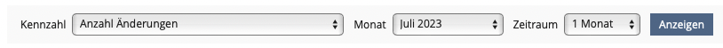

This toolbar filters which segment of data will be shown (from a specific month, what duration) and which kind of data will determine sort and focus.

Following our own Kitchen Sink definition we have concepts and components for this and no longer need to rely on generic inputs pressed into a toolbar:

* "A View Control is used to change the visualization of data."[^ks-view-control]
* "Filters are used to let the user limit content within a table, list or any other collection of items presented on the screen."[^ks-filters]

[^ks-view-control]: ILIAS Community. Kitchen Sink Documentation > Input > View Control. ILIAS 10 testing instance. https://test10.ilias.de/go/stys/21/InputViewControlFactoryViewControl/default/delos
[^ks-filters]: ILIAS Community. Kitchen Sink Documentation > Input > Container > Filter. ILIAS 10 testing instance. https://test10.ilias.de/go/stys/21/InputContainerFilterFactoryFilter/default/delos

Consequently, a table can and should use those components to filter and control the items it shows. Both are either already part of the Data Table (view controls) or will be part of it (filter). In this case the Toolbar would be empty and deprecated.

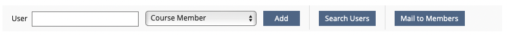

This toolbar is part of the Course Members View with a table listing the Members.

Adding new Members through the first three input elements actually adds entries to the table, so these options could be a part of it as they directly interact with it.

We currently do not have a location for this on the Data Table. The Action Types we have are...

* Standard,
* Single,
* Multi

...and so far these only interact with existing table items.

There seems to be a need for an action to create items, but the description of the current table actions does not allow this. For example, a Single Action is defined as follows: "The Single Action applies to a single record only. A typical example would be 'edit'."[^ks-data-table-single-action]

[^ks-data-table-single-action]: ILIAS Community. Kitchen Sink Documentation > Table > Action > Single. ILIAS 10 testing instance. https://test10.ilias.de/go/stys/21/TableActionSingleSingle/default/delos

The actions all refer to existing record items.

It's notable that the toolbar doesn't just include an Add User button. It's a search field that auto-suggest a valid username, a role search and a submit button.

Without entering a new context like a modal asking for this information, a user can pull an item from another data set. For frequent common actions this saves time because a potential follow-up prompt asking for details is already on screen. The downside is that it fills the interface with more elements which can make other elements more difficult to find.

There is another example for an item creation like this within the blog. This one is more simple and just asks for the name of the newly created blog post:

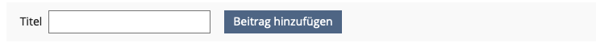

In this case, a new data object is actually created and a first piece of data (the titel) is already filled out on the next screen showing the input form.

In some Export tabs, the type of export can be changed through a select which determines which export file record is generated and added to the table below:

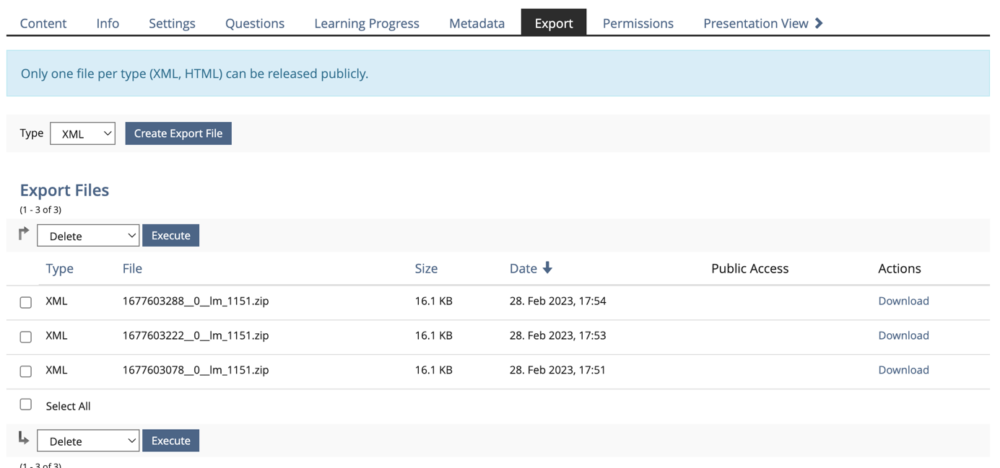

Construct like these (Text Field, Select, Button) can potentially be somewhat built from Kitchen Sink components (although the auto-complete does pose a challenge), but we do not have this as a specialized inline form component.

This specific example could cause problems because it could be wrongly identified as a ViewControl or Filter showing/changing a state of the data below.

Regardless, an item creation location on the Data Table should at least support a simple Add Item button, which could either trigger a prompt to ask for more details (and also cover the functionality behind the Search Users button) or directly create a new item with default values.

Some toolbars only have a button to add a record to the table below:

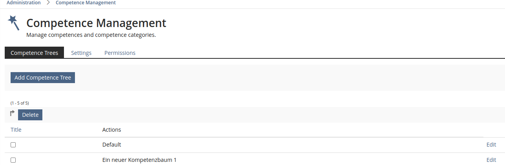

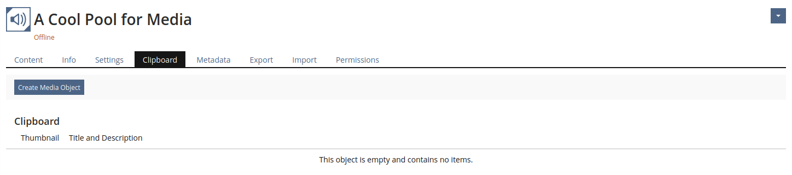

Furthermore, Mail to Members is an option that can also be triggered within the table involving either a single, multiple or all items. For all of these operations, we already have Action Types located in various dropdowns. Alternatively, this could also just be its very own page that can be navigated to from a tab or sub-tab.

Once again, this would leave the toolbar empty and all actions attached to the Data Table directly.

#### Mixing and grouping

We already saw View Controls and Filter inputs within the toolbar. This mix of action types is not uncommon.

Here is a toolbar from a forum thread:

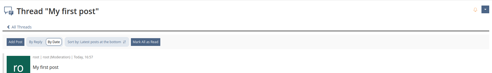

As you can see within the one bar there are...
* An action button adding an item to the component on the page
* A view control (sortation, view mode)
* An action that applies to all items that could possibly be shown in the component below

Stringing up vastly different types of data manipulation with different effects right next to each other is not uncommon in the UI of web-apps and websites. It can save space as you don't need to reserve an entire row or side to communicate a grouping.

Here the IKEA website makes no visual difference between sortation (a view control) and filter:

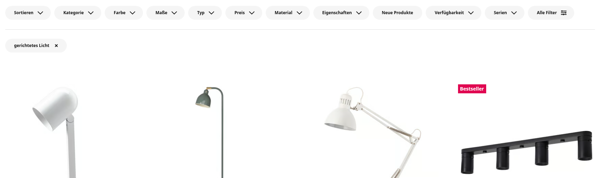

This makes the page look more cohesive, but it can also lead to confusion if buttons that look identical, trigger different kinds of actions.

Notion fits almost all elements like filters, view controls and settings into the same row above its data views:

<small>Source: Notion Official help - [How to write Notion formulas](https://www.notion.com/help/guides/write-formulas-that-extend-capabilities-of-databases)</small>

The order stays consistently the same, which does help orientation. However, one line toolbars still require some time to decipher to find the one relevant action in a tightly packed space. This works well in Notion, because the Table controls are always exactly the same and the other data views use them as well.

Towards the opposite end of this philosophy, we have WordPress spacing different kind of options generously across multiple rows and different ends:

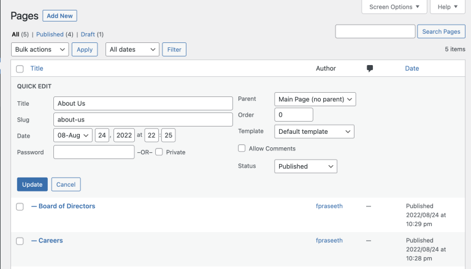

One thing that has become iconic for WordPress is the Add New button next to the headline. Over decades of WordPress history, some other buttons and elements snuck into that position on some pages, but the core functionality (pages, posts, users) is still using that single Add button and nothing else.

From a UX point this is a great decision, because that button is both the first and a frequent functionality that Users will need.

A clear and consistent location teaches a convention to users, which then saves them time on all future screens.

Let's have a look at some more screens that segment options into rows and to different left, center and right alignments.

Here is Jotform:

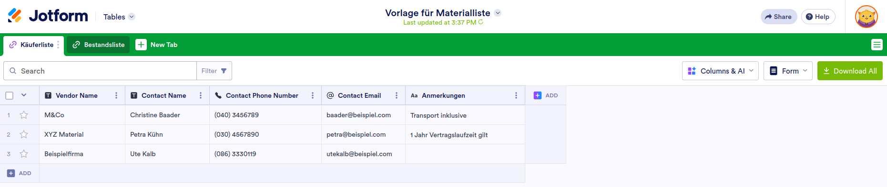

Some takeaways here:
* Sortation is entirely folded into the column headline (you select ascending/descending through the three-dots-menu of the column)
* The most important function in Jotform is not data entry. The data shown came from a form, so that is what is commonly to input more table rows. This is most likely why...
  * the download function is highlighted through a premium button
  * the add function is a bit dialed down and part of an empty row/column placeholder

In Salesforce's Starter Suite you can see the split into two rows and left/right sides very clearly:

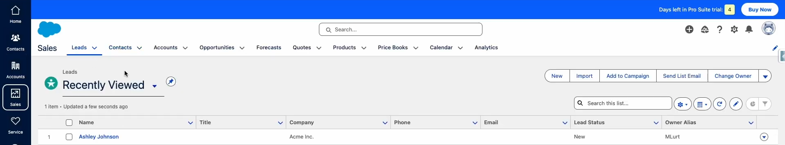

It's worth noting...
* frequent actions that move along the workflow are very clearly grouped in the top right
* the right bottom location is a mix of settings, edit actions, column selection and filters like a search bar
* There is a summary property location at the bottom right bar

For ILIAS, we might want to lean towards a multi-line control area with dedicated locations, because
* the ILIAS toolbars we have analyzed here lack consistency and sometimes take functionality from other locations that are already established,
* when we add functionality in the future, clearly defined locations will make it easier to decide where we will add them.
* By strengthening multiple locations in and around the Data Table we can set and meet expectations very clearly. This prevents accidental clicks and lostness and increases the speed with which both beginners and advanced users can navigate the interface.

### Page vs. Data View

One issue that came to our attention while doing research for this paper, is too large to solve within this context:

A lot of the time, content shown in ILIAS is not actually a content page. Content can be made of different elements that switch or evolve a topic. Instead, it's a quite direct representation of data from the database either as a form or a table. A Question Overview contains a table of all question items and nothing else - no analytics, no preview, no internal comments etc.

However, the page header we generally have in ILIAS is optimized for content pages. The headline (which could very often describe the only table on the page) is positioned at the tab. The tabs and sub-tabs that follow have nothing to do with the table below, they navigate away.

WordPress has largely solved this problem on its core pages in the admin area. All navigation is in the left sidebar. When you open the User Management, all you see in the main area is a table, with its headline, and its options. You don't see a page, you see the data, displayed as a table.

The mix of content and data representation might have caused some confusion for both users and programmers.

Adding sub-pages may be a function that is logical for a page toolbar. However, adding users to a table that happens to be on the page is actually breaking the logic.

Seeing the toolbar as toolbar for managing page itself immediately disqualifies it for many things that it has been used for in the past. Some things should go to the table itself, as we have established, (adding table items, exporting table data) and some operations are actually page actions that would fit very well to a Toolbar in charge of the current page and its sub-pages (Manage).

Currently, we cannot investigate this further. However, it seems that actual content pages and data views might require fundamentally different representation.

As a future project we should examine which operations left inside the toolbar are page-/object-level actions and likely need a consistent place within the page header.

Keeping the header in ILIAS uniform for working with data and working with bodies of content might hurt usability and prevent us from providing specialized interfaces for workflow steps with entirely different requirements. If we introduce specialized data view screens those might actually manage the location of Add New buttons, View Controls, Filters and so on and not the components itself.

### Controls around Tables

Currently, the Data Table already supports a variety of interactive elements that come as part of the component:

* View Control Pagination
* View Control Sortation
* View Control Column Selection
* Standard Actions that can apply to a multi-selection and single items (e.g. copy)
* Single Actions that only apply to one single item (e.g. edit)
* Multi-Actions that only apply to multiple items (e.g. compare)
* Multi-Actions that apply to all items in the table
* Filters are currently work in progress
* Ordering Table allows to change item order with drag and drop and input fields

There actually might still be some things missing we should consider adding (e.g. storing/naming/loading view control and filter configuration), but this would go beyond the scope of this paper.

For evaluating the place and priority of the Add Item location it is worth considering the other elements around it. Not only the relevance to the average User Intent, but also the context of other functionality informs the best possible visual hierarchy.

## Proposal

Considering...
* the high priority of the User Intent
* and the relation to other elements of the Data Table (part of the table but outside the filtered view)
we suggest the following architecture:

{Headline} {Actions table or all data}
{Item Creation} {Import}
{View Controls} {Save/Reset Filter & View}
{Add/Edit Filter Toggle} {Active Filters}
{Expanded Filter Options}
{Table Columns & Rows}

### Item Creation

#### Position

For tables like the Questions in Question Pools, or assigning Members to Groups, the function to add items to the table is one of the main reasons why this screen exists. Therefore, Item Creation should be very high up in our visual hierarchy.

Adding items is also outside the process of filtering and sorting existing data.

Consequently, we suggest displaying any Add or Import buttons below the table heading and general table actions (export, renaming the table), but above view controls and filter.

Given that the Data Table is also specialized in displaying data, not editing it, we recommend 

We propose multiple ways of item creation:

#### Buttons Opening Modals or Form Page

The most simple way to add an item will be a Add {table item} and/or Import button.

This button could then trigger
* a direct action
* a modal with a form (e.g. for import)
* a modal with a tree (e.g. fetching data from other ILIAS objects)
* a modal with a search
* or lead to a more complex form on a new page

#### Auto-Suggest Input

For assigning Users to a Table we have seen several implementations that have an input text field and an Add button.

This interface aligns with our goal to simplify and place the main workflow of the screen high up in our hierarchy.

To be very useful and fast, the input text field needs to auto-suggest item names from the source data set. So when you type "John D", a list of likely options appears (e.g. John Doe, John Dummy)

We do not currently have a UI component that fits these requirements. Fuzzy search and dynamically fetching the data from the server are likely challenges.

### Inline Add Rows and Columns

We saw in the Jotform interface that adding rows and columns could be done through a placeholder rows and columns.

As editing data inline is outside the scope of the Data Table, we suggest to not follow that approach.

### Other Actions

Now that we added the first button to the data table, we might be tempted to add more right next to it.

To keep the hierarchy and information architecture intact and support finding options in semantically separated chunks, we suggest to limit the kind of buttons that can in that place.

This creation location should only allow inputs to add one or multiple items. So [Add Item] and [Import Items] can go there. [Export as CSV] cannot as it has nothing to do with object creation.

Instead, we should strengthen other locations or create new ones that will help us to keep functionality organized.

* Options concerning the entire data table might find there place at the top right next to the title (e.g. Export, Refresh,...)
* Manipulating a selection (e.g. duplicating) is also lower in hierarchy because it relies on data once it is present in the table, so it should be somewhere below the Item Creation area.

### Dropdown Menu with Inside-Out Buttons

We currently do have a catch-all dropdown where multi-actions for a selection of items will be displayed.

To make finding common options easier (e.g. Copy and Paste), we might want to add the possibility to display some of those options outside to the left of the dropdown menu. They are somewhat part of the same set of options semantically, but due to their importance they are shown outside of the dropdown menu instead of inside. The dropdown menu basically becomes a "more options" extension.

This save clicks and teaches new users where these types of options are located without having to guess.

### Multi-Action Dropdown Position

As selecting multiple items is a prominent feature, it might be worth considering placing the dropdown in a more prominent position (e.g. near the select all/nothing toggle)

### Deprecate Select plus Button Actions

The combination of a Dropdown Select Input next to a Submit button should be avoided.

We teach the User that any information shown on the Filter and View Control inputs reflects a display state. Consequently, we should avoid having a rival concept (a select with a state that has no current effect on the data shown).

We suggest explicitly adding such options as their separate dropdown menu entries (Export CSV, Export JSON, Export XML).

## Conclusion & Next Steps

In order of importance we recommend the following steps:

* introduce a withCreation parameter to the Data Table that accepts Add/Assign Item and Import Items type buttons or prompts, and renders above ViewControls and Filters
* put Filters after View Controls as the view control settings apply to the filtered data
* display multi-actions for all data (table-actions) at the very top, even above new object creation
* develop an inline form container (or a Context Renderer) that can display form inputs and their submit button next to each other - this should cover the current quick add functionality where Users can provide a name or other settings to start the creation with.

This should introduce the new functionality to add items to a Data Table with strong hierarchy and logical visual architecture than can easily be learned and operated.

Additionally, we might want to consider the following changes and additions, so that the visual hierarchy of the Data Table is further optimized:

* introduce the inside out dropdown menu concept at least for multi- and table-actions, so Export functions can be presented more prominently.
* in cases where table headline and page headline are identical, we might want to consider removing the page headline or display the headline of the parent location instead - this should further clarify what data set a User is working with
* further analyze how to deal with page/object-level actions to take out of the toolbar and into the page header (potentially differentiating between data view and content pages).
