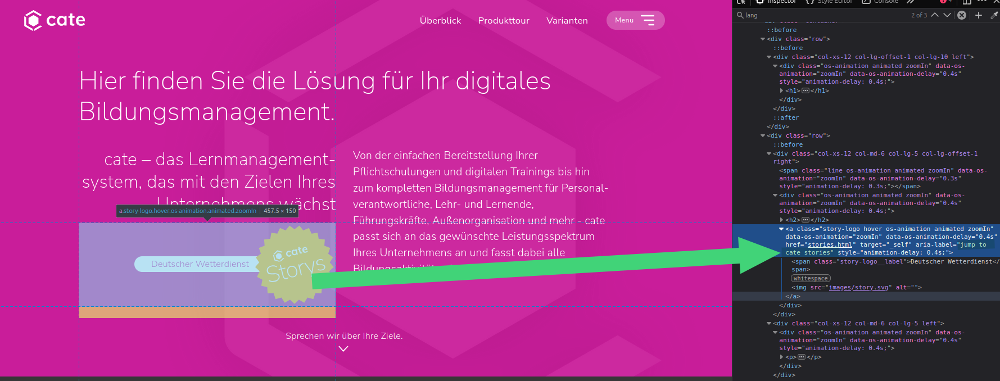
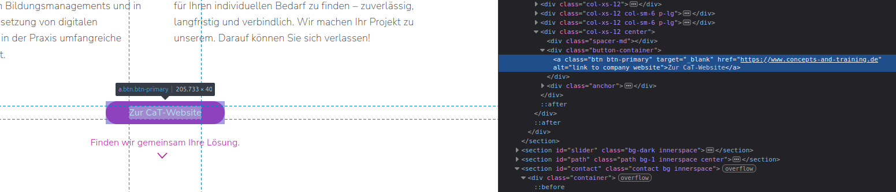
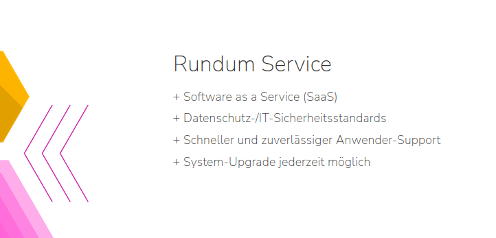
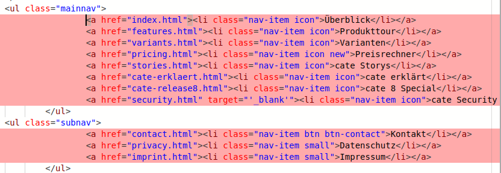
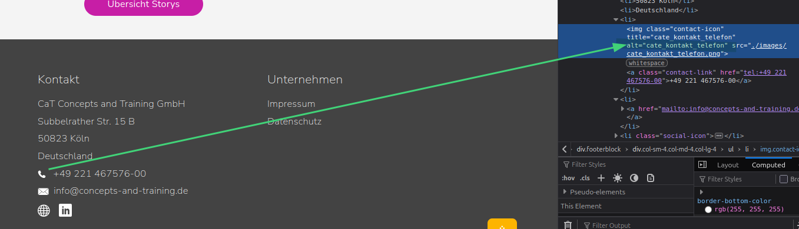
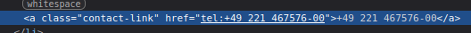
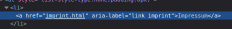
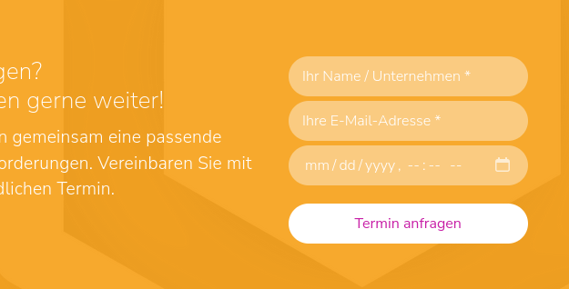
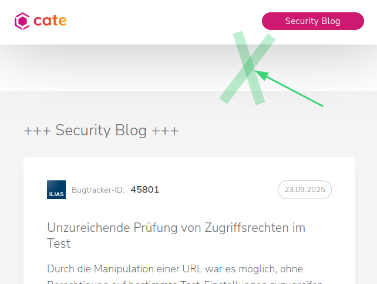

# cate-lms.de

## Funktioniert super 

☑️ Cookie consent banner fängt Fokus ein und ist mit Screen Reader bedienbar

☑️ Headlines auf Homepage sind sinnvoll verschachtelt

☑️ Aria label auf cate stories badge ist sinnvoll gesetzt (aber auf Englisch siehe Abschnitt Handlungsempfehlung).

☑️ Footer Link Icons sind vorbildlich mit alt ausgezeichnet

☑️ coole Lösung mit dem Card-Link bei der Story-Artikelauswahl

## Handlungsempfehlung

### Allgemein

* Für Videos sollten wir Untertitel anbieten: https://developer.mozilla.org/en-US/docs/Learn_web_development/Core/Accessibility/Multimedia#implementing_html_video_text_tracks
* Viele Aria-Label sind noch auf Englisch

* Hauptinhaltsbereich sollte mit `<main>` markiert sein
* Footer: Adresse sollte nicht in einzelne li Elemente aufgesplitted sein, stattdessen in einem gemeinsamen und ggf. mit ` ` getrennt.

### Startseite

* Varianten-Karten: Entweder Karte zu einer Region mit Label machen oder `aria-label="jump to page"` spezifizieren `aria-label="zeige Details zur Variante Partner an"`
* Varianten Karten vielleicht als ul?
* in den Varianten-Karten: Hover State könnte bei Tastaturbedienung auch der focus-visible sein - vlt. zusätzlich zur sonstigen Fokus-Markierung
* `<a>` Tags dürfen kein alt Attribut haben - und brauchen auch kein aria label, wenn einfach nur das vorgelesen werden soll, was eh schon im tag steht.

* Logo Slider hat zwar alt tags auf den Bildern, aber die Slider Bedienung versteht man auf dem Screen Reader ohne weitere Anweisung nicht. Empfehlung: Den slider mit `aria-hidden="true"` für Screenreader ausblenden und eine einfache unsichtbare ul Linkliste mit Überschrift "Einige unserer Kunden" als Ersatz anbieten.

### Produkttour

* `list-style-type: "+ ";` führt in manchen Screen Readern dazu, dass jedes Mal ein "plus" vorgelesen wird. Vielleicht sollten wir solche Listelemente verwenden `<li>+  List Item</li>` mit einer ungestylten liste `list-style: none;`.
  

### Preisrechner

* Preis-Tabelle braucht eine Mobildarstellung.

### Cate Stories

* Artikelliste sollte `<ul>` mit `<li>` Elementen sein.

## Kaputt

### Allgemein

* Navbar: Hamburger Menu Button kann nicht mit der Tastatur angewählt werden. Empfehlung: Checkbox verwenden und zum Hamburger- und Schließen-Icon stylen https://christiantietze.de/posts/2025/01/responsive-scalable-hamburger-menu-accessible-css/
* Falsche Schachtelung der Menü-Elemente. `<a>` muss im `<li>` Element sein.

* Navbarleiste oben, die Mainnav Seitenleiste und die Subnav brauchen sehr klare aria-label, damit diese auseinander gehalten werden können. Alle müssen in `<nav>` tags eingefasst werden.
* Mainnav Seitenleiste steht im DOM ganz oben und wird deshalb nach dem Laden der Seite direkt vorgelesen. Stattdessen sollte der Screenreader mit der h1 und dem Inhalt beginnen. Mögliche Lösungen (am Besten beides machen):
  * `display: none;` oder `visibility: hidden` auf die verborgene Seitenleiste und dann mit discrete animation direkt zu Beginn des Aufklappens auf sichtbar schalten: https://dev.to/kevinbism/css-animation-with-display-none-4pan
  * Unsichtbarer "Zum Inhalt Springen" Link https://www.w3schools.com/accessibility/accessibility_skip_links.php ggf. bei Tastaturfokus auch für sehende Nutzenden anzeigen
* Nav Listen: menubar und menuitem Roles hinzufügen https://dev.to/ilizette/how-to-build-an-accessible-navigation-menu-1omk
* bei Tastaturnavigation kein sichtbarer focus-visible auf `<a>` tags, die wie Buttons gestyled sind. Empfehlung: scss focus tool aus dem ILIAS trunk verwenden. Beachten welche Art von focus mixin für welche Elemente in ILIAS verwendet werden (e.g. border-only auf bestimmten Bedienelementen).
* Pro Seite muss es eine h1 (und nur eine) geben und alle weiteren müssen der inhaltlichen Verschachtelung folgen. Notfalls können h2s für sehende Nutzer unterschiedliche gestaltet sein (z.B. Überschrift in Fließtext vs. Überschrift in CTA-Banner)
* Telefon Icon im Footer sollte kein alt attribute haben

* Leerzeichen und minus in tel: links nicht zulässig

* Footer: aria-label des Impressums Link und des cate Security Blog Links überschreibt unnötigerweise, was der Screen Reader vorliest mit englischem Text.

* Firefox: Screen Reader lesen den soft-hyphen character `&shy;` vor (das ist ein Bug). Viele Überschriften sind dadurch unverständlich. Stattdessen sollten wir eine Sprache für die Seite setzen und `hyphens: auto;` nutzen.

### Startseite

* Testimonial Slider als `<ul>` anlegen.
* "Der gemeinsame Weg" Tabs sind für Screen Reader Nutzer nicht als Liste oder aufklappbare Accordions erkennbar und zerbricht außerdem im Browse Mode des Screen Readers und verliert sich in unsichbarem Text. Das schnelle Scannen, was wir sehenden Nutzenden ermöglichen, bleibt dadurch mit dem Screen Reader verwehrt. Vorschlag: `<ul>` mit `<li>` Elementen kommunizieren, wie viele Elemente es in der Liste gibt, dann in den Listenelementen aus nativen html Elementen das accordion bauen `

Accordion Title
Accordion content including 

 or whatever is needed.
`. Es gibt Diskussionen, ob ein JavaScript noch aria-expanded/collapsed setzen muss: https://www.hassellinclusion.com/blog/accessible-accordions-part-2-using-details-summary/

### Kontaktseite

* `<h3>` als höchste Überschriftenebene ist nicht zulässig, muss `<h1>` sein, alle weiteren davon ausgehend verschachteln. Notfalls style anpassen, um gewünschte Größen unabhängig von der inhaltlichen Struktur zu erreichen.
* Jede einzelne Adresszeile ist in h tags eingefasst. Es sollte nur einen h tag als Label geben z.B. `<h2 class="someFittingClass">Adresse</h2>` und darunter dann die Postanschrift. Ggf. können Überschriften, die nur für den Screen Reader gedacht sind mit einer screen-reader-only Klasse ausgeblendet werden. https://webaim.org/techniques/css/invisiblecontent/
* Kontaktseiten Felder haben einen schlechten Kontrast je nach Banner Farbe

### Preisrechner

* falls nach Setzen der focus-mixins noch nötig: Überprüfen, ob Tastaturfokus für alle Bedienelemente deutlich gesetzt wird
* live region zum Vorlesen der berechneten Preise nach Setzen der Anzahl

### Cate Stories

* fehlende Fokus-Rahmen bei der Tastaturnavigation durch die Artikel

### Security-Blog

* startet mit h3 statt mit h1
* Mobildarstellung: leere Fläche mit Schatten, die auf dem Desktop nicht zu sehen ist

