# Proposal for a semantic Button and Link Type Hierarchy

## Goal

Currently, **buttons and links are styled inconsistently in ILIAS.** For example, sometimes "Add New" is a Primary Button, on other pages it is a Default Button. In some places, tables are accompanied by View Control Buttons, in others the same options are presented as Shy Buttons.

With this proposal we want to create a framework to bring consistency into this chaos.

Consistent hierarchy and reliable behavior will help both beginners and experienced users to **navigate more quickly and frictionless** through our interface.

## Findings

* One more button type would add one more nuance to the information architecture in ILIAS.
* Treating some buttons differently depending on the type of action they trigger can reduce distractions.
* Finding groupings and dedicated locations for buttons in smaller contexts makes busy interfaces more manageable.

We will investigate and build these findings over the course of this document.

## Buttons vs. Links

An article on makethingsaccessible.com puts it plain and simple:
* "A link goes somewhere,
* a button does something" [^makethingsaccessible-link-button-def]

[^makethingsaccessible-link-button-def]: Darren Lee. Links vs buttons vs other clicky things. April 16, 2023. makethingsaccessible.com. https://www.makethingsaccessible.com/guides/links-vs-buttons-vs-other-clicky-things/ visited on January 21, 2026

There are two sides to this:
* users already expect them to look a certain way
  * links are underlined text
  * buttons are padded boxes
* they have different functionality
  * Links may show the target URL in the browser and cause a page reload. The keyboard shortcut to open them is ENTER.
  * Buttons generally do not cause a reload. Keyboard shortcuts to interact with them is ENTER and SPACEBAR. They are announced by screen readers as "push buttons".

Not following these standards will break the users mental model of how they expect things to work. And that is never not good, because it confuses and overwhelms users.[^breaking-mental-models-examples]

[^breaking-mental-models-examples]: Jason Clauss. BUXRU #24: This is what happens when you break the mental model. December 6, 2018. uxplanet.org. https://uxplanet.org/buxru-24-this-is-what-happens-when-you-break-the-mental-model-ffbce96cccea visited on January 21, 2026

## Two Dimensions

We need to look at two factors that seem to guide the styling of links and buttons:

* Information Architecture Hierarchy: How relevant or consequential is the action?
* Semantic Types: What type of action will be triggered?

### Information Architecture through Visual Hierarchy

#### Priority levels

Typically, many webapps seem to use three visual levels of priority for their **buttons**:

* primary
  * "Usage: emphasize the most important actions
  * Design: bold colors and larger size"[^button-basics]
* secondary (the standard button in ILIAS)
  * "Usage: supporting actions that are less critical than primary buttons
  * Design: subdued colors and smaller size."[^button-basics]
* tertiary buttons  
  * "Usage: optional actions, often for additional features. 
  * Design: minimal styling, often text-based."[^button-basics]

[^button-basics]: Jennifer Pelegrin. Button design for websites and mobile apps. June 3, 2024. justinmind.com. https://www.justinmind.com/blog/button-design-websites-mobile-apps/

Primary and secondary buttons are often above text links in the Information Architecture. Tertiary shy buttons may look exactly like text links.

This is comparable to the main design options offered by the tried and tested design framework of the UK government[^govuk-button-types]:

[^govuk-button-types]: GOV.UK Design System team. Buttons. https://design-system.service.gov.uk/components/button/

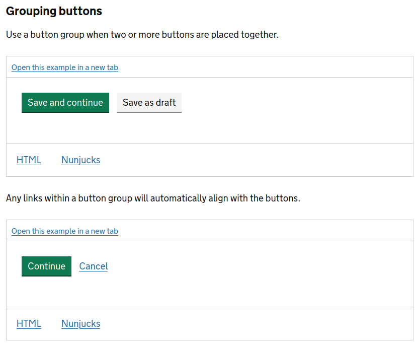

In cate, an LMS based on ILIAS, the designers have introduced a fourth level between secondary and tertiary buttons. It splits the two less remarkable into three levels:
* secondary: medium importance, somewhat frequently used
* suggested inbetween: medium importance, occasionally used or often repeated within the same page
* tertiary: low importance, rarely used

Consequently, we would recommend the following 4 levels for a more complex webapp with many buttons. This naming was suggested by Koen Geerinckx from icapps.com:[^icapps-semantic-names]

* highlight
* default
* alternative
* subtle

[^icapps-semantic-names]: Koen Geerinckx. Button naming for design systems: a more semantic approach. October 26, 2022. icapps.com. https://icapps.com/blog/buttons-design-system. Last visited: March 18, 2026.

HeroUI[^heroui-buttons] is a UI framework that offers 4 button levels plus a shy button (and alert buttons, which we will have a look at later):

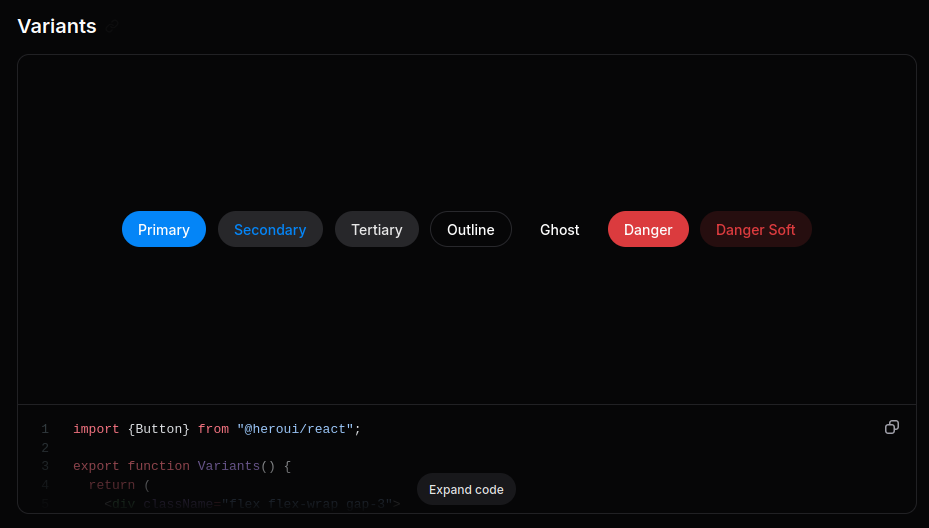

[^heroui-buttons]: HeroUI Community. Button. https://heroui.com/docs/react/components/button

We need to be aware that naming buttons "primary", "secondary" and "tertiary", but also "outline" and "danger" introduces an inconsistency, a category error. This list mixes a priority count ("primary") with a description of design ("Outline"), with a description of context ("Danger"). Most UI frameworks do this and to some degree it might be unavoidable. However, we should strive for a consistent naming - at least for our basic range of buttons.

A scale used by the UI University of Bern uses associations with sound loudness. In such a system, our levels could be named:

* loudest
* loud
* quiet
* whisper

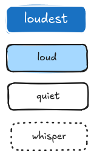

This naming does not mix context hints or concrete descriptions of design. A whisper button could be outlined, or it could just have a faint background - we can leave this up to the skin.

The only thing that this naming demands is that (going down the scale) each button draws less attention than the previous one.

These levels usually use the colors of a branded design.

#### Alert Buttons

There are also "alert buttons" that use colors following a general symbolism:[^red-buttons]

[^red-buttons]: Nick Babich. Using Red and Green in UI Design. January 1st, 2019. UX Planet. https://uxplanet.org/using-red-and-green-in-ui-design-66b39e13de91 last visited on March 16th, 2026

* red buttons for actions with potentially negative consequences (like "Delete" or "Reset")
* green buttons for actions likely leading to a successful conclusion like "Confirm" or "Save"

The framework Webawesome uses alert buttons next to two prioritized buttons (they also offer an outlined variant for every button):

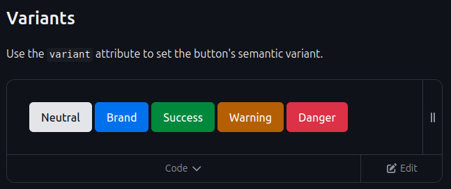

Next to our volume scale, a set of alert buttons would look like this.

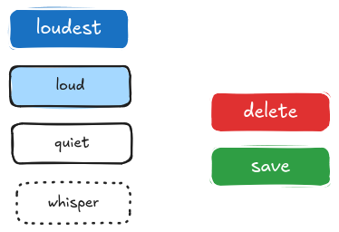

Red and green buttons to indicate dangerous or positive actions also come with additional challenges. 8% of men are colorblind.[^colorblind-statistic] So to them (depending on the shade) the buttons may look similar or the same.

[^color-blind-statistics]: About Colour Blindness. https://www.colourblindawareness.org/colour-blindness/. last visited on March 23, 2026.

Leagues United describes [here](https://leaguesunited.org/news/366) how they solved this issue in their game by uniquely decorating the buttons when a Color Blind Assistance Mode is toggled in the settings:

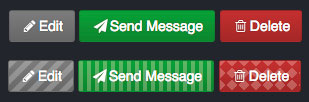

Here is an approximation what they would look like with different kinds of color blindness:

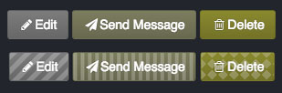

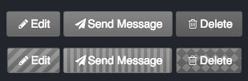

And there is one more pitfall: "using both red and green together actually has the opposite effect [...] We get locked by analysis paralysis."[^alert-paralysis]

[^alert-paralysis]: Kerry Butters. UX Dilemma: Red Button vs. Green Button. April 14, 2014. https://www.sitepoint.com/button-ux-red-green/. last visited on March 23, 2026

So when we have buttons for "Save" or "Disregard", only one should get the alert design, not both of them. If it is highly unlikely that users want to disregard their own input, it is good practice to highlight the "Save" button, despite "Disregard" being the dangerous option.

Observe how alert buttons push their action above the "loud" level:

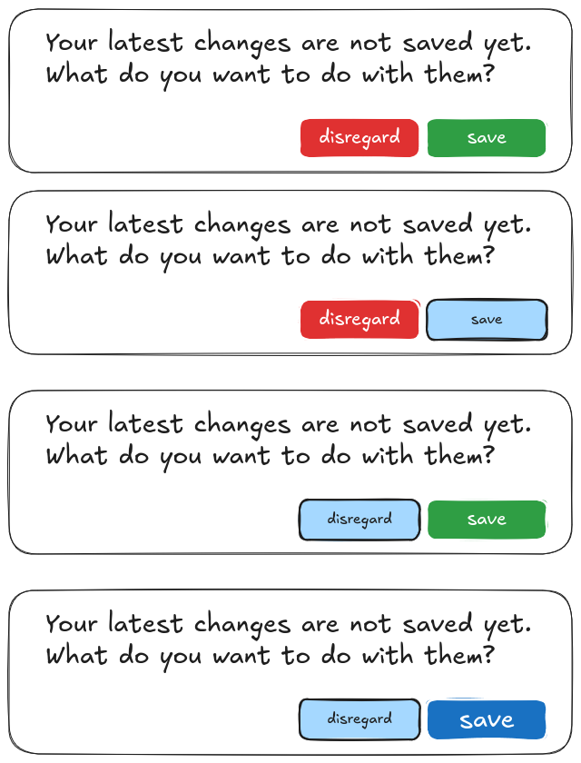

We should also keep in mind that it is fairly clear which buttons should be red or green in this example. Some cases are more ambiguous:

What about a dialog confirming "Should this document be overridden? (Yes) (No)". Is "Yes" dangerous because the previous document will be lost? Is "No" dangerous because the new document remains unsaved? 

Many design frameworks have even more variations of this concept like info buttons, warning buttons - usually mirroring the priorities of a status message box (see Bootstrap 5 documentation: https://getbootstrap.com/docs/5.0/components/buttons/).

Here is the range of buttons in Bootstrap 5 (they also offer an outlined variant for each):
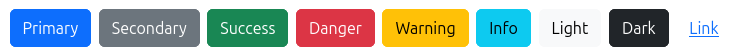

The Bootstrap documentation does not offer semantic guidelines clarifying which button to use in which case. Deciding which button to use where is left entirely up to the consumer building the interface.[^bootstrap-button-doc]

[^bootstrap-button-doc]: Bootstrap Team. Button. https://getbootstrap.com/docs/5.3/components/buttons/

In ILIAS, we ended up not using these variations for buttons while these styles were available, so they have been removed when Bootstrap was replaced.

A "danger" button could definitely prevent some unfortunate accidents. But as we could see in the mockup above, a loudest button works just as well to draw attention to the positive action.

Red and green buttons do introduce a new set of problems:
- bad UX for people with red-green-blindness
- sometimes it is not clear which option is the dangerous one
- what about designs of brands that use a lot of red or green?

#### Links

**Links** within a system usually borrow their base style from the surrounding text. This means they also take over a similar priority within the information architecture. A body link stands out just slightly from the body text. A headline link might be equal or slightly above the information layer of the headline.

However, just like with the buttons, there is one common case to break this pattern: Many **Call-To-Action buttons** used in modern web interfaces are not actually buttons. They lead away from the current page so they are technically links, but visually look like buttons.

Except for this quirk where buttons and links visually look like their counterpart and for very large clickable headlines, buttons are generally more attention-grabbing than links.

#### Resulting hierarchy

Let's summarize the hierarchy that this gives us from standing out most to barely standing out:

* links in large headlines
* button loudest (and Call-To-Action Links looking like it)
* alert buttons (e.g. a red delete button)
* button loud (and Call-To-Action Links looking like it)
* button quiet
* button whisper
* links in text

In this example, the loudest button was made larger to ensure it is perceived before the alert buttons.

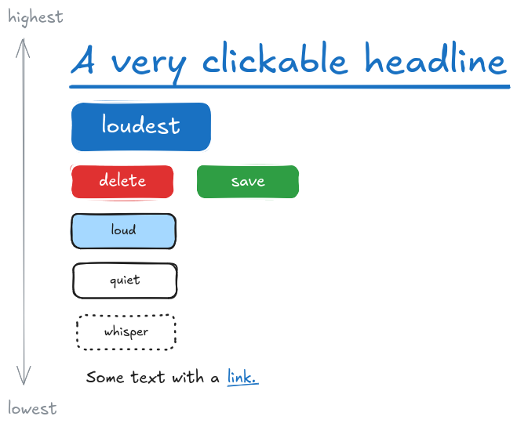

This is a purely visual hierarchy. With this framework, **we know that a Button primary is more eye-catching, but so far we do not know when a Button is important enough to be a Button Primary.** We need a second criteria for making these decisions.

### Design Modifiers

There are some design modifications that use one of the other appearances as a base but increase the perceived priority compared to the unmodified variation.

* floating buttons
* full or large width buttons
* buttons with icons
* larger font-size

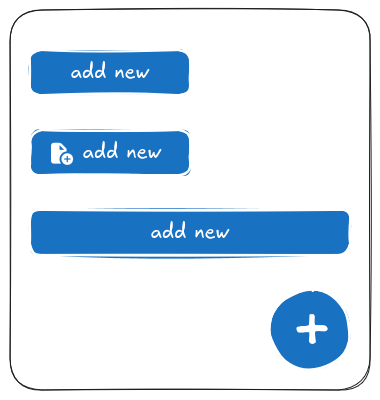

Some modifiers decrease a buttons perceived priority within the Information Architecture:

* reduced font-size
* icon only with no text label

### Related elements

While this paper focuses on buttons, there are some elements that are based on the button design or may borrow a similar hierarchy from them:

* dropdown buttons often look exactly like buttons, but sometimes they do embrace a unique design (e.g. using a circular shape in an UI with mostly square elements)
* menu entries may be shy buttons by default. However, primary, secondary and alert variants as well as icon modifiers may be used in UIs with a large amount of menu items.

### Semantic Types

To have a framework for a consistent and understandable we need to define...
* which types of actions are triggered by a button
* need to be associated with which type of appearance

Here is a (probably incomplete) collection of actions in a webapp and a suggestion how to group them. Some categorizations may appear surprising, but will be explained.

#### End workflow (step) (with given input)
mental model: putting a letter into the mailbox, ringing a doorbell and someone answers
user intention: get a result from the system and likely move on to another task

* submit an input like a form, login, comment
* add an item based on choices in other inputs
* trigger a search after entering a keyword
* apply a filter
* changing a status (publish)
* confirm or cancel an operation that is about to happen

#### Start and interact with workflow
mental model: getting on the train towards a location
user intention: engage in a process and expect that it will occupy me for a longer time, so I accomplish one or all milestones

* add an item based on the steps that are about to follow
* call to action
* fundamentally change the relationship between my user and the object (enroll, join)
* start a sequence or workflow (a wizard, a quiz, a sequence of course pages)

#### Manipulate item
mental model: crane or digger re-locating objects
user intention: build and change a structure

* copy
* cut
* paste
* duplicate
* delete
* create, add as (empty) structural element
* add object to list of favorites

Buttons with these actions often have an icon associated with them: A trash bin for "delete", a double paper for "copy", scissors for "cut"...

These icons resembling real world objects are somewhat of a software convention by now and generally understood. It's called skeuomorphism when design "imitate[s] physical elements, reducing the learning curve for unfamiliar interactions."[^nngroup-smorphism]

[^nngroup-smorphism]: Megan Chan. Skeuomorphism. March 15, 2024. nngroup.com. https://www.nngroup.com/articles/skeuomorphism/. last visited March 24, 2026.

#### View Controls
mental model: changing the grid in which post-its on a whiteboard are sorted into
user intent: make the patterns I care for easier to see

* adding or removing parts of the view (sidebars, panels, table columns)
* switching between modes (edit and preview)
* sortation buttons
* pagination
* previous and next item(s)

#### Filter items
mental model: using a sieve to split sand from pebbles
user intent: focus on the relevant items, minimize distraction

* pick a quick filter category
* pick a range, limit or minimum

#### Toggle hidden content
mental model: looking at the index of a folder, then opening the folder at the start of one of the tabs
user intent: dive into some details, not all, keeping the overview

* hide and show more
* expanding and collapsing
* opening and closing a dropdown menu
* opening and closing the node of a tree
* vertical or horizontal tabs

#### Inline Add

In our research we found the dotted button in the Antdesign UI framework, which has a semantic purpose. It is described to be "commonly used for adding more actions."[^antdesign-button]

[^antdesign-button]: Ant Group and AntDesign Community. Button. https://ant.design/components/button

This is a similar distinction we already have in ILIAS for the "add filter input" button. We will probably not further investigate this very specific button type in this paper.

### Investigating Challenges

#### For my user or for others?

Two common semantics we have not yet integrated in our model. They are...
- user scope: does the action only affect my user or all users of the system
- action persistence: does the action only have a temporary or permanent effect

Some webapps like Notion can filter a database just for the current user, but one click can force this filter for every user. They communicate this through the label reading "Save for everyone" and red colors indicating that the filter is not permanent nor visible to everyone.

#### Manipulate items and item creation 

At first, it might seem odd that we mentioned object creation in the same category as copy, move and cut. The latter are clearly dealing with existing entities while object creation involves bringing something into existence. Intuitively, this might feel like it cannot belong in the same category.

However, the user intention for this category is "build and improve a structure". When I add an item while building and expanding a system's structure, I do add it for the sake of the larger architecture and not to further engage with this specific content right now. Therefor, it's recommended to count object creation done with this user intent in mind to this category.

Furthermore, in the digital world, an object can exist in two structures at once. When creating links or adding an object to a list of favorites, the user engages in structuring. Therefor, any cloning, duplicating, marking and linking also falls under this type of action.

#### Add and Create type actions

But object creation may fall into other user intents as well. For example, a button with an "add item" label may fall into one of three categories: 

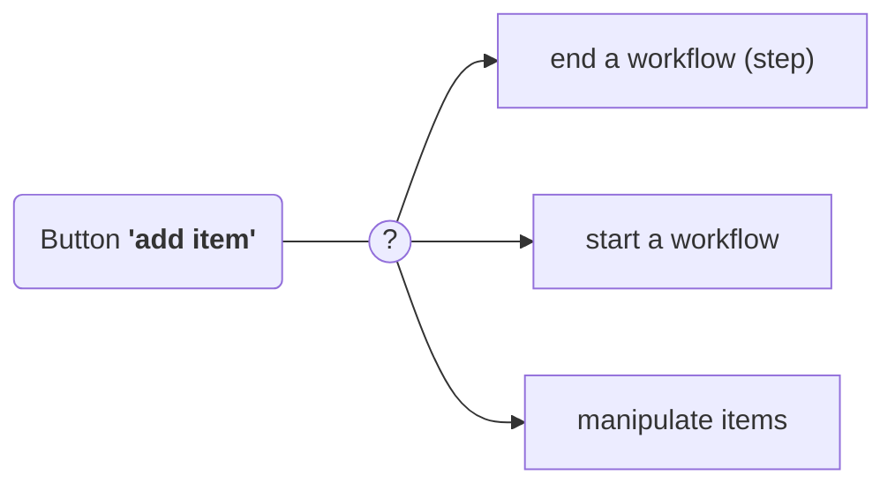

It all depends on the point in the current process. "Add item" may submit a form and item creation is literally done with a click. "Add item" may begin a longer wizard that eventually may end with item creation. Or, as explained before, we might "add items" to carve out a structure and take care of the actual content later.

In many systems, all of these cases would just use a primary or secondary button. Consequently, the user wouldn't know for sure which one of these cases they will be thrown into.

The question that we need to investigate is whether buttons should visually indicate which kind of action they trigger?

## Visual Investigation

Let's bring the factors we have identified into some rough visual mockups. We will set new "rules" iteratively step by step. This way we can better investigate how certain decisions influence the nature of the UI in practice.

We start with an interface where none of our observations have been applied. This gives us a bland, uninteresting and overwhelming pile of buttons:

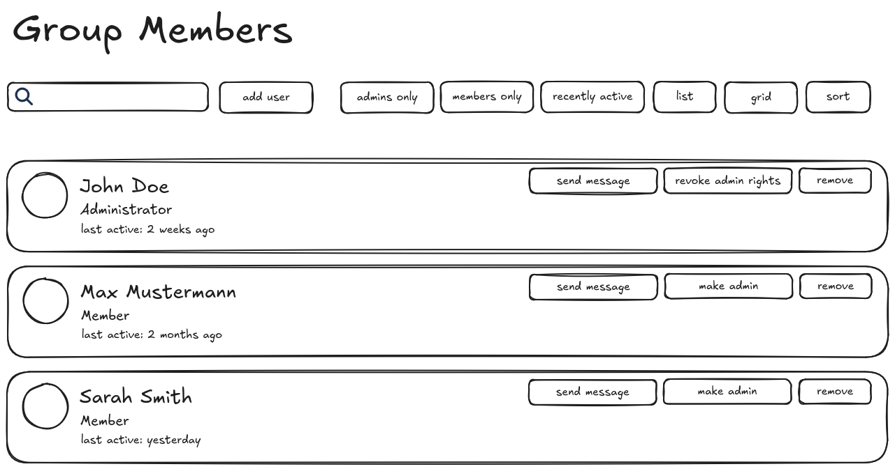

For the sake of simplicity and clarity we will not use a button with an identical look to a link.

Applying the priority level scale we discussed earlier, we may get something like this:

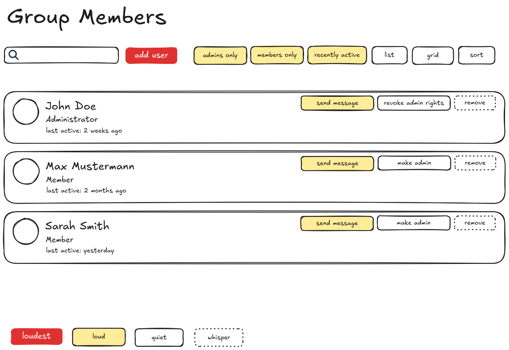

How would it look if we colored and grouped the buttons by their action type instead?

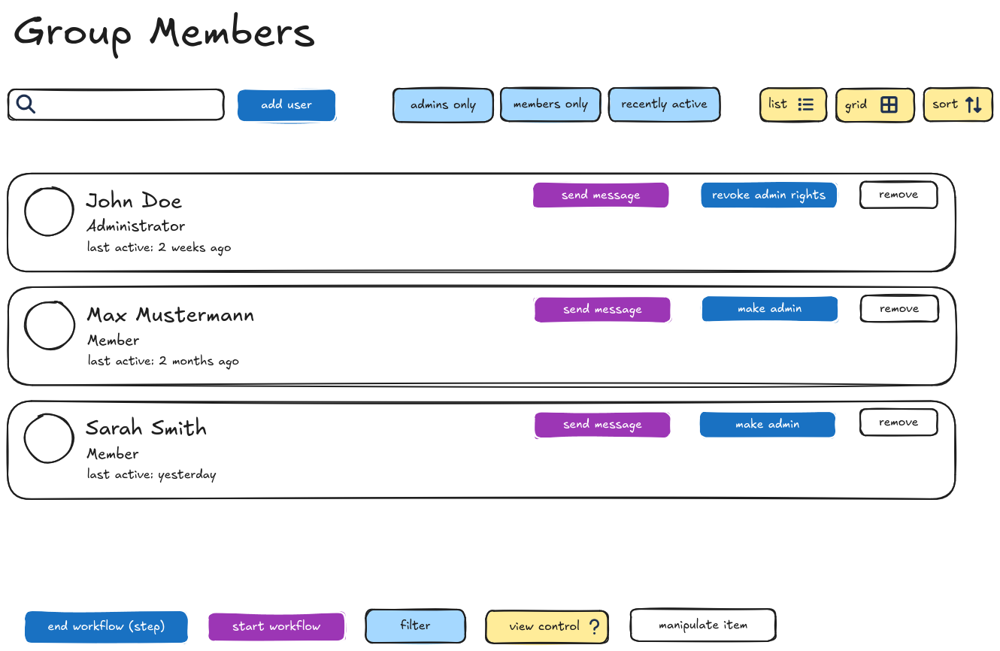

To bring the two dimensions together, let's try to communicate the priority level by size and the action type by color.
To experiment with spacing let's give each priority step and each new action type its own line.

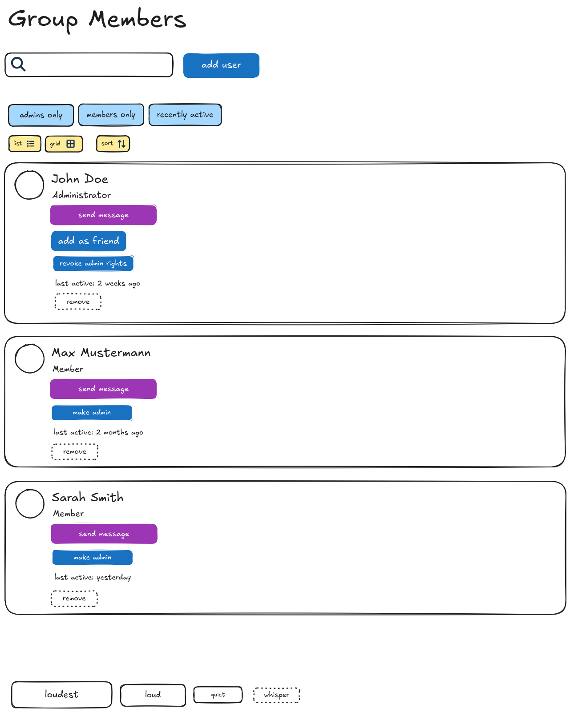

The button stack within the item definitely becomes difficult to decipher at a glance. However, the header of the list is coming along nicely. We can clearly differentiate the main action, filters and view controls. This is a quality we definitely want from our interface.

At this point, it appears like differentiating workflow starting actions from workflow ending actions through two different colors doesn't contribute to clarity. It requires thinking to truly understand why "send message" would have a different color than "make admin". Let's switch back to coloring the buttons by priority level.

To tidy up the content of the item cards, we can fall back onto a previous paper we made about ordering the properties on an entity. We also recently decided in a workshop to split the action buttons on an entity into managing actions, workflow actions and reaction locations. So instead of stacking them, we shift them into fixed slots that all entity-like structures can share:

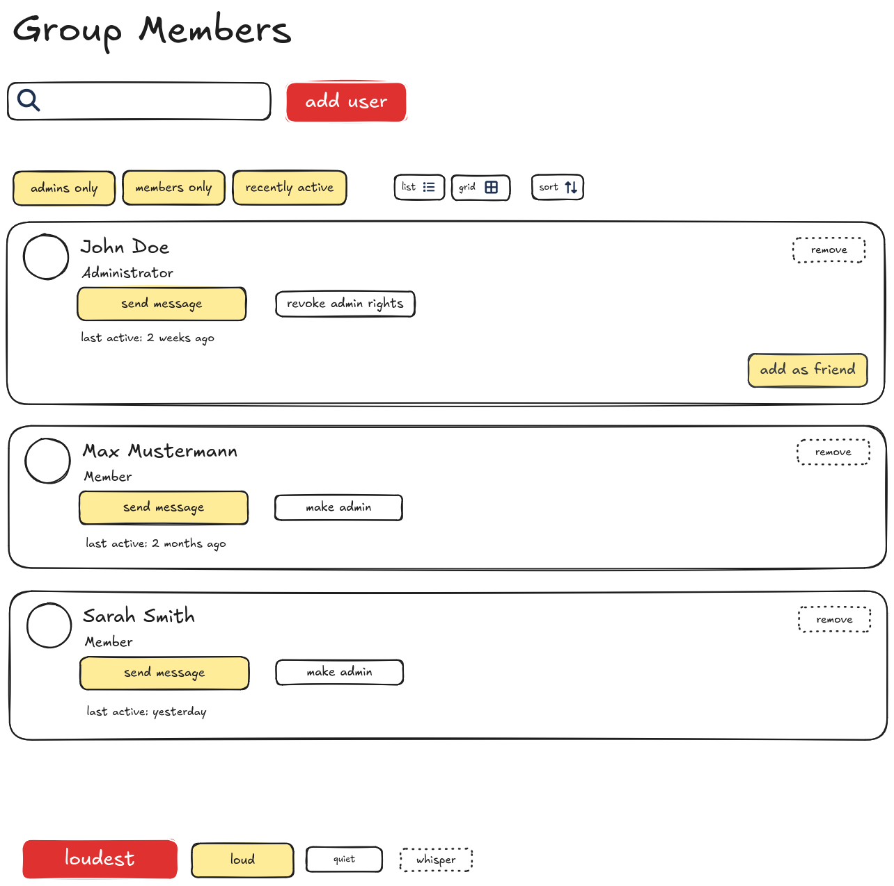

But let's not give up on the idea of communicating action type through button design. Marking action types can still be of value:

* Workflow start actions generally lead to more complex and more time-consuming steps. Because of their more extensive nature, it is easier to find suitable glyph icons to further illustrate and satisfyingly mark the action.
* Glyph icons are also widely used in view controls. There is a whole set of icons to communicate sortation, type of view etc. we can already rely on.
* Using Filters and View Controls require a different mindset compared to browsing an already adjusted and filtered view. In many use cases, I come in with a goal, set up my view and filter accordingly and then browse the results. These steps feel somewhat distinct and separate. Consequently, we have already been experimenting with styling view controls and filters differently to set them apart from any really impactful actions that can be done on or with items.

The UI framework from gov.uk uses a dedicated "Start" button to enter the main service of a website:

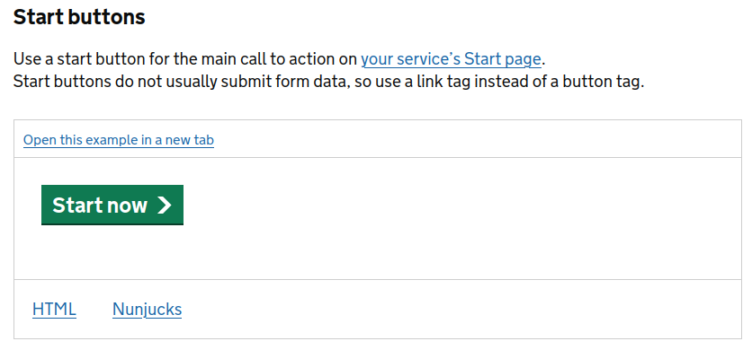

Adding these new ideas gives us an interesting mix of both priority levels and some action types being communicated through design and size:

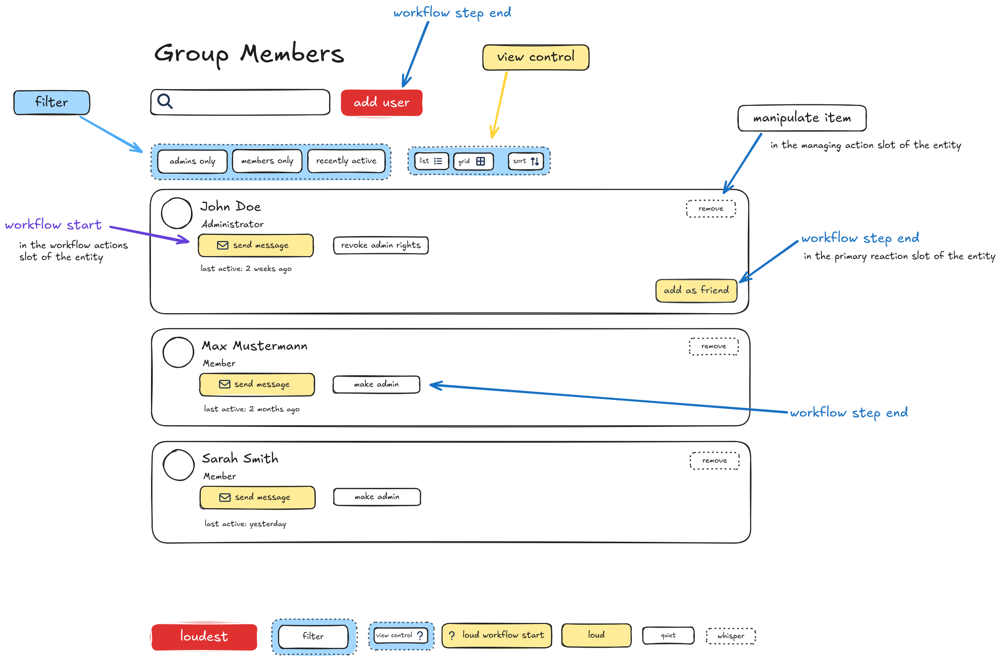

Notice how view controls and filters effectively communicate that they are "something else" and how that breaks the unnecessary competition with the buttons within the items. The area above the list steps back and lets the loud buttons of the items take back the spotlight. This seems appropriate if we expect the user to actually work on the items.

With this change we are beginning to mix two categories of buttons. We now have our button priority scale as well as styling some buttons depending on their purpose. However, since this improved the information architecture with an extra step, we might have found the valid exception to the rule.

As we are nearing the end of this visual experiment it becomes quite obvious that colors and type marking can effectively help guide the user.

However, one of the biggest steps forward doesn't even come from the research done in this paper: When we placed the buttons in the semantic slots on the entity, the item felt decluttered and manageable for the first time.

And the importance of positioning is further confirmed through another decision: We essentially ended up with a view control and filter bar, which forms a dedicated location in the view in relation to the item list.

We could mark and describe the button positions as follows:

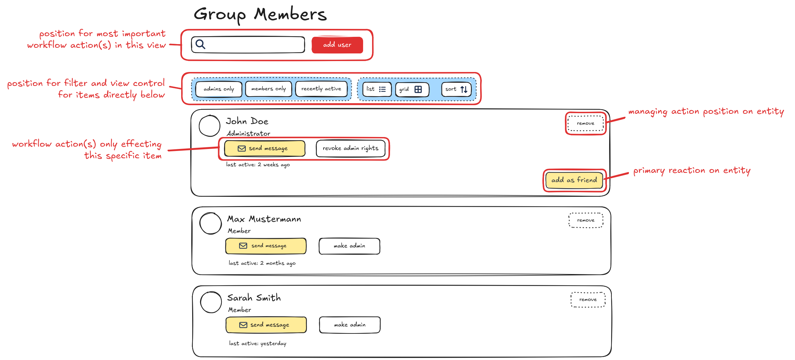

Even when taking back all levels of button sizes, you can see how positioning remains one of the strongest ways to keep the interface digestible and understandable.

### Local priority order

In some mockups, we could observe how some local contexts seem to create their own "inline" priority order.

Let's push this to the extreme by using the loudest button multiple times:

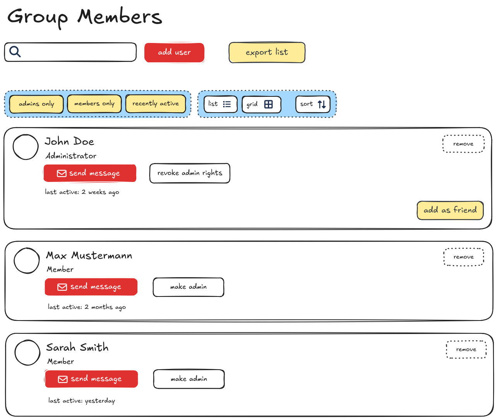

While this mockup uses the loudest button design far more than we would recommend, it seems like there are multiple somewhat independent contexts.

The "add user" button is the most important button in the header
The filter buttons stand out against the view controls.
In the items, "send message" takes priority over all other buttons inside the borders of the item.

One aspect that has been lost: When there is only one loudest button, it clearly directs the attention to one specific action which ideally highlight the option a user most likely wants to do. With multiple loudest options it takes a moment to understand what the main purpose of the page is supposed to be.

This means that inside an isolated context (a toolbar, a line, a boxed item) the priority order somewhat resets and counts for mostly this context.

Since the repeated loudest button clutters the screen let's walk that change back. Drawing the eye to the most important action of the page by using that color exclusively seemed to have been the right choice. Let's additionally modify the header to use a larger size to further strengthen the one actions that will be most likely the reason why the user came to this page:

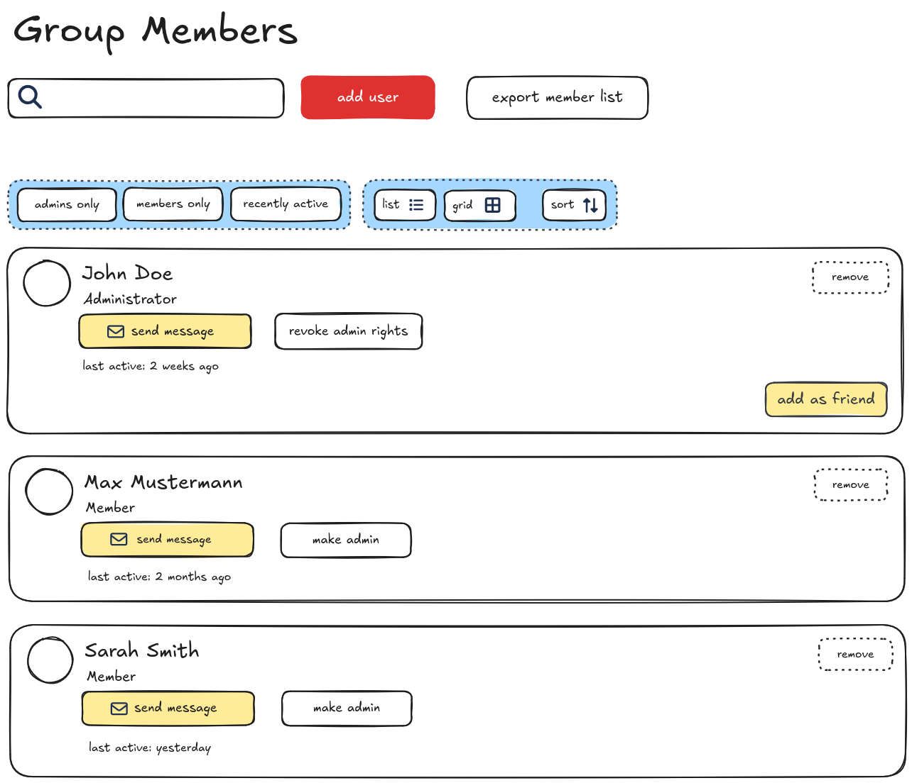

With this, we have achieved a very clear information architecture:
* eye is drawn to the most important actions at the top
* filters and view controls can be easily identified when needed, but step back when they are not of interest
* There is a strong local context and hierarchy through priority levels and positions inside each repeated item.

## Conclusions

### General

* Simple websites generally use 3 levels of buttons ranging from visually standing out a lot to not standing out at all.
* Complex apps often use at least 4 levels. This adds one more option to distinguish relevancy within the mid-range.
* To de-clutter the interface, segmenting and splitting it into distinct sections and groups seems to be the most effective way. 
* Most apps do not seem to distinguish button types by the action type they trigger. However, using a different design for view control and filter type buttons can help to reduce competition for other often more or differently important actions.
* Buttons triggering an action type we identified as "start workflow" might benefit from a distinct design. These actions throw the user into a longer process and both not finding the button when needed and accidentally clicking it can be frustrating.

### Out of scope

There are some more aspects that we only touched on, but could be investigated further:
* A huge aspect that makes or breaks a button is its label. A good label makes clear what exactly happens when its clicked. A bad label causes confusion and accidents. This field of "micro copy" has been extensively studied and written about - especially in the context of marketing. It might be well worth to investigate this further and how it can be applied to buttons inside a web app.
* How are design modifiers (size, full width, floating) connected to semantic slots and groupings?
* Should low or very high priority slots to nest whole container UI components change the appearance of all buttons inside?
* Could button priority management done by a context- and/or type-aware button bar component?

### Recommendations for ILIAS

* We recommend adding another button that falls between button default and shy.
  * This way we reserve the primary color only for the most important action but still have two colored buttons to create hierarchies in local contexts throughout the page.
  * In the current naming convention, it could be named a "simple" button. In other frameworks, they are often named "outlined" buttons, but this is a visual description that might not be true in some skins.
* The button slots on the ILIAS entity made a huge contribution to the mockup experiments in this investigation. We strongly believe that grouping buttons by type, category or other commonalities within a context is the single biggest step forward we can make in ILIAS interfaces. We should consider...
  * which UI components need button slots (panels, messages)?
  * which different priorities do these slots take in their context or do they allow multiple priorities in one slot?
  * which new UI components could be build heavily around meaningful and helpful button slots (view frame, slate action panel, page header,...)
* The instinctive call we have already made to change the look of view controls and filters has been confirmed to be the right one. We should continue styling the new filters so they visually fall between the "default" and "simple" button priority levels.
* We should consider introducing a "workflow start" button so users know when to expect a longer or highly consequential process. The launcher UI component already bends a bulky button into a design that could serve as inspiration for this button.
* We could consider a more intuitive naming convention using the volume scale
  * button primary --> loudest
  * button default --> loud
  * (button simple) --> quiet
  * button shy --> whisper
