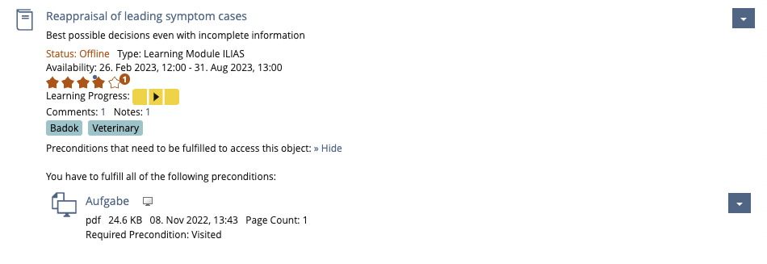
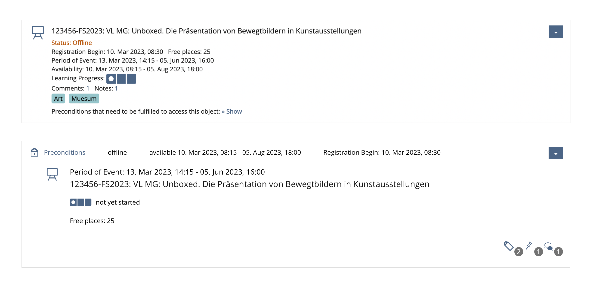
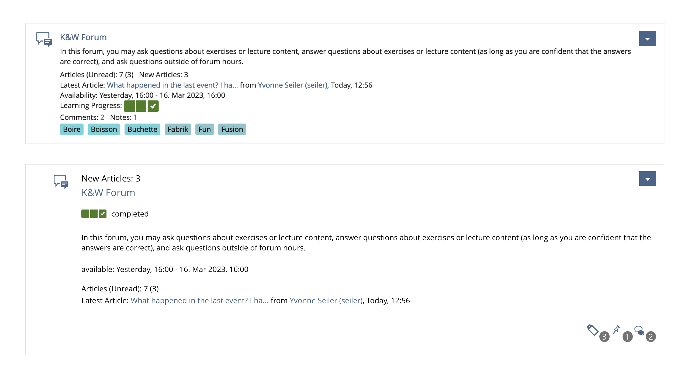
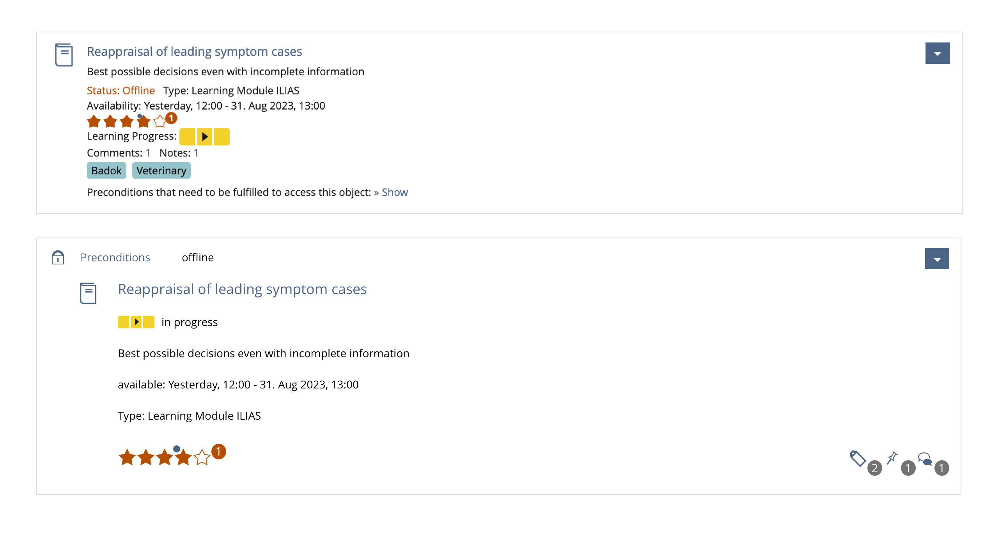
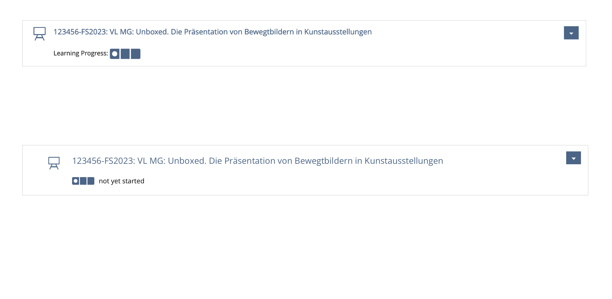
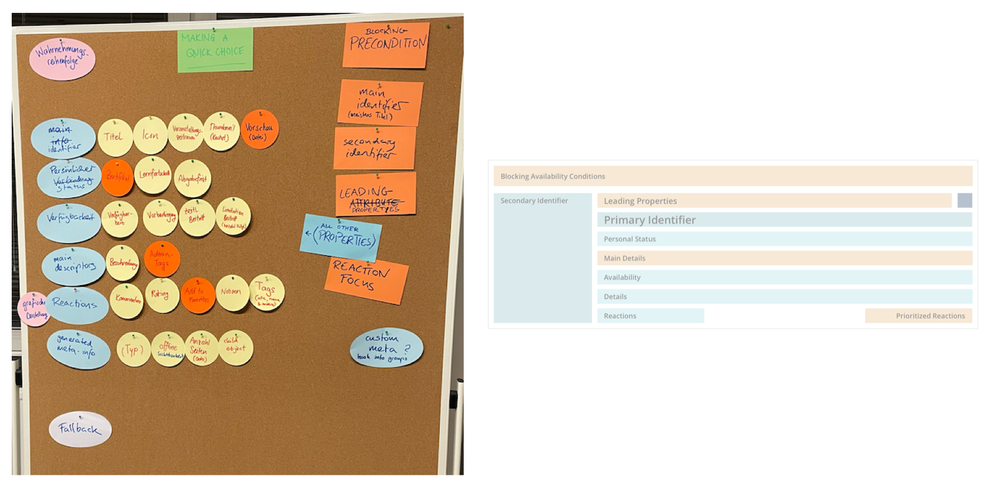
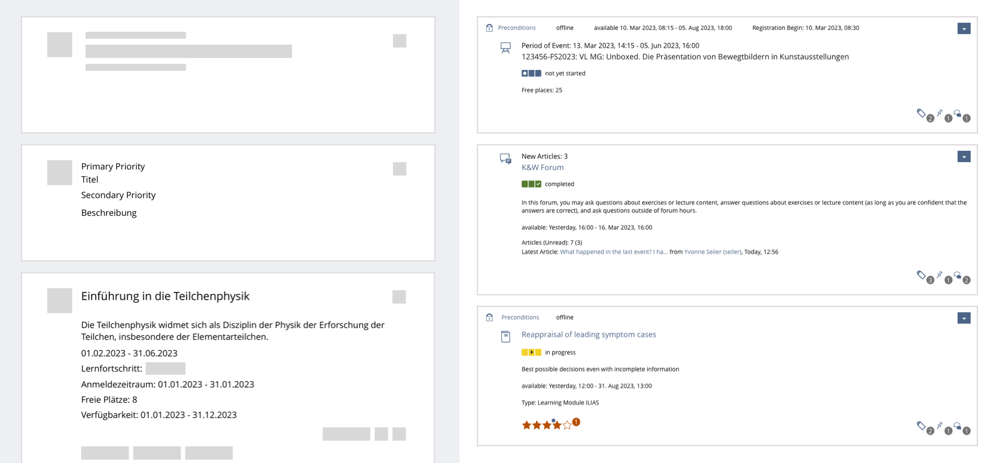
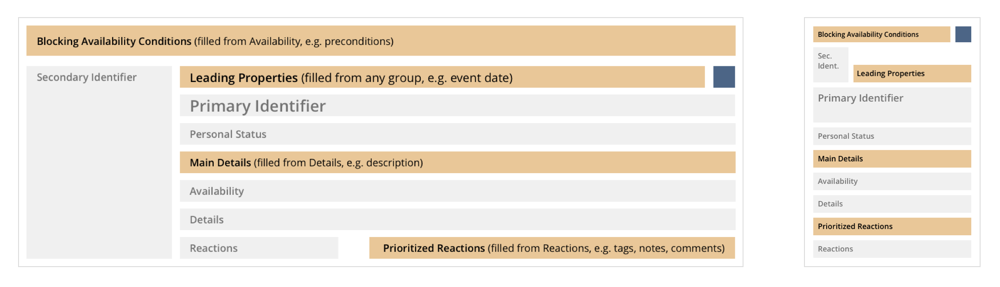

# Bringing Order to Chaos

Object Properties

---

## The challenge

---

### So many properties on an object

---



---

* the title
* a description
* a variety of dates and deadlines
* icons
* a learning progress
* tags
* comments
* previews
* and much more...

---

Properties can pile up...

...so let's try grouping and sorting...

...and see what changes.

---

### Example 1:  Why can't I register?

---



---

### Example 2: Anything new?

---



---

### Example 3: User interaction?

---



---

### Minimal items barely change

---



---

## Why look into this now?

---

Repository is switching from legacy components to UI components
* [Transfer Repository Objects to KS Items
](https://docu.ilias.de/goto_docu_wiki_wpage_6409_1357.html)
* [Streamline Object Properties](https://docu.ilias.de/goto_docu_wiki_wpage_7399_1357.html)

---

## The approach to find groupings

---

### Considering User Intent

* most of the time the user is not an admin, but a learner

---

[UX Guide for Repository Object Properties](https://github.com/ILIAS-eLearning/ILIAS/blob/trunk/src/UI/docu/ux-guide-repository-objects-properties-and-actions.md)

General User Intents

* Managing multiple objects
* Making a quick pick


---

* admin: wants to see all properties for managing and sorting
* normal user (learner): trying to find something quickly

---

#### Making a quick pick

* one clear choice for one expected object
* glancing at one or two of its properties
* action shown as the most prominent usually the reason why user came to this view

---

## Workshop

---

### Collection of possible properties

* Very helpful tables in FR [Streamline Object Properties](https://docu.ilias.de/goto_docu_wiki_wpage_7399_1357.html)
* such collections often focus on data types

---

### Property Types vs Semantic Group

* Type: Date
* Possibly different Semantic Groups:
    * Event Date
    * Registration
    * Availability
    * Deadline 

---

### Finding the Semantic Groups

* Which properties belong together for the most optimal fulfillment of the user intent?
* same kind of information close together
* user learns default order and position

---

* hypothesis -> argumentation -> rearrangement OR acceptance (repeat)

---



---

* find and recognize relevant information increase effectiveness and satisfaction
* but we have so much properties in one semantic group

what can we do?

---

### Priority Areas

* make important information jump out visually
* e.g. user can't open a course, would immediately like to know why
* really quick decisions become possible (leading properties)

---

### Testing with Mockups

* How about other objects like file, exercise, forum, group?

---



---

### Feedback and Tweaking

* Are the semantic groups sufficiently differentiated from each other?
* Have different workflows been run through (e.g. what happens if a property is not available)?
* How do the groups arrange themselves on different screen sizes? (large, small)

---


---

* Is the system flexible enough? (further developments)

---

## Conclusion

* What can we do to help the user make a decision quickly based on the properties on an item?
    * Semantic Groups
    * Priority Areas
    * Leading Properties

---


---


---



---

### Leading Properties

* makes meeting different user expectations possible
    * for courses: event date
    * for files: file type and size
* there are good reasons for it, but not mandatory
* exact logic has to be developed case by case

---


---

## Coding

---

* just rough thoughts, examples and ideas
* implementation details are yet to be determined

---

current UI Item
* all properties as a listing into "withProperties"

---

the proposes UI Repository Item
* properties have to be sorted into the Semantic Groups
* logic for Priority Areas is optional
* we would like to offer making suggestions for leading properties and main details

---

* Collections for the Semantic Groups
    * PrimaryIdentifier
    * SecondaryIdentifier
    * inGroupPersonalStatus
    * inGroupAvailability
    * inGroupDetails
    * inGroupReaction

---

* priority areas could pull from these groups

```PHP
$crs_item = f('title', 'icon') //define primary and secondary identifier during construction
    ->inGroupPersonalStatus('progress', 'membership')
    ->inGroupAvailability('availabilitydate', 'seats', 'preconditions')
        ->withBlockingAvailabilityCondition('preconditions')
    ->inGroupDetails('eventdate', 'description')
        ->withLeadingProperty('eventdate')
```

---

HTML DOM

* flat hierarchy
* DOM order = accessible screen reader order
* Re-ordering with CSS grid or flexbox = best order and weighting for seeing users

---

### Semantic Grouping brings more opportunities

* on other UI components, views and sidebars?
* filter by group?

---

## Outlook UI Repository item

* Repository object MUST be replaced by UI Item soon
* Finalizing design suggestion for Delos
* Finalizing PR -> Discussion/Refinement -> Implementation of UI Repository Item in KS
* FR [Transfer Repository Objects to KS Items
](https://docu.ilias.de/goto_docu_wiki_wpage_6409_1357.html)
