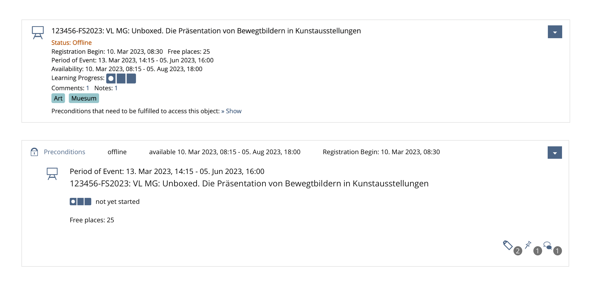
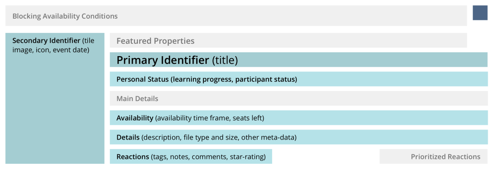
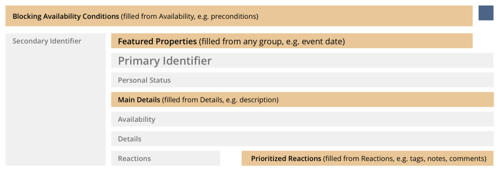

# UI Repository Item

---

## What?

We would like to start implementing
* a new type of Kitchen Sink UI item
* for presenting objects and their properties more intuitively
* to make quick picks easier for the average user.

---

Legacy vs. Repository Item

---

Legacy vs. Repository Item

---

## Why?

1. Repository has to switch to UI Framework components

---

## Why?

2. Legacy Item tends to pile up properties with no grouping or visual weight.

---

## Concept Development Process
* research project in October 2022: [Best practices for properties and actions displayed on repository objects](https://github.com/ILIAS-eLearning/ILIAS/blob/trunk/src/UI/docu/ux-guide-repository-objects-properties-and-actions.md)
* 2 Day Workshop in January 2023
* Particpation University of Bern, Concepts & Training, Enrico Zenzen from Leifos
* Feedback from colleagues, CSS Squad, UI Clinic
* Presentation at DevConf 2023 in Bremen

---

## 2 concepts to guide the user

---

1. Semantic Groups

---

2. Priority Areas

---

Detailed Concept linked in PR:
https://github.com/ILIAS-eLearning/ILIAS/pull/5688

---

## Name

* UI Repository Item = too sepcific, one use?
* Entity Representation = more open and hint towards object/entity nature

---

## Next steps

* Start implementing the Repsoitory Item
* Finalizing design suggestion for Delos
* Finalizing Implementation PR
* FR [Transfer Repository Objects to KS Items
](https://docu.ilias.de/goto_docu_wiki_wpage_6409_1357.html)
