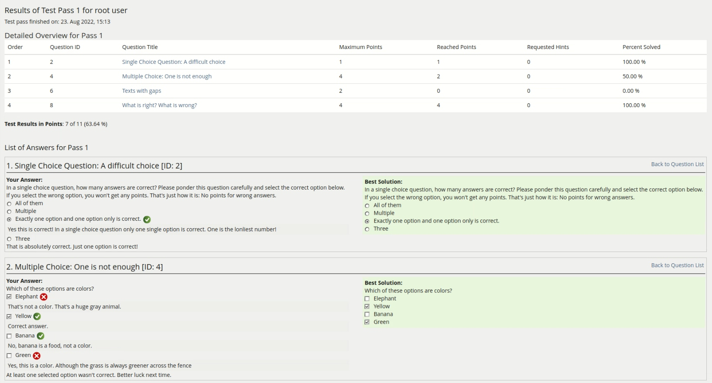
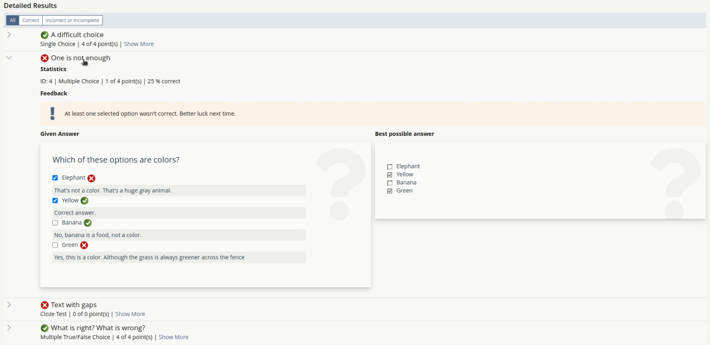
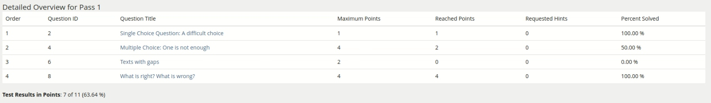
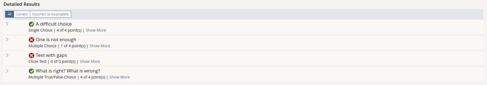
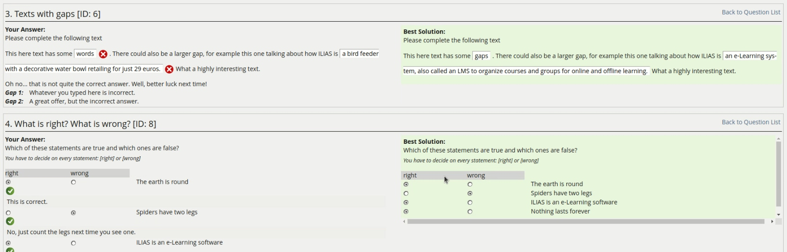
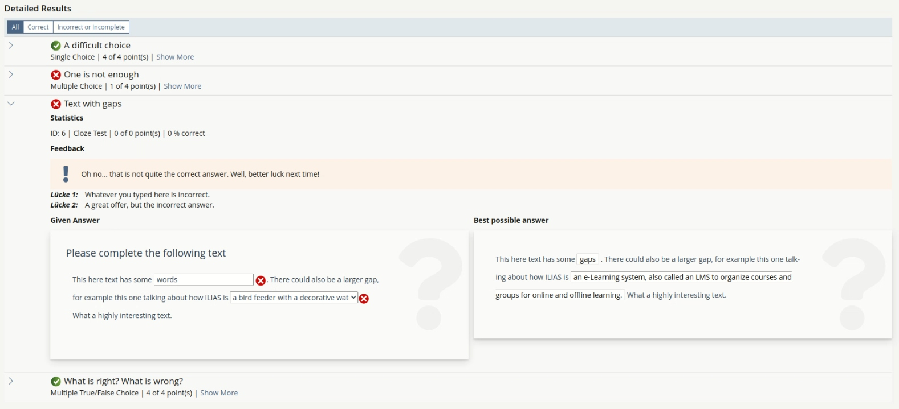

## 1 Initial Problem
The current detailed result view of the Test Assessment
* requires many clicks and much scrolling to navigate,
* renders questions with no regard to the content styles,
* and is optimized for printing, but many users evaluate test results on screens.

This impacts the user experience negatively:
* Users see the questions in an unfamiliar, unstyled look - which causes them to wonder why the view "looks broken".
* The lack of filters and view controls can make it difficult and time consuming to evaluate tests with many questions.

For developers there are drawbacks to how this view is currently assembled:

* The view is rendered with deprecated legacy methods instead of using kitchen sink elements from the UI framework.
* Some bugs and visual glitches are tricky to fix, because the content styles and the stripped down print rendering of the questions clash in unexpected ways.

## 2 Conceptual Summary

We propose a new detailed result view that is
* using the global content style appearance for questions to minimize confusion and visual glitches
* enabling the user to intuitively drill down to the information they seek using a flexible and filterable presentation table,
* making maintenance easier by using modern UI components from the UI framework.

| Current implementation | Mockup with possible optimizations |
| --- | --- |
|  |  |

## 3 User Interface Modifications

### 3.1 List of Affected Views
* ilrepositorygui > ilTestEvaluationGUI > outParticipantsPassDetails
* UI component Presentation Table

### 3.2 User Interface Details

### Maximizing overview

The presentation table provides a two-layered approach to showing information. The first layer of information is shown on the collapsed rows: These are only the properties most important to the average user. Everything else is tucked away into the expandable area not currently shown, but easily accesible.

This layer should suffice to provide a rough overview and help the user decide which answers they want to explore further.

For comparison, this is how the table of contents at the top of the detailed result page currently looks

Here is an example of how the new view could look with all questions collapsed within a presentation table:

The collapsed  presentation table helps users to
* skim through the list of answers without being distracted by too many properties (e.g. the number of Requested Hints is not of immediate interest for most users, but took over more space in the old legacy table than the highly relevant Percentage Solved column)
* get a rough feeling for the weakest and strongest parts of the test results without even opening a single question
* quickly identify and jump to specific questions that they know about (e.g. a participant could find that one Cloze Test question they had trouble with during the test by focusing on the question title and type)

These points align with the user intend described as "Making a quick pick" in this UX document.

To support quick identification
* correct and incorrect/incomplete answers are more clearly distinguishable by an icon
* the values for reached and maximum points are pulled closer together instead of being pulled apart by a lot of white space in the legacy table
* the tables view controls make it easier to filter for complete and incorrect/incomplete answers, which serves of a spring board from the "quick choice" to the "comparing" user intent.

### Drilling down for details

The second layer of information is shown when clicking on a row of the presentation table inside the expandable area. Users interested in specifics of one or multiple answers can find them with one click, without leaving their spot in the presentation table.

The current view jumps to a question block inside a long list, which is rendered in this way:

This stripped down rendering of questions makes focused work difficult:
* The feedback blends in with the body of the question
* The other question blocks clutter and overwhelm the view even though they might not be of interest

This is an example for a possible new rendering inside the presentation table:

The aforementioned UX guide names the mode of exploring the details of multiple items as "Comparing before choosing". While we are less certain of what information exactly the user is looking for, the presentation table still helps us to improve the user experience:

* users don't loose their position in the table when opening or closing a row entry
* familiar styling makes important areas like the feedback box stand out and helps distinguish e.g. the question text from the rest of the answer.
* more properties can be revealed for more rare use cases without taking up an entire table column (e.g. checking the question ID)

### Filters for quicker evaluation

{ For each of these views please list all user interface elements that should be modified, added or removed. Please provide the textual appearance of the UI elements and their interactive behaviour. }

### 3.3 New User Interface Concepts

#### Colum Panel

#### New Presentation Table Features

#### New Column Panel

#### New View Controls

{ If the proposal introduces any completely new user interface elements, you might consult UI Kitchen Sink in order to find the necessary information to propose new UI-Concepts. Note that any maintainer might gladly assist you with this. }

### 3.4 Accessibility Implications
{ If the proposal contains potential accessibility issues that are neither covered by existing UI components nor clarified by guidelines, please list them here. For every potential issue please either propose a solution or write down a short risk assessment about potential fallout if there would be no solution for the issue. }

## 4 Technical Information
{ The maintainer has to provide necessary technical information, e.g. dependencies on other ILIAS components, necessary modifications in general services/architecture, potential security or performance issues. }

## 5 Privacy
{ Please list all personal data that will need to be stored or processed to implement this feature. For each date give a short explanation why it is necessary to use that date. }

## 6 Security
{ Does the feature include any special security relevant changes, e.g. the introducion of new endpoints or other new possible attack vectors. If yes, please explain these implications and include a commitment to deliver a written security concept as part of the feature development. This concept will need an additional approvement by the JourFixe. }

## 7 Contact
Author of the Request: Engländer, Ferdinand
Maintainer:
Implementation of the feature is done by: {The maintainer must add the name of the implementing developer.}

## 8 Funding
If you are interest in funding this feature, please add your name and institution to this list.

## 9 Discussion